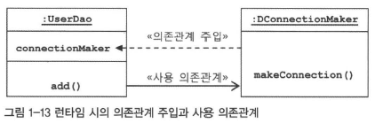

# 1장. 오브젝트와 의존관계
- 스프링의 핵심 철학 : 잃어버렸던 **객체지향** 기술의 가치를 회복시키고, 객체지향 프로그래밍이 제공하는 많은 혜택을 누릴 수 있게 기본으로 돌아가자는 것
- 따라서 스프링을 이해하려면 `오브젝트` 에 집중해야 한다
- 스프링은 **오브젝트를 어떻게 효과적으로 설계, 구현, 사용, 개선할 것인가에 대한 명쾌한 기준**을 마련해준다
- 스프링은 객체지향 기술과 설계, 구현에 대한 실용적인 전략, 검증된 best practice 를 자연스럽고 손쉽게 적용할 수 있도록 프레임워크 형태로 제공한다.

## 1.1. 초난감 DAO
- 자바빈(JavaBean)은 원래 비주얼 툴에서 조작 가능한 컴포넌트를 말한다. 
- 이제는 자바빈이라고 말하면 비주얼 컴포넌트라기보다는 다음 두 가지 관례를 따라 만들어진 오브젝트를 가리킨다. 
  - **디폴트 생성자** : 자바빈은 `파라미터가 없는 디폴트 생성자`를 갖고 있어야 한다. 툴이나 프레임워크에서 리플렉션을 이용해 오브젝트를 생성하기 때문에 필요하다.
  - **프로퍼티** : `자바빈이 노출하는 이름을 가진 속성`을 프로퍼티라고 한다. 프로퍼티는 set으로 시작하는 수정자 메소드(setter)와 get으로 시작하는 접근자 메소드(getter)를 이용해 수정 또는 조회할 수 있다.

## 1.2. DAO 의 분리
### 1.2.1. 관심사의 분리
- 개발자가 객체를 설계할 때 가장 염두에 둬야할 것은, **미래의 변화를 어떻게 대비할 것인가** 이다.
- 객체지향설계와 프로그래밍이 절차적 프로그래밍 패러다임에 비해 조금 더 많은 초기 비용을 소모되는데, 그 이유는 객체지향 기술 자체가 갖는 변화에 효과적으로 대처할 수 있다는 기술적인 특징 때문이다. 
- 변경이 일어날 때, 필요한 작업을 최소화하고 그 변경이 다른 곳에 문제를 일으키지 않게 하려면 **분리와 확장을 고려한 설계를 해야한다.**
- 변화는 대체로 집중된 `한 가지 관심` 에 대해 일어나지만, 그에 따른 작업은 한 곳에 집중되지 않는 경우가 많다. 
  - 관심이 같으면 하나의 객체 또는 친한 객체로 모이게 하고, 관심이 다르면 가능한 한 떨어지도록 분리한다

### 1.2.2. 커넥션 만들기의 추출

```java
public class UserDao {
    public void add(User user) throws ClassNotFoundException, SQLException {
		Class.forName("com.mysql.jdbc.Driver");
		Connection c = DriverManager.getConnection("jdbc:mysql://localhost/springbook?characterEncoding=UTF-8", "spring",
				"book");

		PreparedStatement ps = c.prepareStatement(
			"insert into users(id, name, password) values(?,?,?)");
		ps.setString(1, user.getId());
		ps.setString(2, user.getName());
		ps.setString(3, user.getPassword());

		ps.executeUpdate();

		ps.close();
		c.close();
	}


	public User get(String id) throws ClassNotFoundException, SQLException {
		Class.forName("com.mysql.jdbc.Driver");
		Connection c = DriverManager.getConnection("jdbc:mysql://localhost/springbook?characterEncoding=UTF-8", "spring",
				"book");
		PreparedStatement ps = c
				.prepareStatement("select * from users where id = ?");
		ps.setString(1, id);

		ResultSet rs = ps.executeQuery();
		rs.next();
		User user = new User();
		user.setId(rs.getString("id"));
		user.setName(rs.getString("name"));
		user.setPassword(rs.getString("password"));

		rs.close();
		ps.close();
		c.close();

		return user;
	}
}
```

- UserDao 의 관심사항
  - DB 와의 연결을 위한 커넥션 설정
  - 파라미터로 넘어온 정보를 Statement 에 바인딩하여 실행시키기
  - Statement 와 Connectin 오브젝트 close

- 중복 코드의 메소드 추출
  - DB 연결코드를 getConnection() 이라는 독립 메소드로 만든다
  - `메소드 추출` : 공통의 기능을 담당하는 메소드로 중복된 코드를 뽑아내는 것 
    ```java
    private Connection getConnection() throws ClassNotFoundException, SQLException {
        Class.forName("com.mysql.jdbc.Driver");
        Connection c = DriverManager.getConnection("jdbc:mysql://localhost/springbook?characterEncoding=UTF-8", "spring","book");
        return c;
    }
    ```

### 1.2.3. DB 커넥션 만들기의 독립
- 다른 종류의 DB 를 사용하며, DB 커넥션을 가져오는 방법도 다를 경우
  - getConnection() 의 구현부를 제거하고 추상메소드로 만든다.
  - UserDao 도 추상클래스로 만들고, UserDao 클래스를 상속하여 서브클래스를 만든 후, 추상메소드로 선언했던 getConnection() 메소드를 구현한다. 
    ```java
    public abstract class UserDao {
        public void add(User user) throws ClassNotFoundException, SQLException {...}

        public User get(String id) throws ClassNotFoundException, SQLException {...}

        abstract protected Connection getConnection() throws ClassNotFoundException, SQLException;
    ```
    ```java
    public class NUserDao extends UserDao {
        protected Connection getConnection() throws ClassNotFoundException,
                SQLException {
            Class.forName("com.mysql.jdbc.Driver");
            Connection c = DriverManager.getConnection(
                    "jdbc:mysql://localhost/springbook?characterEncoding=UTF-8",
                    "spring", "book");
            return c;
        }
    }
    ```
- `템플릿 메소드 패턴` : 위와 같은 예시처럼 **슈퍼클래스에 기본 로직 흐름을 만들고, 기능의 일부를 추상메서드나 오버라이딩 가능한 protected 메소드로 만든 뒤, 서브클래스에서 이런 메소드를 필요에 맞게 구현해서 사용하도록 하는 방법**
  - 스프링에서 애용되는 디자인 패턴
- `팩토리 메소드 패턴` : 서브클래스에서 **구체적인 오브젝트 생성 방법을 결정하게 하는 것**
  - UserDao 의 서브클래스의 getConnection() 메소드 == 어떤 Connection 클래스의 오브젝트를, 어떻게 생성할 것인지를 결정하는 방법
- 결국, UserDao 는 Connection 오브젝트가 만들어지는 방법 + 내부 동작과는 상관없이, 자신이 필요한 기능을 Connection 인터페이스를 통해 사용하기만 할 뿐!
- 디자인 패턴 : 주로 객체지향 설계에 관한 것, 대부분 객체지향적 설계 원칙을 이용해서 문제를 해결한다
  - 패턴의 설계 구조는 대부분 비슷한데, 객체지향적 설계로부터 문제 해결을 위해 적용할 수 있는 확장성 추구 방법이 대부분 2가지로 정리되기 때문이다.
  - **상속과 오브젝트 합성!**
  - 핵심은 `각 패턴의 핵심이 담긴 목적 또는 의도` 이며, **패턴을 적용할 상황, 해결해야 할 문제, 솔루션 구조, 각 요소의 역할, 핵심의도가 무엇인가** 를 기억해둬야 한다.
- 템플릿 메소드 패턴
  - 상속을 통해 슈퍼클래스 기능 확장 시 사용하는 가장 대표적인 방법
  - 변하지 않는 기능은 슈퍼클래스에, 자주 변경되며 확장할 기능은 서브클래스에 둔다
  - `훅 메소드` : 슈퍼클래스에서 디폴트 기능을 정의해두거나 비워두었다가, 서브클래스에서 선택적으로 오버라이드할 수 있게 만들어둔 메소드
    - 서브클래스에서는 `추상 메소드를 구현` 하거나, `훅 메소드를 오버라이드` 하는 방법으로 기능의 일부를 확장한다
  ```java
  public abstract class Super {
    public void templateMethpd() {
      hookMethod();
      abstractMethod();
    }

    protected void hookMethod() { } // 선택적으로 오버라이딩 가능한 훅메소드
    public abstract void abstractMethod(); // 서브클래스에서 반드시 구현해야 하는 추상 메소드
  }

  public class Sub1 extends Super {
    protected void hookMethod() {...}
    public void abstractMethod() {...}
  }
  ```
- 팩토리 메소드 패턴
  - 템플릿메소드 패턴과 마찬가지로, `상속` 을 통해 기능을 확장하게 하는 패턴
  - 주로 **인터페이스 타입으로 오브젝트를 리턴**하므로, 서브클래스에서 정확히 어떤 클래스의 오브젝트를 만들어 리턴하는지 슈퍼클래스는 알지 못한다
  - 서브클래스에서 **오브젝트 생성 방법과 클래스를 결정할 수 있게 미리 정의해둔 클래스** 를 팩토리 메소드라고 하며, 이 방식을 통한 오브젝트 생성 방법을 슈퍼클래스의 기본코드에서 독립시키는 방법을 팩토리 메소드 패턴이라고 한다.
- 상속은 상하위 클래스 관계가 생각보다 밀접하며, 여전히 서로 다른 관심사에 대한 긴밀한 결합을 허용한다
  - 슈퍼클래스의 기능을 서브클래스가 직접 사용 가능한 것처럼!
  - 슈퍼클래스 내부 변경이 서브클래스에 영향 미칠 수 있다
- 확장된 기능을 다른 클래스에 적용할 수 없고, 매번 상속을 통해 만들어진 getConnection() 구현부가 클래스마다 중복되는 문제가 발생할 수 있다.

## 1.3. DAO 의 확장
### 1.3.1. 클래스의 분리
- DB 커넥션과 관련된 부분을 서브클래스가 아니라, 별도의 독립된 클래스에 담는다.
```java
public class UserDao {
	private SimpleConnectionMaker simpleConnectionMaker;
	
	public UserDao() {
		this.simpleConnectionMaker = new SimpleConnectionMaker();
	}

	public void add(User user) throws ClassNotFoundException, SQLException {
		Connection c = this.simpleConnectionMaker.getConnection();
	}

	public User get(String id) throws ClassNotFoundException, SQLException {
		Connection c = this.simpleConnectionMaker.getConnection();
  }
}

public class SimpleConnectionMaker {
	public Connection getConnection() throws ClassNotFoundException, SQLException {
		Class.forName("com.mysql.jdbc.Driver");
		Connection c = DriverManager.getConnection(
				"jdbc:mysql://localhost/springbook?characterEncoding=UTF-8", "spring", "book");
		return c;
	}
}
```
- 이 경우에는 UserDao 가 SimpleConnectionMaker 라는 특정 클래스에 종속되어 있어서 상속을 사용했을 때처럼 UserDao의 수정없이 DB 커넥션 생성 기능을 변경할 방법이 없다
  - 다른 DB 커넥션을 생성하고 싶다면,	`this.simpleConnectionMaker = new SimpleConnectionMaker();` 부분을 수정해야 한다
- 클래스를 분리한 경우에도 상속 이용시와 마찬가지로, 자유로운 확장이 가능하게 하려면 2가지 문제를 해결해야 한다.
  - 1 ) SimpleConnectionMaker 클래스에서 사용하는 메소드가 달라질 경우 메소드 커넥션 접근 코드를 일일이 변경해야 한다
  - 2 ) DB 커넥션을 제공하는 클래스가 무엇인지 UserDao 가 구체적으로 알고 있어야 한다.
  - 이런 문제의 근본적 원인은, UserDao 가 변경가능한 정보, 즉 DB 커넥션을 가져오는 클래스에 대해 **너무 많이 알고 있기 때문** (어떤 클래스가 쓰이는 지, 클래스 내의 커넥션 가져오는 메소드 이름이 무엇인지)

### 1.3.2. 인터페이스의 도입
- 인터페이스 : 자바가 어떤 것들의 공통적 성격을 뽑아내어 이를 따로 분리해내는 작업인 `추상화` 를 위해 제공하는 가장 유용한 도구
- 인터페이스로 추상화해놓은 최소한의 통로를 통해, 접근하는 쪽에서는 오브젝트를 만들 때 사용할 클래스가 무엇인지 몰라도 된다.
```java
public interface ConnectionMaker {
	public Connection getConnection() throws ClassNotFoundException, SQLException;
}

public class UserDao {
	private ConnectionMaker connectionMaker;
	
	public UserDao() {
		this.connectionMaker = new DConnectionMaker();
	}

	public void add(User user) throws ClassNotFoundException, SQLException {
		Connection c = this.connectionMaker.getConnection();
	}

	public User get(String id) throws ClassNotFoundException, SQLException {
		Connection c = this.connectionMaker.getConnection();
  }
}
```
- 하지만 여전히 UserDao 의 생성자에서 클래스 생성자를 호출하는 부분 때문에 DB 커넥션을 제공하는 클래스에 대한 구체적인 정보를 제거되지 않고 남아있다.

### 1.3.3. 관계설정 책임의 분리
- `this.connectionMaker = new DConnectionMaker();` 이 코드는 결국 **UserDao 와 UserDao 가 사용할 ConnectionMaker 의 특정 구현 클래스 사이의 관계를 설정해주는 것에 대한 관심사**를 담고 있다.
  - 이 관심사를 담은 코드를 UserDao 에서 분리하지 않으면 UserDao 는 결코 독립적으로 확장 가능한 클래스가 될 수 없다.
- **UserDao 의 클라이언트가 이 제 3의 관심사항 (관계를 결정해주는 기능) 을 분리해서 두기에 적절한 곳**이다.
  - 따라서 UserDao 의 클라이언트 (UserDao 사용부) 에서 UserDao 를 사용하기 전, 먼저 UserDao 가 어떤 ConnectionMaker 의 구현클래스를 사용할지 결정하도록 만든다
- **런타임 시 한쪽이 다른 오브젝트의 레퍼런스를 갖고 있는 방식으로 오브젝트 사이의 관계를 만들어 주어야 한다.**
  - 클래스 사이의 관계가 아님 !! -> 클래스 사이에 관계가 만들어진다는 것은, 한 클래스가 인터페이스 없이 다른 클래스를 직접 사용한다는 뜻
  - 즉, 코드에 다른 클래스 이름이 나타나기 때문에 만들어지는 것이다.
  - 하지만 오브젝트 사이의 관계는 그렇지 않다. 
  - 특정 클래스를 전혀 알지 못해도, **해당 클래스가 구현한 인터페이스를 사용하면 그 클래스의 오브젝트를 인터페이스 타입으로 받아서 사용할 수 있다.**
- UserDao 오브젝트가 DConnectionManager 오브젝트를 사용하게 하려면 두 클래스 오브젝트 사이에 `런타임 사용관계` 또는 `링크` 또는 `의존관계` 라고 불리는 관계를 맺어주면 된다
  - 모델링 시에는 없었던, 그래서 코드에는 보이지 않던 관계가 오브젝트로 만들어진 후에 생성된다
- 클라이언트는 자신이 UserDao 를 사용해야 하는 입장이므로, UserDao 의 세부전략으로 볼 수 있는 ConnectionMaker 의 구현 클래스를 선택하며, 선택한 클래스의 오브젝트를 생성해서 UserDao 와 연결해줄 수 있다
```java
public class UserDaoTest {
	public static void main(String[] args) throws ClassNotFoundException, SQLException {
		ConnectionMaker connectionMaker = new DConnectionMaker();
		UserDao dao = new UserDao(connectionMaker);
    ...
  }
}

public class UserDao {
	private ConnectionMaker connectionMaker;
	
	public UserDao(ConnectionMaker simpleConnectionMaker) {
		this.connectionMaker = simpleConnectionMaker;
	}
}
```
- 이를 통해 UserDaoTest 가 UserDao 와 ConnectionMaker 구현 클래스와의 **런타임 오브젝트 의존관계를 설정하는 책임을 담당** 하고 있다

### 1.3.4. 원칙과 패턴
- 개방 폐쇄 원칙
  - 클래스나 모듈은 확장에 열려 있으며, 변경에는 닫혀 있어야 한다
  - 인터페이스를 사용해 확장기능을 정의한 경우 대부분 이 원칙을 잘 따른다고 볼 수 있다
- 높은 응집도와 낮은 결합도
  - 높은 응집도
    - 하나의 모듈, 클래스가 **하나의 책임 또는 관심사에만 집중**하고 있다
    - 변화가 일어날 때 해당 모듈의 많은 부분이 함께 바뀐다
  - 낮은 결합도
    - 높은 응집도보다 더 민감한 원칙
    - 책임과 관심사가 다른 오브젝트 또는 모듈과 느슨하게 연결된 형태를 유지해야 한다
    - 하나의 변경이 발생할 타 모듈과 객체로 변경에 대한 요구가 전파되지 않는 상태이다
- 전략 패턴
  - 개방 폐쇄 원칙의 실현에도 가장 잘 들어맞는 패턴
  - 자신의 기능 맥락(context) 에서, 필요에 따라 **변경이 필요한 알고리즘 (독립적인 책임으로 분리 가능한 기능)을 인터페이스를 통해 통째로 외부로 분리시키고, 이를 구현한 구체적인 알고리즘을 필요에 따라 바꿔서 사용** 할 수 있게 하는 디자인 패턴 -> 전략을 바꾼다! 라고 생각
  - 컨텍스트 (UserDao) 를 사용하는 클라이언트 (UserDaoTest) 는 컨텍스트가 사용할 전략 (ConnectionMaker를 구현한 클래스) 을 컨텍스트의 생성자 등을 통해 제공해주는 게 일반적이다

## 1.4. 제어의 역전 (IoC)
### 1.4.1. 오브젝트 팩토리
- 팩토리(factory) : 객체의 생성 방법을 결정하고 그렇게 만들어진 오브젝트를 돌려주는 역할을 하는 클래스
  - 추상 팩토리 패턴이나 팩토리 메소드 패턴과는 다르니 혼동하지 말자. 
  - **단순히 오브젝트를 생성하는 쪽과 생성된 오브젝트를 사용하는 쪽의 역할과 책임을 깔끔히 분리하기 위함**이다.
```java
public class DaoFactory {
    public UserDao userDao() {
        return new UserDao(new DSimpleConnectionMaker());
    }
}

public class UserDaoTest {
    public static void main(String[] args) throws SQLException, ClassNotFoundException {
        UserDao dao = new DaoFactory().userDao();
        ...
    }
}
```
- 설계도로서의 팩토리
  - UserDao: 데이터 로직에 대한 책임
  - ConnectionMaker: DB 연결 기술에 대한 책임
  - DaoFactory: 오브젝트를 구성하고 관계를 정의하는 책임
  - UserDaoTest: 동작을 테스트하는 책임
  - 여기서 UserDao, ConnectionMaker는 `실질적인 로직을 담당`하는 컴포넌트라면, DaoFactory는 `컴포넌트의 구조와 관계를 정의한 설계도 같은 역할`을 한다고 볼 수 있다.
- DaoFactory 를 분리했을 때 얻는 이점은, **애플리케이션 컴포넌트 역할을 하는 오브젝트와 애플리케이션 구조를 결정하는 오브젝트를 분리**했다는 데 의미가 있다

### 1.4.2. 오브젝트 팩토리의 활용
- 다른 DAO들이 필요한 상황이 되었다고 가정했을 때, 어떤 ConnectionMaker 구현 클래스를 사용할 지 결정하는 기능이 중복돼서 나타나는 문제가 생긴다.
- DAO 가 많아지면 ConnectionMaker 구현클래스를 바꿀 때마다 모든 메소드에 수정이 일어난다
```java
public class DaoFactory {
    public UserDao userDao() {
        return new UserDao(new DSimpleConnectionMaker());
    }

    public MessageDao messageDao() {
        return new MessageDao(new DSimpleConnectionMaker());
    }

    public AccountDao accountDao() {
        return new AccountDao(new DSimpleConnectionMaker());
    }
}
```
- ConnectionMaker 생성용 메소드를 추출하여 `메소드 추출 기법`으로 다시 중복을 제거한다.
```java
public class DaoFactory {
    public UserDao userDao() {
        return new UserDao(getConnectionMaker());
    }

    public MessageDao messageDao() {
        return new MessageDao(getConnectionMaker());
    }

    public AccountDao accountDao() {
        return new AccountDao(getConnectionMaker());
    }

    private DSimpleConnectionMaker getConnectionMaker() {
        return new DSimpleConnectionMaker();
    }
}
```

### 1.4.3. 제어권의 이전을 통한 제어관계 역전
- 일반적인 프로그램은 main 메소드에서 로직이 시작되며, 필요한 오브젝트를 만들고 오브젝트가 주체적으로 어떤 구현체를 사용하여 어떤 행위를 할 것인지에 대해 결정한다.
- 처음 만든 UserDao는 직접 DConnectionMaker라는 구현체를 사용할 것이라고 결정했지만, 현재는 DaoFactory가 지정해주는 ConnectionMaker의 구현체를 쓰게 되었다. 여기서 제어의 역전이 일어났다.
- 제어의 역전이 없는 상태(처음 만들었던 UserDao)에서는 **모든 오브젝트가 능동적으로 자신이 사용할 클래스를 결정하고, 언제 어떻게 그 오브젝트를 만들지 스스로 관장**한다. 
- `모든 종류의 작업을 사용하는 쪽에서 제어하는 구조`이다.
- 제어의 역전이란 이런 제어 흐름을 거꾸로 뒤집는 것

<br>

- 제어의 역전에서는 **모든 오브젝트가 자신이 사용할 오브젝트를 스스로 선택하지 않고 생성하지도 않는다.**
- 자신도 어떻게 만들어지고 어디서 사용되는지를 알 수 없다. 
- 모든 제어권한을 **자신이 아닌 다른 대상에게 위임**하기 때문이다.
- 모든 오브젝트는 `위임받은 제어 권한을 가진 특별한 오브젝트`에 의해 결정되고 만들어진다. ex) DaoFactory

#### 서블릿의 제어의 역전
- 스프링을 통해 서블릿을 개발하면 서버에 배포할 수는 있지만 **그 실행을 개발자가 직접 제어할 수 있는 방법은 없다.** 
- 서블릿 안에 main() 메소드가 있어서 실행시킬 수 있는 것도 아니며, **서블릿에 대한 제어 권한을 가진 컨테이너가 적절한 시점에 서블릿 클래스의 오브젝트를 만들고 그 안의 메소드를 호출한다.**
- 서블릿, JSP, EJB처럼 컨테이너 안에서 동작하는 구조에는 제어의 역전 개념이 적용되었다고 볼 수 있다.

#### 템플릿 메소드 패턴의 제어의 역전
- **제어권을 상위 템플릿 메소드에 넘기고, 자신은 필요할 때 호출되어 사용되도록 한다**는 제어의 역전 개념이 들어있다. 
  - 추상 UserDao를 상속한 서브클래스는 getConnection() 을 구현하지만, 이 메소드가 언제 어떻게 사용될 지 알지 못한다.
  - DB 커넥션을 만든다는 기능만 구현해두면, 슈퍼클래스인 UserDao 의 템플릿 메소드인 add(), get() 등에서 필요할 때 호출해서 사용하는 것이다.
- 템플릿 메소드는 제어의 역전이라는 개념을 활용해 문제를 해결하는 디자인 패턴으로 볼 수 있다.

#### 프레임워크의 제어의 역전
- 프레임워크와 라이브러리의 다른 점으로 제어의 역전이 있다. 
- **라이브러리를 사용하는 애플리케이션 코드는 애플리케이션 흐름을 직접 제어한다.**
  - 단지 동작하는 중에 필요 기능이 있을 때 능동적으로 라이브러리를 사용할 뿐이다.
- 반면에 **프레임워크는 거꾸로 애플리케이션 코드가 프레임워크에 의해 사용된다.** 
  - 보통 프레임워크 위에 개발한 클래스를 등록해두고, 프레임워크가 흐름을 주도하는 중에 개발자가 만든 애플리케이션 코드를 사용하도록 만드는 방식이다.
- 프레임워크에는 분명한 제어의 역전 개념이 적용되어 있어야 하며, 애플리케이션 코드는 프레임워크가 짜놓은 틀에서 `수동적`으로 동작해야 한다.

#### UserDao, DaoFactory의 제어의 역전
- UserDao는 DaoFactory가 정해주는 구현체를 이용해 지정된 행위를 수행하는 수동적인 클래스가 되었다. 
- UserDaoTest도 DaoFactory가 공급해주는 DAO를 사용할 수 밖에 없다. 
- DAO와 ConnectionMaker의 구현체를 생성하는 책임은 모두 DaoFactory에 있다. -> 제어의 역전이 일어난 상황
- 자연스럽게 관심을 분리하고 책임을 나누고 유연하게 확장 가능한 구조로 만들기 위해 DaoFactory를 도입했던 과정이 바로 IoC를 적용하는 작업이었다고 볼 수 있다.

#### 제어의 역전(IoC)과 스프링 프레임워크
- IoC는 스프링 프레임워크만의 기술이 아니며, 프레임워크가 꼭 필요한 개념도 아니다. 
- 단순히 디자인 패턴에서도 발견할 수 있는 것처럼 상당히 폭 넓게 사용되는 프로그래밍 모델이다. 
- IoC를 적용하여 설계가 깔끔해지고 유연성이 증가하며 확장성이 좋아질 수 있다
- 제어의 역전에서는 프레임워크 또는 컨테이너와 같이 **애플리케이션 컴포넌트의 생성과 관계설정, 사용, 생명주기 관리 등을 관장하는 존재가 필요하다.** 
  - DaoFactory는 오브젝트 수준의 가장 간단한 IoC 컨테이너 혹은 IoC 프레임워크라고 볼 수 있다.
  - IoC를 애플리케이션 전반에 걸쳐 본격적으로 적용하려면 스프링과 같은 IoC 프레임워크의 도움을 받는 편이 훨씬 유리하다. 
  - 스프링은 IoC를 모든 기능의 기초가 되는 기반 기술로 삼고 있으며, IoC를 극한까지 적용하고 있는 프레임워크이다.

## 1.5. 스프링의 IoC
- 스프링의 핵심을 담당하는 것은 `빈 팩토리` 혹은 `애플리케이션 컨텍스트`
- 이 2가지는 이전에 만들어본 DaoFactory를 조금 더 일반화한 것이다.
### 1.5.1. 오브젝트 팩토리를 이용한 스프링 IoC
#### 애플리케이션 컨텍스트와 설정정보
- `빈(bean)` : 스프링에서 **스프링이 제어권을 가지고 직접 만들고 관계를 부여하는 오브젝트**
  - 자바빈, 엔터프라이즈 자바빈에서 말하는 것과 비슷한 오브젝트 단위의 애플리케이션 컴포넌트
- `스프링 빈`은 **스프링 컨테이너가 생성, 관계설정, 사용 등을 제어해주는 제어의 역전이 적용된 오브젝트**
- `빈 팩토리(Bean Factory)` : 스프링에서 **빈의 생성과 관계설정 같은 제어를 담당하는 IoC 오브젝트**
  - 빈 팩토리를 조금 더 확장하면 애플리케이션 컨텍스트(Application Context) 가 되며, IoC 방식을 따라 만들어진 일종의 빈 팩토리라고 생각하면 된다.
- 빈 팩토리와 애플리케이션 컨텍스트는 동일하다고 봐도 무방하다. 
- 빈 팩토리는 `빈을 생성하고 관계를 설정하는 IoC의 기본 기능`에 초점을 맞추는 것이고, 애플리케이션 컨텍스트는 애플리케이션 전반에 걸쳐 `모든 구성요소의 제어 작업을 담당하는 IoC 엔진`이라는 의미가 좀 더 부각된다.
- 애플리케이션 컨텍스트는 **별도의 설정 정보를 참고해서 빈의 생성, 관계설정 등의 제어 작업을 총괄**한다. 
  - 설정 정보를 담고 있는 무엇인가를 가져와 이를 활용하는 범용적인 IoC 엔진같은 것으로 보면 된다.
  - 이전에 어플리케이션 로직을 담은 컴포넌트와 설계도 역할을 하는 팩토리로 구분했는데, 설계도 역할을 하는 것이 **애플리케이션 컨텍스트와 설정정보들**이라고 보면 된다.
  - 그 자체로 애플리케이션 로직을 담당하지는 않지만, **IoC 방식을 이용해 애플리케이션 컴포넌트를 생성하고 관계를 맺어주는 등의 책임을 담당**한다.

#### DaoFactory를 사용하는 애플리케이션 컨텍스트
- DaoFactory를 **스프링의 빈 팩토리가 사용할 수 있는 설정정보**로 만들어보자.
- `@Configuration` 을 붙여서 해당 클래스가 **빈 팩토리를 위한 오브젝트 설정을 담당하는 클래스** 라고 알릴 수 있다.
- `@Bean` 을 객체 생성 메소드에 붙이면, **해당 메소드가 생성한 객체를 스프링 빈으로서 활용**할 수 있다.
- 이 두 가지 애노테이션만으로 작성한 클래스를 스프링 프레임워크의 빈 팩토리 혹은 애플리케이션 컨텍스트가 IoC 방식의 기능을 제공할 때 사용할 설정정보로 만들 수 있다.
```java
@Configuration // `애플리케이션 컨텍스트` 혹은 `빈 팩토리`가 사용할 설정 정보라는 표시
public class DaoFactory {

    @Bean // 오브젝트 생성을 담당하는 IoC용 메소드라는 표시
    public UserDao userDao() {
        return new UserDao(getConnectionMaker());
    }

    @Bean // 오브젝트 생성을 담당하는 IoC용 메소드라는 표시
    public ConnectionMaker getConnectionMaker() {
        return new DSimpleConnectionMaker();
    }
}
```
- 이제 **DaoFactory 를 설정정보로 사용하는 애플리케이션 컨텍스트**를 만들어보자.
- @Configuration 이 붙은 자바코드를 설정정보로 사용하려면 AnnotationConfigApplicationContext() 구현체를 사용하면 된다.
- getBean() 은 ApplicationContext 가 관리하는 오브젝트를 요청하는 메소드
  - 파라미터인 userDao 는 ApplicationContext 에 등록된 빈의 이름
```java
public class UserDaoTest {
    public static void main(String[] args) throws SQLException, ClassNotFoundException {
        ApplicationContext context = new AnnotationConfigApplicationContext(DaoFactory.class);

        UserDao userDao = applicationContext.getBean("userDao", UserDao.class);
    }
}
```

### 1.5.2. 애플리케이션 컨텍스트의 동작 방식
- 기존 오브젝트 팩토리 방식과 스프링 애플리케이션 컨텍스트의 방식을 비교해보자.
- 오브젝트 팩토리에 대응되는 것이 스프링의 애플리케이션 컨텍스트이다. 
- **애플리케이션 컨텍스트 : IoC 컨테이너, 스프링 컨테이너, 빈 팩토리**라고 부른다.
  - 애플리케이션 컨텍스트는 BeanFactory 인터페이스를 상속했으므로 일종의 빈 팩토리
- DaoFactory는 DAO 오브젝트를 생성하고, DAO와 ConnectionMaker 구현체 간의 관계를 맺어주는 제한적인 역할을 했다. - 반면, 애플리케이션 컨텍스트는 **애플리케이션에서 IoC를 적용해 관리할 모든 오브젝트에 대한 생성과 관계 설정을 담당**한다.
  - 애플리케이션 컨텍스트는 직접적인 관계 작성 코드는 없고, **생성정보와 연관관계 정보는 별도의 설정정보를 통해서만 얻는다.**
  - 때론 외부 오브젝트 팩토리에 그 작업을 위임하고 그 결과를 가져다가 사용하기도 한다.

#### 애플리케이션 컨텍스트의 이점
- 클라이언트는 구체적인 팩토리 클래스를 알 필요가 없다.
  - DaoFactory는 매번 필요할 때마다 팩토리 오브젝트를 생성해야 하는 번거로움이 있다. 
  - 애플리케이션 컨텍스트를 사용하면 오브젝트 팩토리가 아무리 많아져도 이를 알아야하거나, 직접 사용할 필요가 없다
  - 애플리케이션 컨텍스트를 이용하면 **일관된 방식으로 원하는 오브젝트를 가져올 수 있다.** 
  - 팩토리 오브젝트를 생성할 필요 없이 XML 처럼 단순한 방법으로 애플리케이션 컨텍스트가 사용할 IoC 설정정보를 만들 수 있다.
- 애플리케이션 컨텍스트는 **종합 IoC 서비스를 제공**해준다.
  - 애플리케이션 컨텍스트의 역할은 단지 오브젝트 생성과 다른 오브젝트와의 관계 설정이 전부가 아니다.
  - 오브젝트가 만들어지는 방식, 시점과 전략을 다르게 가져가는 방법, 자동생성, 오브젝트 후처리, 정보의 조합, 설정방식 다변화, 인터셉팅 등 오브젝트를 효과적으로 사용할 수 있는 다양한 기능을 제공한다.
  - 스프링 빈이 사용할 수 있는 기반 기술 서비스나 외부 시스템과 연동 등을 컨테이너 차원에서 제공해주기도 한다.
- 애플리케이션 컨텍스트는 빈을 검색하는 다양한 방법을 제공해준다.
  - 빈 이름으로 검색, 타입으로 검색, 특정 애노테이션 설정된 빈 등 다양한 방식으로 찾을 수 있다.

### 1.5.3. 스프링 IoC 용어 정리
- **빈 (Bean, 스프링 빈, 빈 오브젝트)**
  - 스프링이 IoC 방식으로 관리하여 **직접 그 생성과 제어를 담당하는 오브젝트**를 말한다.
  - 스프링을 사용하는 어플리케이션에서 만들어지는 모든 오브젝트가 다 빈은 아니라는 말이다.
- **빈 팩토리 (Bean Factory)**
  - 스프링 IoC를 담당하는 핵심 컨테이너를 말한다. 
  - 빈 등록, 생성, 조회, 반환 등 기타 부가적인 빈 관리 기능을 담당한다. 
  - 보통은 빈 팩토리를 바로 사용하기보다 **이를 확장한 애플리케이션 컨텍스트를 사용**한다. 
  - BeanFactory 는 빈 팩토리가 구현하고 있는 가장 기본적인 인터페이스이며, 내부에는 getBean()과 같은 메소드가 정의되어 있다.
- **애플리케이션 컨텍스트 (Application Context)**
  - 빈 팩토리를 확장한 IoC 컨테이너이다. 
  - **빈 팩토리의 기능 (빈을 등록하고 관리하는 기본적인 기능) 에 추가적으로 스프링이 제공하는 애플리케이션 지원 기능이 포함**된다. 
  - 빈 팩토리는 `빈의 생성과 제어 관점`에서 쓰는 용어이고, 애플리케이션 컨텍스트는 `스프링이 제공하는 애플리케이션 지원 기능을 모두 포함`해서 이야기하는 용어이다.
  - 스프링에서는 애플리케이션 컨텍스트라는 용어를 빈 팩토리보다 더 많이 사용한다. 
  - ApplicationContext는 애플리케이션 컨텍스트가 구현하는 기본 인터페이스를 가리키며, 이는 BeanFactory 를 상속한다.
- **설정정보/설정 메타정보 (Configuration Metadata)**
  - **애플리케이션 컨텍스트 혹은 빈 팩토리가 IoC를 적용하기 위해 사용하는 메타정보**를 말한다.
  - 보통 IoC에 의해 관리될 애플리케이션 오브젝트를 생성하고 구성할 때 사용된다. 
  - 애플리케이션의 형상 정보라고도 한다.
- **컨테이너 (Container) 혹은 IoC 컨테이너**
  - **IoC 방식으로 빈을 관리한다는 의미**에서, 애플리케이션 컨텍스트나 빈 팩토리를 컨테이너 혹은 IoC 컨테이너라고도 한다
  - IoC 컨테이너는 주로 `빈 팩토리` 관점에서 이야기하는 것이고, 컨테이너 (스프링 컨테이너) 라고 할 때는 `애플리케이션 컨텍스트` 를 가리키는 것이다
  - 애플리케이션 컨텍스트는 그 자체로 ApplicationContext 인터페이스를 구현한 오브젝트를 가리키기도 하는데, 애플리케이션 컨텍스트 오브젝트는 하나의 애플리케이션에서 보통 여러 개가 만들어진다.
    - 이를 통틀어서 스프링 컨테이너라고 부를 수 잇다
  - 애플리케이션 컨텍스트, 빈 팩토리와 같은 의미이다. 컨테이너를 그냥 스프링이라고 부르는 사람도 있다.
- **스프링 프레임워크**
  - 애플리케이션 컨텍스트, 빈 팩토리, IoC 컨테이너를 포함해 스프링이 포함하는 모든 기능을 통틀어 말할 때 사용한다.

## 1.6. 싱글톤 레지스트리와 오브젝트 스코프
- 스프링의 애플리케이션 컨텍스트는 기존에 직접 만든 오브젝트 팩토리와는 중요한 차이점이 있다
- 오브젝트의 동일성과 동등성
  - 동일한 (identical) : == 연산자로 비교
    - 2개의 오브젝트가 동일하다면, 사실은 `하나의 오브젝트만 존재`하며 2개의 오브젝트 레퍼런스 변수를 갖고 있을 뿐
  - 동등한 (equivalent) : equals() 메소드로 비교
    - 2개의 오브젝트가 동등하다면, `2개의 각기 다른 오브젝트가 메모리상에 존재`하는 것
  - 자바 클래스 생성시 equals() 를 따로 구현하지 않으면, 최상위 클래스 Object 의 equals() 메소드가 사용된다
  - Object 의 equals() 메소드는 두 오브젝트의 동일성을 비교해서 그 결과를 돌려준다
- DaoFactory 의 userDao() 를 여러번 호출할 경우 동일한 오브젝트가 돌아올까?
  - userDao() 호출할 때마다 new 연산자에 의해 새로운 오브젝트가 만들어지게 되어 있다
  ```java
  DaoFactory factory = new DaoFactory();
  UserDao daol = factory.userDao();
  UserDao dao2 = factory.userDao();
  System.out.println(daol); // springbook.dao.UserDao@118f375
  System.out.println(dao2); // springbook.dao.UserDao@117a8bd
  ```
- DaoFactory 를 스프링의 애플리케이션 컨텍스트에 설정정보로 등록하고 getBean() 으로 userDao 로 등록된 오브젝트를 가져와보자
  - 여기서도, 애플리케이션 컨텍스트가 DaoFacory 의 userDao() 를 호출하여 오브젝트를 만드는 건 동일하다
  ```java
  ApplicationContext context = new AnnotationConfigApplicationContext(DaoFactory.class);
  UserDao dao3 = context.getBean("userDao" , UserDao.class);
  UserDao dao4 = UserDao.class);
  System.out.println(dao3); // springbook.dao.UserDao@ee22f7
  System.out.println (dao4); // springbook.dao.UserDao@ee22f7
  ```
  - 이 결과를 통해 스프링은 **여러 번에 걸쳐 빈을 요청해도 매번 동일한 오브젝트를 돌려준다** 는 사실을 알 수 있다
    - 물론 특정한 빈에 대해서는 설정을 바꿔서 매번 새로 빈을 생성하게 만들 수도 있지만, 기본 동작은 동일한 빈을 반환한다.
### 1.6.1. 싱글톤 레지스트리로서의 애플리케이션 컨텍스트
- 애플리케이션 컨텍스트는 오브젝트 팩토리와 비슷한 방식으로 동작하는 IoC 컨테이너이면서, **싱글톤을 저장하고 관리하는 싱글톤 레지스트리** 이다.
- 스프링은 기본적으로 별다른 설정 없이는 **내부에서 생성하는 빈 오브젝트를 모두 싱글톤** 으로 만든다.

#### 왜 스프링은 싱글톤으로 빈을 만들까?
- 스프링 프레임워크가 동작하는 환경이 대부분 서버환경인데 있다. 
- 서버는 내부적으로 계층별로 나뉜 수많은 오브젝트(데이터 액세스 로직, 서비스 로직, 비즈니스 로직, 프레젠테이션 로직 등)를 이용해서 사용자의 요청을 처리해준다.
- 요청 1개에 5개의 오브젝트가 관여한다고 했을 때 싱글톤을 사용하지 않는다면, 1000명의 사용자가 해당 기능을 동시에 요청한다면 5000개의 오브젝트를 만들었다가 다시 제거해야 한다. 
- 이 과정에서 오브젝트가 만들어지고 사라지면서 생기는 오버헤드는 어마어마하다.
- 그래서 엔터프라이즈 분야에서는 `서비스 오브젝트`라는 개념을 일찍부터 사용했는데, 대표적으로는 서블릿이 있다. - 스펙에서 강제하진 않지만, **서블릿은 대부분 멀티스레드 환경에서 싱글톤으로 동작**한다. 
- 서블릿 클래스당 하나의 오브젝트만 만들어두고, 사용자의 요청을 담당하는 여러 스레드에서 하나의 오브젝트를 공유해 동시에 사용한다.
- 싱글톤 패턴의 원리 : `오브젝트 생성과 제거에 대한 오버헤드`를 해결하기 위해 애플리케이션에 제한된 수 혹은 한 개의 오브젝트만 만들어서 사용하는 것
  - 서버 환경에서는 서비스 싱글톤의 사용이 권장된다.

#### 싱글톤 패턴의 한계
- private 생성자로 인해 상속이 불가능하다.
  - private 생성자를 지닌 클래스는 다른 생성자가 없다면 상속이 불가능하다. 
  - **객체지향의 장점인 상속과 이를 이용한 다형성을 적용할 수 없다.** 
  - 객체지향의 특징이 적용되지 않는 스태틱 필드와 메소드를 사용하는 것도 문제다.
- 싱글톤은 테스트하기 힘들다.
  - 싱글톤은 만들어지는 방식이 제한적이어서 **목 오브젝트 등으로 대체하기 힘들다.**
  - 싱글톤은 **초기화 과정에서 필요한 오브젝트 등을 다이나믹하게 주입해줄 수 없다.**
  - 이 경우 테스트용 오브젝트로 대체하기 힘들며, 테스트는 엔터프라이즈 개발의 핵심인데 테스트를 만드는데 지장이 있다는 건 큰 단점이다.
- 서버 환경에서는 싱글톤이 하나만 만들어지는 것을 보장하지 못한다.
  - 서버에서 클래스 로더를 어떻게 구성하냐에 따라 **싱글톤임에도 하나 이상의 오브젝트가 만들어질 수 있다.**
  - 따라서 자바 언어를 이용한 싱글톤 패턴 기법은 서버 환경에서는 싱글톤이 보장된다고 볼 수는 없다.
  - 여러 개의 JVM에 분산돼서 설치되는 경우에도 각각 독립적으로 오브젝트가 생성되기 때문에 싱글톤으로서의 가치가 떨어진다.
- 전역 상태를 만들 수 있기 때문에 바람직하지 못하다.
  - 아무 객체나 자유롭게 접근, 수정, 공유 가능한 **전역 상태를 갖는 것은 객체지향 프로그래밍에서는 권장되지 않는 프로그래밍 모델이다.**
  - 그럴 바에 스태틱 필드와 메소드만으로 구성된 클래스를 사용하는 게 낫다

#### 싱글톤 레지스트리
- 스프링은 서버 환경에서 싱글톤 서비스 오브젝트를 사용하는 것은 지지했으나, 자바의 기본 싱글톤 패턴 구현 방식은 여러가지 단점이 있다.
- 따라서 **스프링은 직접 싱글톤 형태의 오브젝트를 만들고 관리하는 기능을 제공**하는데 그것이 바로 `싱글톤 레지스트리` 이다. 
- 스프링 컨테이너는 **싱글톤을 생성하고, 관리하고 공급하는 싱글톤 관리 컨테이너**이기도 하다.
- 싱글톤 레지스트리의 장점
  - static 메소드, private 생성자를 사용해야 하는 비정상적 클래스가 아니라, 평범한 자바 클래스를 싱글톤으로 활용하게 해준다.
    - 평범한 자바 클래스라도 **IoC 방식의 컨테이너를 사용해서 생성, 관계설정, 사용 등에 대한 제어권을 컨테이너에게 넘기면 손쉽게 싱글톤 방식으로 만들어져 관리되게** 할 수 있다. <br> -> `오브젝트 생성 권한이 모두 애플리케이션 컨텍스트에` 있기 때문에 가능하다.
  - 테스트 환경에 따라 자유롭게 오브젝트를 만들거나, 목 오브젝트로 대체하는 것도 간단하다. 
    - 생성자 파라미터를 통해 구현체를 주입하는 것에도 아무런 문제가 없다.
  - 스프링은 싱글톤 패턴을 사용하면서도 **객체지향적인 설계방식과 원칙, 디자인 패턴 등을 적용하는데 아무런 제약이 없게 만들어주었다.**
- 스프링은 IoC 컨테이너일 뿐만 아니라, 고전적인 싱글톤 패턴을 대신해서 싱글톤을 만들고 관리해주는 싱글톤 레지스트리이다.

### 1.6.2. 싱글톤과 오브젝트의 상태
- 싱글톤이 멀티스레드 환경에서 사용된다면, 상태정보를 내부에 갖고 있지 않은 **무상태 stateless여야 한다.**
- 물론 단순 읽기 전용 값을 상태로 가지는 것은 아무런 문제가 없겠지만, 공유되는 상태 정보를 가지면 다른 사용자들에 의해 내가 의도하지 않은 방향으로 해당 값이 바뀌고 읽어지고 할 확률이 매우 크다.
- 상태가 없는 방식으로 클래스를 만들면, 요청에 대한 정보나 DB 나 서버 리소스로부터 생성한 정보는 어떻게 다룰까?
  - **파라미터, 로컬 변수, 리턴 값 등을 이용하면 된다** 
  - 메소드 파라미터나, 메소드 내에서 생성되는 로컬변수는 **매번 새로운 값을 저장할 독립된 공간이 만들어지므로 싱글톤이어도 여러 스레드가 변수의 값을 덮어쓸 일은 없다**
- 또한 **자신이 사용하는 다른 싱글톤 빈을 저장하려는 용도라면 인스턴스 변수를 사용해도 무관하다**. 
  - 이를테면 UserDao 빈에서는 ConnectionMaker 빈의 주입 정보를 기억하기 위한 필드를 만들어도 무방하다. 
  - 왜냐하면 connectionMaker 는 읽기전용 정보이며, 이 변수도 DaoFactory 에 @Bean 을 붙여서 만들었으니 기본적으로 1개의 오브젝트만 만들어져서 인스턴스 필드에 저장되기 때문이다.
  - 스프링이 한번 초기화해주면 이후에는 수정되지 않으므로, 멀티스레드 환경에서 사용해도 아무런 문제가 없다
  ```java
  public class UserDao (
    private ConnectionMaker connectionMaker; 
    private Connection c;
    private User user
    ...
  }
  ```
- **읽기전용 속성을 가진 정보면 인스턴스 변수로 사용해도 좋으며**, 단순한 읽기 전용 값이라면 static final 이나 final 로 선언하는 것이 좋다

### 1.6.3. 스프링 빈의 스코프
- `빈의 스코프` : 스프링이 관리하는 오브젝트인 빈이 생성되고 존재하고 적용되는 범위
- 스프링 빈의 **기본 스코프는 싱글톤**이며, 이는 스프링 컨테이너가 존재하는 동안에는 계속 유지된다.
  - 싱글톤 스코프는 컨테이너 내에 1개의 오브젝트만 만들어진다
- 경우에 따라서는 싱글톤 외에 다른 스코프를 가질 수도 있다. 
  - 대표적으로 프로토타입 스코프 : 싱글톤과 달리 컨테이너에 빈을 요청할 때마다 매번 새로운 오브젝트를 만들어준다. - 이 외에도 HTTP 요청이 생길 때마다 생성되는 요청 스코프
  - 웹의 세션과 유사한 스코프를 가지는 세션 스코프도 있다

## 1.7. 의존관계 주입(DI)
### 1.7.1. 제어의 역전(IoC)과 의존관계 주입
- 스프링의 IoC 컨테이너 : DaoFactory 처럼 **객체 생성, 관계를 맺어주는 등의 작업을 담당하는 기능을 일반화**한 것
- 스프링이 제공하는 IoC 방식의 핵심을 짚어주는 `의존관계 주입` 이라는 이름이 사용된다
- DI(Dependency Injection) : **오브젝트 레퍼런스를 외부로부터 제공받고 이를 통해 여타 오브젝트와 다이나믹하게 의존관계가 만들어지는 것**이 핵심이다. 
  - 엄밀히 말해서 오브젝트는 다른 오브젝트에 주입할 수 있는 게 아님! 오브젝트의 레퍼런스가 전달될 뿐이다

### 1.7.2. 런타임 의존관계 설정
#### 의존관계란

- UML모델에서는 위와 같이 점선과 화살표로 의존관계가 표현된다.
- A와 B 두 클래스가 의존 관계를 가지고 있으며 `A가 B에 의존하고 있다`는 의미이다.
- 의존한다는 것은 A가 B를 사용하고 있을 경우, B를 변경하면 A에 영향이 미친다는 것이다. 
  - ex) A에서 B에 정의된 메소드를 호출해서 사용하는 경우
- 의존관계에는 방향성이 존재한다
  - A가 B에 의존하고 있지만, B는 A에 의존하지 않는다.
  - 즉, `의존하지 않는다` == `B는 A의 변화에 영향을 받지 않는다`

#### UserDao 의 의존관계
- UserDao는 ConnectionMaker라는 인터페이스를 느슨하게 의존하고 있고, 이 인터페이스를 구현한 클래스에 변화가 생겨도 영향을 받지 않는다.
  - 인터페이스에 대해서만 의존관계를 만들어두면, **인터페이스 구현 클래스와의 관계는 느슨해지면서 변화에 영향을 덜 받는 결합도 낮은 상태가 된다.**
  - 즉, 인터페이스를 통해 `의존관계를 제한` 해주면, 그만큼 변경에서 자유로워 지는 것이다.
- UML에서 말하는 의존관계 == `설계 모델의 관점`에서 이야기하는 것
- 그런데 모델이나 코드에서 클래스와 인터페이스를 통해 드러나는 의존관계 외에, **런타임 시에 오브젝트 사이에서 만들어지는 의존관계** 를 런타임 의존관계, 오브젝트 의존관계라고 한다
  - 설계시점의 의존관계가 `실체화`된 것이라고 볼 수 있다
  - 모델링 시점의 의존관계와는 성격이 분명히 다르다
- 의존 오브젝트 : 런타임 시에 의존관계를 맺는 대상, 즉 실제 사용 대상인 오브젝트 (UserDao 오브젝트에서 사용하는 ConnectionMaker)
- 의존관계 주입 : **구체적인 의존 오브젝트와 그것을 사용할 주체, 보통 클라이언트라고 부르는 오브젝트를 런타임 시에 연결해주는 작업**
- 의존관계 주입이란 다음 세가지 조건을 충족하는 작업이다
  - 클래스 모델이나 코드에서는 **런타임 시점의 의존관계가 드러나지 않아야 한다.** 즉, **인터페이스에만 의존**해야 한다.
  - **런타임 시점의 의존관계는 컨테이너나 팩토리(이전의 DaoFactory)와 같은 제3의 존재가 결정**한다.
  - 의존관계는 **사용할 오브젝트에 대한 레퍼런스를 외부에서 제공(주입)** 해줌으로써 만들어진다.
- 의존관계 주입의 핵심은, 설계 시점에는 `알지 못했던` 두 오브젝트의 관계를 맺도록 `도와주는 제 3의 존재가 있다`는 것이다.
- DI 에서 말하는 제 3의 존재 == 관계설정 책임을 가진 코드를 분리해서 만들어진 오브젝트
  - ex) DaoFactory, DaoFactory 같은 작업을 일반화해서 만들어졌다는 스프링의 애플리케이션 컨텍스트, 빈 팩토리, IoC 컨테이너 등 

#### UserDao 의 의존관계 주입
```java
public UserDao() (
  connectionMaker = new DConnectionMaker();
} 
```
- 관계설정 책임 분리 전에는, 런타임 시의 의존관계가 코드속에 미리 결정되어 있다
- 따라서 IoC 방식을 사용하여, UserDao 로부터 **런타임 의존관계를 드러내는 코드를 제거** 하고, **제 3의 존재에게 런타임 의존관계 결정 권한을 위임** 한다.
- DaoFactory 가 여기서 두 오브젝트 사이의 런타임 의존관계를 설정해주는 `의존관계 주입 작업을 주도하는 존재` 였다
- DI 는 근간이 되는 개념인 IoC 와 함께 사용해서 IoC/DI 컨테이너라고 함께 사용되기도 한다.
```java
public class UserDao (
  private ConnectionMaker connectionMaker;
  public UserDao(ConnectionMaker connectionMaker) {
    this.connectionMaker = connectionMaker;
  }
  ...
}
```
- DI 컨테이너는 자신이 결정한 의존관계를 맺어줄 클래스 오브젝트를 만들고 (UserDao), 이 생성자의 파라미터로 오브젝트의 레퍼런스 (ConnectionMaker) 를 전달해준다.
- 생성자 파라미터를 통해 전달받은 런타임 의존관계를 갖는 오브젝트는, 인스턴스 변수에 저장한다.
- DI 컨테이너에 의해, 런타임 시 의존 오브젝트를 사용할 수 있도록 `레퍼런스를 전달받는 과정` 이 마치 메소드(생성자) 를 통해 DI 컨테이너가 UserDao 에게 주입해주는 것과 같다고 하여 `의존관계 주입` 이라고 부른다.


- DI 는 자신이 사용할 **오브젝트에 대한 선택과 생성 제어권을 외부로 넘기고**, 자신은 `수동적` 으로 주입받은 오브젝트를 사용한다는 점에서 IoC 개념과 잘 들어맞는다.
- 스프링 컨테이너의 IoC 는 주로 의존관게 주입 또는 DI 에 초점이 맞춰져 있다.

### 1.7.3. 의존관계 검색과 주입
- IoC 방법에는 의존관계 검색이라는 방법도 있다. 
  - 구체 클래스에 의존하지 않고, 런타임 시에 의존관계를 결정한다는 점에서 의존관계 주입과 비슷하다.
- `의존관계 검색` : 외부로부터 주입을 받는 것이 아니라 **스스로 검색을 이용하기 때문에** 의존관계 검색(Dependency Lookup)이라고 불린다.
  - 의존관계 검색은, 자신이 **필요로 하는 의존 오브젝트를 능동적으로** 찾는다.
  - 자신이 어떤 **클래스의 오브젝트를 이용할지 결정하지는 않는다**
- 의존관계 검색은 **런타임시 의존관계를 맺을 오브젝트를 결정하는 것** (ConnectionMaker) 과 **오브젝트 생성 작업** (UserDao) 은 IoC에 맡기지만 !! 이를 가져올 때는 **메소드나 생성자를 통한 주입 대신** `스스로 컨테이너에게 요청`하는 방법을 사용한다.
```java
public UserDao() (
  DaoFactory daoFactory = new DaoFactory();
  this.connectionMaker = daoFactory.connectionMaker();
}
```
- 위 코드에서 보면 UserDao 는 여전히 어떤 ConnectionMaker 오브젝트를 사용할 지 알지 못하며, 의존 대상은 ConnectionMaker 인터페이스 뿐이다.
- 또한 런타임 시 DaoFactory 가 만들어서 돌려주는 오브젝트와 다이나믹하게 런타임 의존관계를 맺는다.
- 하지만 외부로부터 오브젝트를 주입받는 게 아니라, 스스로 IoC 컨테이너인 DaoFactory 에게 요청하고 있다

```java
public class UserDao {
  ConnectionMaker connectionMaker;

  // DL (Dependency Lookup) 를 이용한 방법
  public UserDao() {
    ApplicationContext applicationContext = new AnnotationConfigApplicationContext(DaoFactory.class);
    this.connectionMaker = applicationContext.getBean(ConnectionMaker.class);
  }
}
```
- 이런 작업을 일반화한 스프링의 애플리케이션 컨텍스트라면, 미리 정해둔 이름을 전달해서 해당되는 오브젝트를 찾는다
- 그 대상이 런타임 의존관계를 가질 오브젝트이므로, 의존관계 검색이라고 부른다
- 스프링 IoC 컨테이너인 애플리케이션 컨텍스트는 `getBean() 메소드`를 제공하며, 이것이 의존관계 검색에서 사용된다
- 의존관계 검색은 코드 안에 오브젝트 팩토리나 스프링 API 가 나타나기 때문에 의존관계 주입이 훨씬 단순하고 깔끔하다
- 그런데 의존관계 검색 방식을 사용해야 할 때가 있다.
```java
public class UserDaoTest {
    public static void main(String[] args) throws SQLException, ClassNotFoundException {
        ApplicationContext context = new AnnotationConfigApplicationContext(DaoFactory.class);

        UserDao userDao = applicationContext.getBean("userDao", UserDao.class);
    }
}
```
- UserDaoTest와 같은 클라이언트에서는 스프링 IoC와 DI를 컨테이너를 적용했다고 하더라도, **애플리케이션의 기동 시점에서 적어도 한 번은 의존관계 검색 방식을 사용해 오브젝트를 가져와야 한다.**
  - 스태틱 메소드인 main()에서는 **DI를 이용해 오브젝트를 주입받을 방법이 없기 때문**이다.
- 의존관계 검색과 의존관계 주입 시 가장 중요한 차이점
  - 의존관계 검색에서는 **검색하는 오브젝트 자신이 스프링 빈일 필요가 없다**
    - UserDao 에 getBean() 을 이용한 의존관계 검색 방법을 적용해도, UserDao 는 스프링 빈일 필요가 없다
    - 직접 new UserDao() 해도 되며, 이 때는 ConnectionMaker 만 스프링 빈이면 된다
  ```java
  public UserDao() {
    ApplicationContext applicationContext = new AnnotationConfigApplicationContext(DaoFactory.class);
    this.connectionMaker = applicationContext.getBean(ConnectionMaker.class);
  }
  ```
  - 의존관계 주입에서는 UserDao 와 ConnectionMaker 사이에 DI 가 적용되려면 UserDao도 반드시 **컨테이너가 만드는 빈 오브젝트** 여야 한다.
    - 컨테이너가 UserDao 에 ConnectionMaker 오브젝트를 주입해주려면 **UserDao 에 대한 생성, 초기화 권한을 갖고 있어야 한다**
    - 그러려면, UserDao 는 **IoC 방식으로 컨테이너에서 생성되는 오브젝트, 즉 빈이어야 한다**
    - DI 를 원하는 오브젝트는 먼저 `자기 자신이 컨테이너가 관리하는 빈이 되어야 한다`
- DI 받는다
  - 단지 외부에서 파라미터로 오브젝트를 넘겼다고 (즉, 주입해줬다고) 다 DI 가 아니다
  - 주입받는 메소드 파라미터가 이미 `특정 클래스 타입` 으로 고정되어 있으면 DI 가 일어날 수 없다
  - DI 에서 말하는 주입은, `다이나믹하게 구현 클래스를 결정해서` 제공받을 수 있게 `인터페이스 타입` 의 파라미터로 이루어져야 한다

### 1.7.4. 의존관계 주입의 응용
- 코드에는 `런타임 클래스에 대한 의존관계가 나타나지 않고`, `인터페이스` 를 통해 결합도가 낮은 코드를 만드므로, 다른 책임을 가진 사용 의존관계에 있는 대상이 변경되더라도 `영향을 받지 않으며`, 변경을 통한 다양한 확장 방법에 자유롭다
- DI 가 응용될 수 있는 사례를 살펴보자
  - 기능 구현 교환
    - 로컬DB 에서 운영DB 로 교체하려고 할 때, DI 설정정보에 해당하는 생성코드 1줄만 수정하면 된다.
    ```java
    @Bean
    public ConnectionMaker connectionMaker() {
      return new ProductionDBConnectionMaker();
    }
    ```
  - 부가기능 추가
    - Connection이 성립되었을 때, 총 연결된 횟수를 출력하고 싶다고 가정해보자. 
    ```java
      public class LoggingConnectionMaker implements ConnectionMaker{
        int counter = 0;
        private final ConnectionMaker realConnectionMaker;

        public LoggingConnectionMaker(ConnectionMaker realConnectionMaker) {
            this.realConnectionMaker = realConnectionMaker;
        }

        @Override
        public Connection makeNewConnection() throws ClassNotFoundException, SQLException {
            counter++;
            System.out.println("커넥션 성립, 커넥션 연결 횟수: " + counter);
            return realConnectionMaker.makeNewConnection();
        }
    }
    ```
    - ConnectionMaker인터페이스를 상속하여 makeNewConnection()에 counter를 증가시키고, 의존성 주입받은 realConnectionMaker를 반환한다.
    ```java
    @Configuration
    public class LoggingDaoFactory {
        @Bean
        public UserDao userDao() {
            return new UserDao(connectionMaker());
        }

        @Bean
        public ConnectionMaker connectionMaker() {
            return new LoggingConnectionMaker(realConnectionMaker());
        }

        @Bean
        public ConnectionMaker realConnectionMaker() {
            return new DConnectionMaker();
        }
    }
    ```
- 스프링은 DI 를 편하게 사용할 수 있게 도와줄 뿐만 아니라, DI 를 적극 활용한 프레임워크이기도 하다

### 1.7.5. 메소드를 이용한 의존관계 주입
- 수정자 메소드를 통한 의존관계 주입
  - set... 등의 수정자를 이용하여 DI 가능하다.
  - 한 번에 한 개의 파라미터만 가질 수 있다.
  - 수정자 메소드의 핵심 기능은, 파라미터로 전달된 값을 보통 내부의 인스턴스 변수에 저장하는 것이다.
  - 부가적으로 입력 값에 대한 검증이나 그 밖의 작업도 수행 가능하다.
- 일반 메소드를 통한 의존관계 주입
  - 수정자메소드처럼 set 으로 시작해야하고, 한번에 한 개의 파라미터만 가질 수 있는 제약이 싫다면, 여러 개의 파라미터를 갖는 일반 메소드를 사용할 수 있다
  - **한번에 여러 개의 파라미터를 받을 수 있다.**
  - 임의의 초기화 메소드를 이용하는 DI 는 적절한 개수의 파라미터를 갖는 **여러 개의 초기화 메소드를 만들 수도 있기에** 한번에 **모든 필요한 파라미터를 받아야 하는 생성자보다 낫다**
- 스프링은 전통적으로 수정자 메소드를 가장 많이 사용해왔다.
- XML을 사용하는 경우 자바빈 규약을 따르는 수정자 메소드가 가장 사용하기 편하다.
- setter는 IDE에서 자동으로 생성해주는 규약을 따르는 것이 좋다.

## 1.8. XML을 이용한 설정
- 오브젝트 사이의 의존 정보는 틀에 박힌 구조를 갖고 있으며, 일일이 자바 코드로 만들어주기 번거롭다. 
- 또, DI 구성이 바뀔 때마다 자바 코드를 수정하고 클래스를 다시 컴파일하기도 귀찮은데 XML 은 그런 작업이 필요없다.
- XML의 특징
  - 단순한 텍스트 파일이라 다루기 쉽다
  - 별도의 빌드 작업이 필요 없다
  - 환경이 바뀌어도 XML의 내용은 바뀔 필요가 없다.
  - 스키마나 DTD를 이용해 정해진 포맷을 따라 작성했는지 쉽게 체크 가능하다.

### 1.8.1. XML 설정
- 스프링 애플리케이션 컨텍스트는 XML에 담긴 DI 정보를 활용할 수 있다
- **@Configuration은 <beans\>에 대응된다.**
- **@Bean은 <bean\>에 대응된다.**
- 하나의 @Bean 메소드를 통해 얻을 수 있는 빈의 DI 정보
  - 빈의 이름: @Bean 메소드 이름
  - 빈의 클래스: 빈 오브젝트를 어떤 클래스를 이용해 만들지 정의
  - 빈의 의존 오브젝트: 빈의 생성자나 수정자 메소드를 통해 의존 오브젝트를 넣어준다.
- XML 은 자바코드처럼 유연하게 정의할 수 없으므로, 핵심 요소를 짚어서 해당하는 태그와 애트리뷰트가 무엇인지 알아야 한다

#### connectionMaker() 전환
- 빈 설정파일
  - 자바 : @Configuration
  - XML : <beans\>
- 빈 이름
  - 자바 : @Bean methodName()
  - XML : <bean id="methodName"\>
- 빈 클래스
  - 자바 : return new BeanClass();
  - XML : class="a.b.c...BeanClass">
- <bean\> 태그의 class 애트리뷰트에 지정하는 것은 **반드시 리턴 타입 인터페이스가 아닌 구현체 클래스를 가리켜야 한다.** 
  - XML에서는 리턴하는 타입을 지정하지 않아도 된다.

```java
@Bean 
public ConnectionMaker connectionMaker() {
    return new DConnectionMaker();
}
```
```xml
<bean id="connectionMaker" class="toby_spring.chapter1.user.connection_maker.DConnectionMaker" />
```
- DI 컨테이너는 이 <bean\> 태그 정보를 읽어서 ConnectionMaker() 와 같은 작업을 진행한다

#### userDao() 전환
- XML로 의존관계 정보를 만들 때는 자바빈의 관례를 따라 수정자 메소드를 프로퍼티로 사용한다. 
- **프로퍼티 이름은 set을 제외한 나머지 부분을 사용한다.**

위에서 정의한 @Bean connectionMaker() 메소드를 이용한 의존성 주입 자바코드는 아래와 같다.
```java
userDao.setConnectionMaker(connectionMaker());
```
```xml
<property name="connectionMaker" ref="connectionMaker" />
```
- XML에서는 의존관계 정보를 줄 때, <bean id="userDao"> 내부에 위와 같이 치환될 것이다.
```xml
<bean id="userDao" class="toby_spring.chapter1.user.dao.UserDao">
  <property name="connectionMaker" ref="connectionMaker" />
</bean>
```
- <property\> 태그는 name, ref 두개의 애트리뷰트를 갖는다.
  - name 은 **프로퍼티의 이름** 이다.
    - 수정자 메소드에서 set 을 제외한 나머지 부분이므로, 프로퍼티 이름으로 수정자 메소드를 알 수 있다.
  - ref 는 수정자 메소드를 통해 **주입해줄 오브젝트 빈 이름** 이다.

#### XML의 의존관계 주입 정보
```java
@Configuration
public class LoggingDaoFactory {
  @Bean
  public UserDao userDao() {
    return new UserDao(connectionMaker());
  }

  @Bean
  public ConnectionMaker connectionMaker() {
    return new LoggingConnectionMaker(realConnectionMaker());
  }
}
```

```xml
<beans>
  <bean id="connectionMaker" class="springbook.user.dao.DConnectionMaker">
  <bean id="userDao" class="springbook.user.dao.UserDao">
    <property name="connectionMaker" ref="connectionMaker" />
  </bean>
</beans>
```
- name 애트리뷰트 : DI 에 사용할 **수정자 메소드의 프로퍼티 이름**
- ref 애트리뷰트 : 주입할 오브젝트를 정의한 **빈의 ID**
- 프로퍼티나 빈의 이름은 인터페이스 이름을 따르는게 자연스럽지만 다르게 해도 상관없다

#### DTD 와 스키마
- XML 문서는 미리 정해진 구조를 따라서 작성된 지 검사할 수 있다.
- XML 문서구조를 정의하는 방법에는 DTD 와 스키마가 있다
- 특별한 이유가 없다면 DTD 보다는 스키마를 사용하는게 바람직하다

```java
<beans xmlns="http://www.springframework.org/schema/beans"
       xmlns:xsi="http://www.w3.org/2001/XMLSchema-instance"
       xsi:schemaLocation="http://www.springframework.org/schema/beans
                            http://www.springframework.org/schema/beans/spring-beans-3.0.xsd">
```

### 1.8.2. XML을 이용하는 애플리케이션 컨텍스트
- 애플리케이션 컨텍스트가 DaoFactory 대신 XML 설정정보를 활용하도록 하려면 `GenericXmlApplicationContext` 를 사용하면 된다
- 애플리케이션 컨텍스트가 사용하는 XML 설정파일 이름은 관례를 따라 applicationContext.xml 이라고 만들며, 아래 코드 내용을 저장해둔다 (DaoFactory 의 DI 정보 전환해서 만든 XML + 스프링 스키마 적용)
```xml
<?xml version="1.0" encoding="UTF-8"?>
<beans xmls="http://www.springframework.org/schema/beans"
	xmls:xsi="http://www.w3.org/2001/XMLSchema-instance"
    xsi:schemaLocation="http://www.springframework.org/schema/beans
    	http://www.springframework.org/schema/beans/spring-beans-3.0.xsd">
    <bean id="connectionMaker" class="springbook.user.dao.DConnectionMaker" />
    
    <bean id="userDao" class="springbook.user.dao.UserDao">
    	<property name="connectionMaker" ref="connectionMaker" />
    </bean>
</beans>
```
- 다음은 애플리케이션 컨텍스트 생성부분인데 AnnotationConfigApplicationContext 대신 GenericXmlApplicationContext 를 이용해 애플리케이션 컨텍스트를 생성한다.
```java
public class UserDaoTest {
    public static void main(String[] args) throws SQLException, ClassNotFoundException {
        ApplicationContext context = new AnnotationConfigApplicationContext(DaoFactory.class);

        UserDao userDao = applicationContext.getBean("userDao", UserDao.class);
    }
}
```
```java
ApplicationContext context = new GenericXmlApplicationContext("applicationContext.xml");
```
- GenericXmlApplicationContext 말고도 ClassPathXmlApplicationContext 를 사용할 수 있는데, `ClassPathXmlApplicationContext` 는 XML 파일과 **같은 클래스패스에 있는 클래스 오브젝트를 넘겨서 클래스패스에 대한 힌트를 제공할 수 있다**
  - UserDao 를 함께 넣어주면, XML 파일 위치를 UserDao 의 위치로부터 `상대적`으로 지정할 수 있다
  ```java
  new GenericXmlApplicationContext("springbook/user/dao/daoContext.xml");
  new ClassPathXmlApplicationContext("daoContext.xml", UserDao.class);
  ```