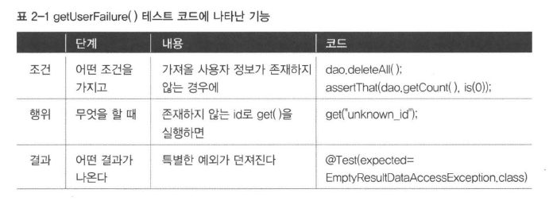

# 2장. 테스트
- 스프링의 핵심인 IoC 와 DI 는 `오브젝트 설계와 생성, 관계, 사용` 에 관한 기술이다
- 스프링은 복잡한 엔터프라이즈 애플리케이션을 효과적으로 개발하기 위한 기술이다
  - 복잡한 어플리케이션 개발하는데 필요한 도구 중 하나는 `객체지향 기술`
  - 또 다른 도구는 강조하고 있는 것은 `테스트` 
- 복잡해지는 애플리케이션에 대응하는 2가지 전략
  - **확장과 변화를 고려한 객체지향적 설계** + 그것을 효과적으로 담을 수 있는 IoC/DI 같은 기술
  - **테스트 기술** ; 만들어진 코드를 확신하게 해주며 변화에 유연하게 대처할 수 있는 자신감을 주는 기술

## 2.1. UserDaoTest 다시 보기
### 2.1.1. 테스트의 유용성
- 테스트란 결국 내가 예상하고 의도한 대로 코드가 정확히 동작하는 지 확인해서, **만든 코드를 확신할 수 있게** 해준다

### 2.1.2. UserDaoTest 의 특징
#### 웹을 통한 DAO 테스트 방법의 문제점
- DAO 뿐만 아니라 서비스 클래스, 컨트롤러, JSP 뷰 등 모든 레이어의 기능을 다 만들어야 테스트가 가능하다
- 다른 계층의 코드와 컴포넌트, 심지어 서버의 설정 상태까지 모두 테스트에 영향을 줄 수 있으므로, 이런 방식으로 테스트하는 것은 번거롭고, 오류가 있을 때 빠르고 정확하게 대응하기가 힘들다.

#### 작은 단위의 테스트
- 테스트는 가능하면 **작은 단위로 쪼개서** 집중해서 할 수 있어야 한다.
- 테스트의 관심이 다르다면 테스트할 대상을 분리하고 집중해서 접근해야 한다.
- `단위 테스트(unit test)` : 작은 단위의 코드에 대해 테스트를 수행한 것
>  DB가 사용되어도 단위테스트인가?
>  - 어떤 개발자는 테스트 중에 DB가 사용되면 단위 테스트가 아니라고도 한다. 
>  - 그럼 UserDaoTest는 단위 테스트가 아니라고 봐야 할까?
> 
> NO!
> - 지금까지 UserDaoTest를 수행할 때 매번 테이블의 내용을 비웠다.
> - **사용할 DB의 상태를 테스트가 관장하고 있다면** 단위 테스트라고 해도 된다. <br>
> <br>
> 다만, **통제할 수 없는 외부의 리소스에 의존하는 테스트**는 단위 테스트가 아니라고 보기도 한다.
- 단위 테스트를 하는 이유
  - 개발자가 설계하고 만든 코드가 **원래 의도대로 동작하는지 개발자 스스로 빨리 확인받기 위해서**
  - 확인의 대상과 조건이 간단하고, 명확할수록 좋다

#### 자동수행 테스트 코드
- 테스트는 자동으로 수행되도록 **코드로 만들어지는 것이 중요** 하다
- 자동으로 수행되는 테스트의 장점은 자주 `반복` 할 수 있다는 것이다
- 애플리케이션을 구성하는 클래스 안에 테스트 코드를 포함시키는 것보다는 **별도로 테스트용 클래스를 만들어서** 테스트 코드를 넣는 편이 낫다.

#### 지속적인 개선과 점진적인 개발을 위한 테스트
- 단순 무식한 방법으로 정상동작하는 코드를 만들고, 테스트를 통해 매우 작은 단계를 거쳐가면서 계속 코드를 개선할 수 있다
- 기존 기능 뿐만 아니라 새로운 기능을 추가할 때도 기대한 대로 동작하는 지 확인할 수 있다

### 2.1.3. UserDaoTest 의 문제점
```java
public class XmlUserDaoTest {
    public static void main(String[] args) throws SQLException, ClassNotFoundException {
        ApplicationContext applicationContext = new GenericXmlApplicationContext("spring/applicationContext.xml");
        UserDao userDao = applicationContext.getBean(UserDao.class);

        User user = new User();
        user.setId("12341234");
        user.setName("제이크22522");
        user.setPassword("jakejake");

        userDao.add(user);

        System.out.println(user.getId() + " register succeeded");

        User user2 = userDao.get(user.getId());
        System.out.println(user2.getName());
        System.out.println(user2.getPassword());

        System.out.println(user2.getId() + " query succeeded");
    }
}
```
- 수동 확인 작업의 번거로움
  - add()에서 User 정보를 DB에 등록하고, 이를 다시 get()을 이용해 가져왔을 때 입력한 값과 가져온 값이 일치하는지를 테스트 코드는 확인해주지 않는다.
- 실행 작업의 번거로움
  - 아무리 간단히 실행 가능한 main() 메소드라고 하더라도 매번 그것을 실행하는 것은 제법 번거롭다.
  - 만약 DAO가 수백 개가 되고 그에 대한 main() 메소드도 그만큼 만들어진다면 전체 기능을 테스트해보기 위해 main() 메소드를 수백 번 실행해야 한다.

## 2.2. UserDaoTest 개선
### 2.2.1. 테스트 검증의 자동화
- 모든 테스트는 성공과 실패의 두 가지 결과를 가질 수 있다.
  -  테스트 에러 : 테스트가 진행되는 동안에 `에러가 발생`해서 실패
  -  테스트 실패 : 테스트 작업 중에 에러가 발생하진 않았지만 그 `결과가 기대한 것과 다르게` 나옴
- 테스트 프레임워크를 통해 두 경우 모두 검증할 수 있다.

### 2.2.2. 테스트의 효율적인 수행과 결과 관리
#### JUnit 테스트로 전환
- 프레임워크는 개발자가 만든 클래스에 대한 제어 권한을 넘겨받아서 **주도적으로 애플리케이션의 흐름을 제어**한다.
- 개발자가 만든 클래스의 오브젝트를 생성하고 실행하는 일은 프레임워크에 의해 진행된다.
- 따라서 프레임워크에서 동작하는 코드는 main() 메소드도 필요 없고 오브젝트를 만들어 실행하는 코드도 필요 없다.

#### 테스트 메소드 전환
- 기존에 만들었던 main() 메소드 테스트는 제어권을 직접 가졌기에 프레임워크에 적용하기엔 적합하지 않다. 
- 테스트 코드를 main()에서 일반 메소드로 옮겨야 한다.
- JUnit 테스트 메소드 요구조건
  - 메소드가 public으로 선언돼야 한다.
  - 메소드에 @Test 애노테이션을 붙여줘야 한다.

#### 검증 코드 전환
- JUnit은 예외가 발생하거나 assertThat()에서 실패하지 않고 테스트 메소드의 실행이 완료되면 테스트가 성공했다고 인식한다.

#### JUnit 테스트 실행
- 테스트 에러 : JUnit은 assertThat()을 이용해 검증을 했을 때 기대한 결과가 아니면 이 AssertionError를 던진다
- 테스트 예외 : 테스트 수행 중에 일반 예외가 발생한 경우에도 테스트 수행은 중단되고 테스트는 실패한다
```java
public class UserDaoTest {
    @Test
    public void addAndGet() throws SQLException {
        ApplicationContext applicationContext = new GenericXmlApplicationContext("spring/applicationContext.xml");

        UserDao userDao = applicationContext.getBean(UserDao.class);

        User userToAdd = new User();
        userToAdd.setId("hunch");
        userToAdd.setName("헌치");
        userToAdd.setPassword("password");

        userDao.add(userToAdd);

        User userToGet = userDao.get("hunch");

        Assertions.assertEquals(userToAdd.getId(), userToGet.getId());
        Assertions.assertEquals(userToAdd.getName(), userToGet.getName());
        Assertions.assertEquals(userToAdd.getPassword(), userToGet.getPassword());
    }
}
```

## 2.3. 개발자를 위한 테스팅 프레임워크 JUnit
- 스프링 프레임워크 자체도 JUnit 프레임워크를 이용해 테스트하며 개발되었다
- 스프링의 핵심 기능 중 하나인 스프링 테스트 모듈도 JUit 을 이용한다

### 2.3.1. JUnit 테스트 실행 방법
- IDE
  - 매우 간단하고 직관적이며 소스와 긴밀하게 연동돼서 결과를 볼 수 있다.
- 빌드 툴
  - 여러 개발자가 만든 코드를 모두 통합해서 테스트를 수행해야 할 때도 있다.
  - 이 경우, 서버에서 모든 코드를 가져와 통합하고 빌드한 뒤에 테스트를 수행하는 것이 좋다.
  - 이때는 빌드 스크립트를 이용해 JUnit 테스트를 실행하고 그 결과를 메일 등으로 통보받는 방법을 사용하면 된다.

### 2.3.2. 테스트 결과의 일관성
- addAndGet() 테스트의 불편한점은 실행 전 수동으로 USER 테이블 내용을 모두 삭제해 줘야 하는 것이다
#### 동일한 결과를 보장하는 테스트
```java
@Test
    public void addAndGet() throws SQLException {
        ApplicationContext applicationContext = new GenericXmlApplicationContext("spring/applicationContext.xml");
        UserDao userDao = applicationContext.getBean(UserDao.class);

        // `deleteAll()`, `getCount()` 기능 동작 확인
        userDao.deleteAll();
        assertEquals(userDao.getCount(), 0);

        User userToAdd = new User();
        userToAdd.setId("jinkyu1");
        userToAdd.setName("진규");
        userToAdd.setPassword("password");
        userDao.add(userToAdd);
        // 유저가 있을 때, `getCount()` 기능 동작 확인
        assertEquals(userDao.getCount(), 1);

        User userToGet = userDao.get("jinkyu1");
        // 유저가 제대로 등록되었는지 확인
        assertEquals(userToAdd.getId(), userToGet.getId());
        assertEquals(userToAdd.getName(), userToGet.getName());
        assertEquals(userToAdd.getPassword(), userToGet.getPassword());

        // 유저가 있을 때, `deleteAll()`, `getCount()` 기능 동작 확인
        userDao.deleteAll();
        assertEquals(userDao.getCount(), 0);
    }
```
- deleteAll(), getCount() 메소드를 추가한다
- 단위테스트는 코드가 바뀌지 않는다면 **반복적으로 실행되어도 동일한 결과가 나올 수 있게** 해야 한다
- 테스트하기 전에 테스트 실행에 문제가 되지 않는 상태를 만들어주는 것이 더 좋다
- DB 에 남은 데이터와 같이, **외부 환경에 영향을 받지 말아야 하며**, 테스트 실행 순서를 변경해도 동일한 결과가 보장되어야 한다.

### 2.3.3. 포괄적인 테스트
- JUnit 은 특정한 테스트 메소드의 실행 순서를 보장해주지 않는다.
- 테스트 결과가 테스트 실행 순서에 영향을 받는다면 테스트가 잘못 만들어진 것이다.
- 모든 테스트는 **실행 순서에 상관없이 독립적으로 항상 동일한 결과를 내야 한다**
- JUnit 은 예외 발생 여부를 테스트할 수 있는 방법을 제공한다
  - expected 엘리먼트에 **테스트 메소드 실행 중 발생하리라 기대하는 예외 클래스를 넣어준다**
```java
@Test(expected = EmptyResultDataAccessException.class)
public void getUserFailure () throws SQLException {
  ...
}
```
- 테스트를 작성할 때 **부정적인 케이스를 먼저 만드는** 습관을 통해 예외적인 상황을 빠뜨리지 않아야 한다.

### 2.3.4. 테스트가 이끄는 개발

- 테스트 코드는 잘 작성된 하나의 기능정의서처럼 보인다.
- 이런식으로 추가하고 싶은 기능을 테스트 코드로 표현해서, **코드로 된 설계문서**를 만든다고 생각해보자.
- 그 후에 실제 기능을 가진 애플리케이션 코드를 만들면, 작성해두었던 테스트를 실행해서 설계한 대로 코드가 동작하는지 빠르게 검증할 수 있다.
- 테스트가 실패하면, **설계한 대로 코드가 만들어지지 않았음**을 알 수 있다.

#### 테스트 주도 개발
- TDD의 기본원칙 : 실패한 테스트를 성공시키기 위한 목적이 아닌 코드는 만들지 않는다
- TDD 는 테스트 작성시간과 애플리케이션 코드 작성 시간의 간격이 짧아지게 해준다
- TDD 에서는 테스트를 작성하고, 이를 성공시키는 코드를 만드는 **작업 주기를 가능한 한 짧게 가져가는 것을 권장** 한다
  - UserDao 예시에서 코드 수정 - 테스트 검증 작업은 길어야 10분 정도면 충분했다
  - 따라서 TDD 를 하면 자연스럽게 `단위 테스트` 를 만들 수 있다
- 테스트는 코드 작성 후에 가능한 빨리 실행할 수 있어야 하므로, 테스트 없이 한 번에 너무 많은 코드를 만드는 것은 좋지 않다
- 테스트를 작성하면, 오류를 빨리 잡아낼 수 있어 전체적인 개발 속도는 오히려 빨라진다.

### 2.3.5. 테스트 코드 개선
- JUnit이 하나의 테스트 클래스를 가져와 테스트를 수행하는 방식
1. 테스트 클래스에서 @Test가 붙은 public이고 void형이며 파라미터가 없는 테스트 메소드를 모두 찾는다.
2. 테스트 클래스의 오브젝트를 하나 만든다.
3. @Before가 붙은 메소드가 있으면 실행한다.
4. @Test가 붙은 메소드를 하나 호출하고 테스트 결과를 저장해둔다.
5. @After가 붙은 메소드가 있으면 실행한다.
6. 나머지 테스트 메소드에 대해 2~5번을 반복한다.
7. 모든 테스트의 결과를 종합해서 돌려준다.

- JUnit 은 @Test 가 붙은 메소드 실행 전, 후에 각각 @Before, @After 가 붙은 메소드를 자동 실행한다
- 하나의 테스트 클래스 안에 있는 테스트 메소드들은 **공통적인 준비 작업과 정리 작업이 필요**한 경우가 많다. 
- 이런 작업들을 @Before, @After가 붙은 메소드에 넣어두면 JUnit이 자동으로 메소드를 실행해주니 매우 편리하다.
- 대신 @Before나 @After 메소드를 테스트 메소드에서 **직접 호출하지 않기 때문에** 서로 주고받을 **정보나 오브젝트가 있다면** `인스턴스 변수`를 이용해야 한다.
- 각 테스트 메소드 실행할 때마다 **테스트 클래스의 오브젝트를 새로 만들며**, 한번 만들어진 오브젝트는 하나의 테스트 메소드 사용하고 나면 버려진다.
- 왜 테스트 메소드를 실행할 때마다 새로운 오브젝트를 만드는 것일까? 그냥 테스트 클래스마다 하나의 오브젝트만 만들어놓고 사용하는 편이 성능도 낫고 더 효율적이지 않을까?
  - 각 테스트가 **서로 영향을 주지 않고 독립적으로 실행됨을 확실히 보장해주기 위해** 매번 새로운 오브젝트를 만들게 했다.
- 테스트 메소드 일부에서만 공통으로 사용되는 코드가 있다면, 일반적인 **메소드 추출 방법** 을 사용하여 메소드를 분리하고, 테스트 메소드에서 **직접 호출해 사용** 하도록 만드는 게 좋다
  - 아니면, 아예 공통 특징을 가진 테스트 메소드를 모아 별도의 테스트 클래스로 만드는 것도 좋다
- 픽스처 : 테스트를 수행하는 데 필요한 정보나 오브젝트
  - 여러 테스트에서 반복적으로 사용되기 때문에 @Before 메소드를 이용해 생성해두면 편리하다.

## 2.4. 스프링 테스트 적용
```java
public class UserDaoTest {
  private UserDao dao;

  @Before
  public void setUp() {
    ApplicationContext context = new GenericXmlApplicationContext("applicationContext.xml");
    this.dao = context.getBean("userDao", UserDao.class);
  }
}
```
- @Before 메소드가 테스트 메소드 개수만큼 반복되기 때문에 애플리케이션 컨텍스트도 세 번 만들어진다. 
- 빈이 많아지고 복잡해지면 애플리케이션 컨텍스트 생성에 적지 않은 시간이 걸릴 수 있다.
  - 애플리케이션 컨텍스트 생성 시 **모든 싱글톤 빈 오브젝트를 초기화** 하기 때문이다.
  - 어떤 빈은 독자적으로 많은 리소스를 할당하거나 독립적인 스레드를 띄우기도 하기 때문이다.
- 테스트 후 컨텍스트 내의 빈이 할당한 리소스를 깔끔하게 정리해주지 않으면, 다음 테스트에서 문제가 발생할 수 있다.
- 테스트는 **가능한 한 독립적으로 매번 새로운 오브젝트를 만들어서 사용하는 것이 원칙이다**. 
  - 하지만 애플리케이션 컨텍스트처럼 생성에 많은 시간과 자원이 소모되는 경우에는 **테스트 전체가 공유하는 오브젝트를 만들기도 한다.**
  - 애플리케이션 컨텍스트는 초기화 후 내부 상태가 변하는 일이 거의 없다.
    - 빈은 싱글톤으로 만들어져서 상태를 가지지 않는다.
    - DB 상태는 각 테스트에서 관리한다.
  - 따라서 한번만 만들고, 여러 테스트가 공유해서 사용해도 된다.
- 문제는 JUnit이 매번 테스트 클래스의 오브젝트를 새로 만든다는 점이다. 
  - 따라서 **여러 테스트가 함께 참조할 애플리케이션 컨텍스트를 오브젝트 레벨에 저장해두면 곤란하다.**
  - JUnit 은 테스트 클래스 전체에 걸쳐 딱 1번만 실행되는 @BeforeClass 스태틱 메소드를 지원하긴 하지만, 스프링이 직접 제공하는 애플리케이션 컨텍스트 테스트 지원 기능을 사용하는 것이 더 편하다

### 2.4.1. 테스트를 위한 애플리케이션 컨텍스트 관리
#### 스프링 테스트 컨텍스트 프레임워크 적용
- 스프링은 **JUnit을 이용하는 테스트 컨텍스트 프레임워크를 제공**한다. 
- 따라서 애플리케이션 컨텍스트를 만들어서 모든 테스트가 공유하게 할 수 있다.
```java
// @Runwith(SpringJUnit4ClassRunner.class) (JUnit4)
@ExtendWith(SpringExtension.class) // (JUnit5)
@ContextConfiguration(locations="/spring/applicationContext.xml")
public class UserDaoTest {
    @Autowired 
    ApplicationContext applicationContext;

    UserDao userDao;

    @BeforeEach
    public void setUp() {
        this.userDao = this.applicationContext.getBean("userDao", UserDao.class);
    }
}
```
위와 같이 코드를 작성하면, spring-test 의존성이 테스트에서 사용할 ApplicationContext 하나를 만들고, 공유하도록 지정할 수 있다.

- @RunWith는 JUnit 프레임워크의 테스트 실행 방법을 확장할 때 사용한다.
  - SpringJUnit4ClassRunner라는 JUnit용 테스트 컨텍스트 프레임워크 확장 클래스를 지정해주면 **JUnit은 테스트가 사용할 애플리케이션 컨텍스트를 만들고 관리하는 작업** 을 해준다.
- @ExtendWith는 JUnit5에서 테스트 클래스를 확장할 때 쓰이는 애노테이션이다.
- @ContextConfiguration은 locations라는 엘리먼트를 통해 **ApplicationContext에 사용될 xml파일의 위치를 지정**해줄 수 있다.
- 스프링의 JUnit 확장 기능은 **테스트 실행 전 딱 1번만 애플리케이션 컨텍스트를 만들어두고**, 테스트 오브젝트 생성마다 특별한 방법을 이용해 애플리케이션 컨텍스트를 테스트 오브젝트의 특정 필드에 주입하는 것이다.

#### 테스트 클래스의 컨텍스트 공유
- 하나의 테스트 클래스 내에서 애플리케이션 컨텍스트를 공유해주는 게 전부가 아니다.
- 여러 개 테스트 클래스가 있을 때, `모두 같은 설정 파일을 가진` 애플리케이션 컨텍스트를 사용한다면, **테스트 클래스 사이에서도 애플리케이션 컨텍스트를 공유하게 해준다** 
```java
@Runwith(SpringJUnit4ClassRunner.class) 
@ContextConfiguration(locations="/spring/applicationContext.xml")
public class UserDaoTest { ... }

@Runwith(SpringJUnit4ClassRunner.class) 
@ContextConfiguration(locations="/spring/applicationContext.xml")
public class GroupDaoTest { ... }
```

#### @AutoWired
- @AutoWired가 붙은 인스턴스 변수가 있으면, 테스트 컨텍스트 프레임워크는 **변수 타입과 일치하는 컨텍스트 내의 빈을 찾고, 타입이 일치하는 빈이 있으면 인스턴스 변수에 주입한다.**
- 스프링 애플리케이션 컨텍스트는 초기화할 때 **자기 자신도 빈으로 등록**한다. 
  - 따라서 애플리케이션 컨텍스트에는 ApplicationContext 타입의 빈이 존재하며 당연히 DI도 가능하다.
  - @AutoWired는 생성자, 수정자 등의 메소드 없이 주입이 가능한데, 이를 `자동 와이어링` 이라고 한다.
- @AutoWired는 `타입을 기준`으로 어떤 빈을 가져올지 결정한다. 
  - DataSource를 주입받으려고 하는데, DataSource 타입의 빈이 두개 이상 등록되어 있어 중복되는 경우, **이름으로 빈을 검색**한다.
  - 변수명으로도 빈을 찾을 수 없다면 예외가 발생한다
- 테스트에서 **빈을 사용하고 싶은 용도에 따라 인터페이스 타입으로 받을지, 클래스 타입으로 받을지 결정**하면 된다.
  - 구체 클래스 자체에 관심이 있을 수도 있으므로, 테스트는 필요하다면 얼마든 애플리케이션 클래스와 밀접하게 연관되어 있어도 된다.
  - 하지만 꼭 필요하지 않다면, 가능한 인터페이스를 사용해서 애플리케이션 코드와 느슨한 연결을 하는게 좋다

### 2.4.2. DI 와 테스트
> SimpleDriverDataSource를 생성하고 사용하면 안 될까? <br>NO! 인터페이스를 두고 DI를 적용해야 한다.

- 소프트웨어 개발에서 절대로 바뀌지 않는 것은 없기 때문이다.
- 클래스의 구현 방식은 바뀌지 않는다고 하더라도 인터페이스를 두고 DI를 적용하게 해두면 **다른 차원의 서비스 기능을 도입**할 수 있기 때문이다.
- 테스트 때문이다. 
  - 자동으로 실행 가능하며 빠르게 동작하도록 테스트 코드를 만들려면 `가능한 한 작은 단위의 대상에 국한`해서 테스트해야 한다. 
  - **DI는 테스트가 작은 단위의 대상에 대해 독립적으로 만들어지고 실행되게** 한다.

#### 테스트 코드에 의한 DI

> 테스트할 때 운영용 DataSource를 이용하면 안된다! <br>
UserDaoTest를 실행하는 순간 deleteAll()에 의해 운영용 DB의 사용자 정보가 모두 삭제된다.  <br>
그렇다고 applicationContext.xml 설정을 수정하는 방법도 있겠지만, 번거로우며 위험할 수 있다.  <br>
DI를 이용해서 테스트 중에 DAO가 사용할 DataSource 오브젝트를 바꿔주자!

- 테스트 코드에 의한 DI 를 이용해서, 테스트용 DB에 연결해주는 DataSource를 **테스트 내에서 직접 만들면** 된다.
```java
@DirtiesContext
public class UserDaoTest {
  @Autowired
  UserDao dao;

  @Before
  public void setUp() {
    // 테스트에서 사용할 DataSource 오브젝트 직접 생성
    DataSource dataSource = new SingleConnectionDataSource(
      "jdbc:postgresql://localhost/test", "postgres", "password", true
    );
    dao.setDataSource(dataSource); // 코드에 의한 수동 DI
  }
}
```
- 장점
  - **XML 설정파일을 수정하지 않고도** 테스트 코드를 통해 **오브젝트 관계를 재구성**할 수 있다.
  - 예외적인 상황을 만들기 위해 일부러 엉뚱한 오브젝트를 넣거나, 위와 같이 테스트용으로 준비된 오브젝트를 사용하게 할 수 있다.
- 주의사항
  - 이미 애플리케이션 컨텍스트에서 applicationContext.xml 파일의 설정정보를 따라 구성한 오브젝트를 가져와서, 의존관계를 강제로 변경하기 때문에 주의해야 한다.
- @DirtiesContext
  - 스프링의 테스트 컨텍스트 프레임워크에게 **해당 클래스의 테스트에서 애플리케이션 컨텍스트의 상태를 변경한다는 것**을 알려준다.
  - 테스트 컨텍스트는 이 애노테이션이 붙은 테스트 클래스에는 **애플리케이션 컨텍스트 공유를 허용하지 않는다.**
  - 메소드를 수행하면, 매번 **새로운 애플리케이션 컨텍스트를 만들어서** 다음 테스트에서 사용하게 해준다.
  - 클래스에도 적용할 수 있지만, 메소드 레벨로도 적용할 수 있다.

#### 테스트를 위한 별도의 DI 설정
- 아예 테스트에서 사용될 DataSource 클래스가 빈으로 정의된 **테스트 전용 설정파일을 따로 만들어두는 방법**을 이용해도 된다.
- 2가지 설정파일을 만들어서 하나에는 서버에서 운영용으로 사용할 DataSource를 빈으로 등록해두고, 다른 하나에는 테스트에 적합하게 준비된 DB를 사용하는 가벼운 DataSource가 빈으로 등록되게 만드는 것이다.
- 테스트에서는 항상 테스트 전용 설정파일만 사용하게 해주면 된다.
  ```java
  @Runwith(SpringJUnit4ClassRunner.class) 
  @ContextConfiguration(locations="/test-applicationContext.xml")
  public class UserDaoTest { ... }
  ```

#### 컨테이너 없는 DI 테스트
- 아예 스프링 컨테이너를 사용하지 않고 테스트를 만들 수도 있다.
```java
public class UserDaoTest {
  UserDao dao;

  @Before
  public void setUp() {
    //...
    dao = new UserDao();
    DataSource = new SingleConnectionDataSource(
      "jdbc:postgresql://localhost/test", "postgres", "password", true
    );
    dao.setDataSource(dataSource);
  }
}
```
- 장점
  - 애플리케이션 컨텍스트를 아예 사용하지 않으니 코드는 더 단순해지고 이해하기 편하다.
  - 애플리케이션 컨텍스트가 만들어지는 번거로움이 사라져서 그만큼 테스트시간도 절약할 수 있다.
- 단점
  - 테스트를 위한 DataSource를 직접 만드는 번거로움이 있다.
  - 매번 새로운 테스트 오브젝트를 만들기 때문에 매번 새로운 UserDao 오브젝트가 만들어진다.

- DI는 객체지향 프로그래밍 스타일이다. 
  - 따라서 **DI를 위해 컨테이너가 반드시 필요한 것은 아니다.**
  - DI 컨테이너나 프레임워크는 DI를 편하게 적용하도록 도움을 줄 뿐, 컨테이너가 DI를 가능하게 해주는 것은 아니다.

- 비침투적 기술
  - 애플리케이션 로직을 담은 코드에 아무런 영향을 주지 않고 적용이 가능하다.
  - 따라서 `기술에 종속적이지 않은` 순수한 코드를 유지할 수 있게 해준다.
  - 스프링은 이런 비침투적인 기술의 대표적인 예다. 그래서 스프링 컨테이너 없는 DI 테스트도 가능한 것이다.

#### DI를 이용한 테스트 방법 선택

- 항상 **스프링 컨테이너 없이 테스트할 수 있는 방법을 가장 우선적으로 고려하자.**
  - 이 방법이 테스트 수행 속도가 가장 빠르고 테스트 자체가 간결하다.
  - 테스트를 위해 필요한 오브젝트의 생성과 초기화가 단순하다면 이 방법을 가장 먼저 고려해야 한다.
- 여러 오브젝트와 **복잡한 의존관계를 갖고 있는** 오브젝트를 테스트해야 할 경우에는 **스프링의 설정을 이용한 DI 방식의 테스트를 이용**하면 편리하다.
- 테스트에서 애플리케이션 컨텍스트를 사용하는 경우에는 **테스트 전용 설정파일을 따로 만들어 사용**하는 편이 좋다.
- 테스트 설정을 따로 만들었다고 하더라도 때로는 **예외적인 의존관계를 강제로 구성**해서 테스트해야 할 경우가 있다. 
  - 이때는 컨텍스트에서 DI 받은 오브젝트에 다시 **테스트 코드로 수동 DI** 해서 테스트하는 방법을 사용하면 된다.

## 2.5. 학습 테스트로 배우는 스프링
- 학습테스트 : 자신이 만들지 않은 프레임워크나 다른 개발팀에서 만들어 제공한 라이브러리에 대한 테스트
  - 자신이 사용할 **API 나 프레임워크의 기능을 테스트로 보면서 사용법을 익히는 것이 목적** 이다.
  - 프레임워크나 기능에 대한 검증이 목적이 아님
  - 테스트를 만들려고 하는 기술, 기능에 대해 얼마나 제대로 이해하고 있는지 사용법을 바로 알고 있는지 검증하는 것이 목적이다.
  - 테스트 코드를 작성하며 빠르고 정확하게 사용법을 익히는 것도 목적이다.

### 2.5.1. 학습 테스트의 장점
- 다양한 조건에 따른 기능을 손쉽게 확인해볼 수 있다.   
  - 학습 테스트는 자동화된 테스트 코드로 만들어지기 때문에 다양한 조건에 따라 기능이 어떻게 동작하는지 빠르게 확인할 수 있다.
- 학습 테스트 코드를 개발 중에 참고할 수 있다.
  - 다양한 기능과 조건에 대한 테스트 코드를 개별적으로 만들고 남겨둘 수 있어서, 실제 개발에서 샘플 코드로 참고할 수 있다
  - 익숙하지 않은 기술을 사용해야 할 때 미리 만들어진 다양한 기능에 대한 테스트코드는 좋은 참고 자료가 된다
- 프레임워크나 제품을 업그레이드할 때 호환성 검증을 도와준다.    
  - 기존에 사용했던 API나 기능에 변화가 있거나 업데이트된 제품에 버그가 있다면, 학습 테스트를 통해 미리 확인할 수가 있다.
  - 버그가 있어서 테스트가 실패하면 업그레이드 일정을 늦추거나, API 사용 방법에 변화가 발생한 경우라면 그에 맞춰서 애플리케이션 코드를 수정할 계획을 세울 수 있다.
- 테스트 작성에 대한 좋은 훈련이 된다.
- 새로운 기술을 공부하는 과정이 즐거워진다.