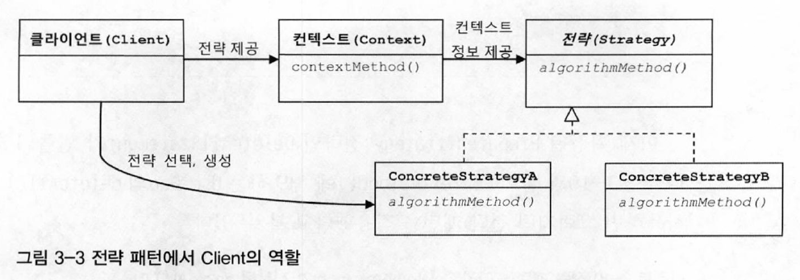
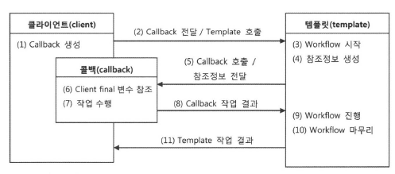

# 3장. 템플릿
- 개방 폐쇄 원칙(OCP) 은 코드에서 어떤 부분은 변경을 통해 그 기능이 다양해지고 확장하려는 성질이 있고, 어떤 부분은 고정되어 있고 변하지 않으려는 성질이 있음을 말해준다.
- 템플릿이란 변경이 거의 일어나지 않으며 일정한 패턴으로 유지되는 특성을 가진 부분을, **자유롭게 변경되는 부분으로부터 독립시켜서** 효과적으로 활용할 수 있게 하는 방법

## 3.1. 다시 보는 초난감 DAO
### 3.1.1. 예외처리 기능을 갖춘 DAO
```java
public void deleteAll() throws SQLException {
    Connection c = dataSource.getConnection();

    PreparedStatement ps = c.preparedStatement("delete from users");
    ps.executeUpdate();     //  여기서 예외가 발생하면 바로 메소드 실행이 중단되면서 DB 커넥션이 반환되지 못한다.

    ps.close();
    c.close();
}
```
- DB 풀은 매번 getConnection()으로 가져간 **커넥션을 명시적으로 close()해서 돌려줘야지 다시 풀에 넣었다가 다음 커넥션 요청이 있을 때 재사용**할 수 있다. 
- 그런데 오류가 날 때마다 미처 반환되지 못한 Connection이 계속 쌓이면 어느 순간에 커넥션 풀에 여유가 없어지고 리소스가 모자란다는 심각한 오류를 내며 서버가 중단될 수 있다.
- 리소스 반환과 close()
  - 단순히 생각하면 만들어진 것을 종료한다고 볼 수도 있지만, 보통 `리소스를 반환` 한다는 의미로 이해하면 좋다
  - 미리 정해진 풀 안에 **제한된 수의 리소스 (Connection, Statement) 를 만들어 두고 필요할 때 이를 할당하고, 반환하면 다시 풀에 넣는 방식으로 운영** 된다.
  - 매번 새로운 리소스를 생성하는 대신, 풀에 미리 만들어둔 리소스를 돌려가며 사용하는 게 훨씬 유리하다
  - 대신, 사용한 리소스는 **빠르게 반환** 해야 한다.
  - close() 메소드는 사용한 리소스를 풀로 다시 돌려주는 역할을 한다.
- 예외사항에서도 리소스를 제대로 반환할 수 있도록 try/catch/finally 구문 사용을 권장하고 있다
```java
public void deleteAll() throws SQLException {
    Connection c = null;
    PreparedStatement ps = null;
    
    try {
        c = dataSource.getConnection();
        ps = c.prepareStatement("delete from users");
        ps.executeUpdate();     //  예외가 발생할 수 있는 코드를 모두 try 블록으로 묶어준다.
    } catch (SQLException e) {
        throw e;        
    } finally {  //  finally이므로 try 블록에서 예외가 발생했을 떄나 안 했을 때나 모두 실행된다.
        if (ps != null) {
            try {
                ps.close();
            } catch (SQLException e) {} //  ps.close() 메소드에서도 SQLException이 발생할 수 있기 때문에 잡아줘야한다.
        }
        if (c != null) {
            try {
                c.close();
            } catch (SQLException e) {}
        }
    }
}
```
- 어느 시점에서 예외가 발생했는지에 따라서 close()를 사용할 수 있는 변수가 달라질 수 있기 때문에 finally에서는 반드시 c와 ps가 null이 아닌지 먼저 확인한 후에 close() 메소드를 호출해야 한다.
- 문제는 이 close()도 SQLException이 발생할 수 있는 메소드이므로, try/catch 문으로 처리해줘야 한다.
#### JDBC 조회 기능의 예외처리
- 조회를 위한 JDBC 코드에는 Connection, PreparedStatement 외에도 ResultSet 이 추가된다.
- 만들어진 ResultSet 을 close 하는 구문이 추가되며, **close() 는 만들어진 순서의 반대로 하는 게 원칙이다**
```java
public void deleteAll() throws SQLException {
    Connection c = null;
    PreparedStatement ps = null;
    ResultSet rs = null;

    try {
        c = dataSource.getConnection();
        ps = c.prepareStatement("delete from users");
        rs.executeQuery();
        rs.next();
        return rs.getInt(1);
    } catch (SQLException e) {
        throw e;        
    } finally {  //  finally이므로 try 블록에서 예외가 발생했을 떄나 안 했을 때나 모두 실행된다.
        if (rs != null) {
            try {
                ps.close();
            } catch (SQLException e) {}
        }
        if (ps != null) {
            try {
                ps.close();
            } catch (SQLException e) {}
        }
        if (c != null) {
            try {
                c.close();
            } catch (SQLException e) {}
        }
    }
}
```

## 3.2. 변하는 것과 변하지 않는 것
### 3.2.1. JDBC try/catch/finally 코드의 문제점
- 복잡한 try/catch/finally 블록이 2중 중첩인데다 모든 메소드마다 반복된다.

### 3.2.2. 분리와 재사용을 위한 디자인 패턴 적용
- 핵심은 변하지 않는, 그러나 많은 곳에서 중복되는 코드와 로직에 따라 자주 확장되고 자주 변하는 코드를 잘 분리해내는 것이다.

```java
public class UserDao {
    public void add(User user) throws ClassNotFoundException, SQLException {
		Connection c = null;

		PreparedStatement ps = null;

        try {
            c = datasource.getConnection();
            ps = c.prepareStatement("delete from users") // 이 부분만 변하는 부분 -> makeStatement 로 추출
        } catch (SQLException e) {
            throw e;
        } finally {
            if (ps != null) {
                try {
                    ps.close();
                } catch (SQLException e) {

                }
            }
            
            if (c != null) {
                try {
                    c.close();
                } catch (SQLException e) {

                }
            }
        }
	}
}
```
#### 템플릿 메소드 패턴의 적용
- 템플릿 메소드 패턴 : `상속` 을 통해 기능을 확장해서 사용하기
  - 변하지 않는 부분을 슈퍼클래스에, 변하는 부분을 `추상 메소드` 로 정의해서 서브클래스에서 오버라이드하여 새롭게 정의하여 쓰도록 함
```java
abstract protected PreparedStatement makeStatement(Connection c) throws SQLException;

public class UserDaoDeleteAll extends UserDao {
    protected PreparedStatement makeStatement(Connection c) throws SQLException {
        PreparedStatement ps = c.preparedStatement("delete from users");
        return ps;
    }
}
```
- UserDao 클래스의 기능을 확장하고 싶을 때마다 상속을 통해 자유롭게 확장 가능하며, 확장 때문에 기존의 상위 DAO 클래스에 불필요한 변화는 생기지 않는다.
- 따라서 객체지향 설계의 핵심 원리인 개방 폐쇄 원칙(OCP)을 그럭저럭 지키는 구조를 만들어낼 수 있다.
- 단점
  - DAO 로직마다 상속을 통해 새로운 클래스를 만들어야 하는 단점이 있다.
  - **확장 구조가 클래스 설계시점에 고정** 된다.
    - 컴파일 시점에 PreparedStatement 를 담고 있는 서브 클래스와 try/catch/finally 블록간의 관계가 이미 결정되어 있으므로 **관계에 대한 유연성이 떨어진다**

#### 전략 패턴의 적용
- 전략 패턴
  - 개방 폐쇄 원칙의 실현에도 가장 잘 들어맞는 패턴
  - 자신의 기능 맥락(context) 에서, 필요에 따라 **변경이 필요한 알고리즘 (독립적인 책임으로 분리 가능한 기능)을 인터페이스를 통해 통째로 외부로 분리시키고, 이를 구현한 구체적인 알고리즘을 필요에 따라 바꿔서 사용** 할 수 있게 하는 디자인 패턴 -> 전략을 바꾼다! 라고 생각
    - PreparedStatement 를 만들어주는 부분이 전략패턴에서 말하는 `전략`
    - 인터페이스의 메소드를 통해 PreparedStatement 생성 전략을 호출해주면 된다
```java
public interface StatementStrategy {
    PreparedStatement makePreparedStatement(Connection c) throws SQLException;
}

public class DeleteAllStatement implements StatementStrategy {
    protected PreparedStatement makeStatement(Connection c) throws SQLException {
        PreparedStatement ps = c.preparedStatement("delete from users");
        return ps;
    }
}

public void deleteAll() throws SQLException {
    ...
    try {
        c = dataSource.getConnection();

        StatementStrategy strategy = new DeleteAllStatement();  
        //  전략 클래스가 DeleteAllStatement로 고정됨으로써 OCP 개방 원칙에 맞지 않게 된다.
        ps = starategy.makePreparedStatement(c);

        ps.executeUpdate();
    } catch (SQLException e) {...}
}
```
- 하지만 전략패턴은 필요에 따라 `컨텍스트는 그대로 유지` 하면서, 전략을 `바꿔 사용` 가능한데, 위의 코드는 이미 컨텍스트 내에서 전략 클래스가 고정되어 있어서 이상하다

#### DI 적용을 위한 클라이언트/컨텍스트 분리
- 전략 패턴에 따르면 Context가 **어떤 전략을 사용하게 할 것인가**는 Context를 사용하는 **앞단의 Client가 결정**하는 게 일반적이다.
  - Client 가 구체적인 전략을 선택하고 오브젝트로 만들어 Context (변하지 않는 부분) 에 전달 
  - Context 는 전달받은 Strategy 구현 클래스의 오브젝트를 사용

- 컨텍스트에 해당하는 부분을 별도 메소드로 독립시킨다.
- 클라이언트는 전략클래스의 오브젝트를 컨텍스트 메소드 (jdbcContextWithStatementStrategy) 호출하며 전달해야 하므로, 전략 인터페이스 (StatementStrategy) 를 컨텍스트 메소드 파라미터로 지정한다.
```java
public class DeleteAllStatement implements StatementStrategy {
    protected PreparedStatement makeStatement(Connection c) throws SQLException {
        PreparedStatement ps = c.preparedStatement("delete from users");
        return ps;
    }
}

public void jdbcContextWithStatementStrategy(StatementStrategy stmt) throws SQLException {
    Connection c = null;
    PreparedStatement ps = null;

    try {
        c = dataSource.getConnection();
        ps = stmt.makePreparedStatement(c);
        ps.executeUpdate();
    } catch (SQLException e) {
        throw e;
    } finally {
        if (ps != null) { try { ps.close(); } catch (SQLException e) }
        if (c != null) { try { c.close(); } catch (SQLException e) }
    }
}
```
- 클라이언트로부터 StatementStrategy 타입의 전략 오브젝트를 제공받고 try/catch/finally 구조로 만들어진 컨텍스트 내에서 작업을 수행한다.
- **클라이언트에서는 전략 오브젝트를 생성하고, 컨텍스트를 호출한다**
```java
public void deleteAll() throws SQLException {
    StatementStrategy st = new DeleteAllStatement();    //  선정한 전략 클래스의 오브젝트 생성
    jdbcContextWithStatementStrategy(st);               //  컨텍스트 호출. 전략 오브젝트 주입
}
```
- 클라이언트가 컨텍스트가 사용할 전략을 정해서 결정한다는 점에서 DI 구조로 이해할 수도 있다.
- DI 의 가장 중요한 개념은 제 3자 (Client) 의 도움을 통해 두 오브젝트 (전략과 컨텍스트 메소드) 사이의 유연한 관계가 설정되도록 만드는 것이다.

## 3.3. JDBC 전략 패턴의 최적화
- 컨텍스트는 PreparedStatement 를 실행하는 `JDBC 작업 흐름` 이고, 전략은 `PreparedStatement 를 생성`하는 것이다.

### 3.3.2. 전략과 클라이언트의 동거
- 이전의 개선된 코드가 가진 2가지 문제점
  - DAO 메소드마다 새로운 StatementStrategy 구현 클래스를 만들어야 한다.
  - DAO 메소드에서 StatementStrategy에 전달할 User와 같은 부가적인 정보가 있는 경우, 이를 전달하고 저장해 둘 생성자와 인스턴스 변수를 번거롭게 만들어야 한다.
```java
public class UserDao {
	private ConnectionMaker connectionMaker;
	
	public UserDao() {
		this.connectionMaker = new DConnectionMaker();
	}

	public void add(User user) throws ClassNotFoundException, SQLException {
		Connection c = this.connectionMaker.getConnection();
	}
```
- StatementStrategy 전략 클래스를 매번 독립된 파일로 만들지 말고 **UserDao 클래스 안에 내부 클래스로 정의**해버리면 클래스 파일이 많아지는 문제는 해결할 수 있다.
```java
public class UserDao {
	private ConnectionMaker connectionMaker;
	
	public UserDao() {
		this.connectionMaker = new DConnectionMaker();
	}

	public void add(User user) throws ClassNotFoundException, SQLException {
        class AddStatement implements StatementStrategy {   //  add() 메소드 내부에 선언된 로컬 클래스
            User user;

            public AddStatement(User user) {
                this.user = user;
            }

            public PreparedStatement makePreparedStatement(Connection c) throws SQLException {
                PreparedStatement ps = c.prepareStatement("insert into users(id, name, password) values(?,?,?)");
                ps.setString(1, user.getId());
                ps.setString(2, user.getName();
                ...
                return ps;
            }
        }
        StatementStrategy st = new AddStatement(user);
        jdbcContextWithStatementStrategy(st);
	}  
}
```
- 로컬 클래스로 만들어두니, 내부 클래스의 특징을 이용해 **자신이 정의된 메소드의 로컬 변수에 직접 접근 가능**하다.
  - 즉, add() 메소드 내에 AddStatement 클래스를 정의하면 번거롭게 생성자를 통해 User 오브젝트를 전달해줄 필요가 없다.
  - 따라서 AddStatement 클래스가 정의된 add 메소드의 user 라는 메소드 파라미터 (일종의 로컬변수) 에 접근할 수 있다.
  - 다만, **내부 클래스에서 외부 변수 사용할 때는 외부 변수를 반드시 final 로 선언** 해줘야 한다.
```java
public class UserDao {
	private ConnectionMaker connectionMaker;
	
	public UserDao() {
		this.connectionMaker = new DConnectionMaker();
	}

	public void add(final User user) throws ClassNotFoundException, SQLException {
        class AddStatement implements StatementStrategy {   
            public PreparedStatement makePreparedStatement(Connection c) throws SQLException {
                PreparedStatement ps = c.prepareStatement("insert into users(id, name, password) values(?,?,?)");
                ps.setString(1, user.getId()); // 내부 클래스에서 외부의 메소드 로컬 변수에 직접 접근 가능
                ps.setString(2, user.getName();
                ...
                return ps;
            }
        }
        StatementStrategy st = new AddStatement(); // 생성자 파라미터로 user 전달 불필요
        jdbcContextWithStatementStrategy(st);
	}  
}
```

#### 익명 내부 클래스
- AddStatement 클래스는 add() 메소드에서만 사용할 용도로 만들어져서, 간결하게 클래스명도 제거할 수 있다.
- 클래스 선언과 동시에 오브젝트를 생성한다.
- 클래스를 **재사용할 필요가 없고**, 구현한 인터페이스 타입으로만 사용할 경우에 유용하다
`new 인터페이스 이름() { 클래스 본문 };`
```java
// AS-IS
class AddStatement implements StatementStrategy {   
    public PreparedStatement makePreparedStatement(Connection c) throws SQLException {
        PreparedStatement ps = c.prepareStatement("insert into users(id, name, password) values(?,?,?)");
        ps.setString(1, user.getId()); // 내부 클래스에서 외부의 메소드 로컬 변수에 직접 접근 가능
        ps.setString(2, user.getName();
        ...
        return ps;
    }
}
StatementStrategy st = new AddStatement(); // 생성자 파라미터로 user 전달 불필요
jdbcContextWithStatementStrategy(st);

// TO-BE
StatementStrategy st = new StatementStrategy() {
    public PreparedStatement makePreparedStatement(Connection c) throws SQLException {
        PreparedStatement ps = c.prepareStatement("insert into users(id, name, password) values(?,?,?)");
        ps.setString(1, user.getId()); 
        ps.setString(2, user.getName();
        ...
        return ps;
    }
}
```
- 위와 같이 만들어진 익명 내부 클래스 오브젝트는 딱 1번만 사용하기에 변수에 담지말고, jdbcContextWithStatementStrategy() 메소드 파라미터에서 바로 생성하는 게 낫다.
```java
public void add(final User user) throws SQLException {
    jdbcContextWithStatementStrategy(
        new StatementStrategy() {
            public PreparedStatement makePreparedStatement(Connection c) throws SQLException {
                PreparedStatement ps = c.prepareStatement("insert into users(id, name, password) values(?,?,?)");
    
                ps.setString(1, user.getId());
                ps.setString(2, user.getName();
                ...
                return ps;
            }
        }
    );
}
```

## 3.4. 컨텍스트와 DI
### 3.4.1. JdbcContext 의 분리
- 전략 패턴의 구조로 보았을 때,
  - UserDao 의 메소드 (add 메소드) : `클라이언트`
  - 익명 내부 클래스로 만들어진 StatementStrategy : `전략`
  - UserDao 내의 PreparedStatement 를 실행하는 기능을 수행하는 jdbcContextWithStatementStrategy : `컨텍스트 메소드`
  - 컨텍스트 메소드는 JDBC 일반적인 흐름을 담고 있으므로 다른 DAO 에서도 사용할 수 있게 분리해보자

#### 클래스 분리
- JdbcContext 라는 클래스를 만들고, jdbcContextWithStatementStrategy 메소드를 이름을 변경하여 옮겨 둔다
```java
// AS-IS 
public void jdbcContextWithStatementStrategy(StatementStrategy stmt) throws SQLException {
    Connection c = null;
    PreparedStatement ps = null;

    try {
        c = dataSource.getConnection();
        ps = stmt.makePreparedStatement(c);
        ps.executeUpdate();
    } catch (SQLException e) {
        throw e;
    } finally {
        if (ps != null) { try { ps.close(); } catch (SQLException e) }
        if (c != null) { try { c.close(); } catch (SQLException e) }
    }
}

// TO-BE
public class JdbcContext {
    private DataSource dataSource;

    public void setDataSource(DataSource dataSource) {  //  DataSource 타입 빈을 DI 받을 수 있게 준비
        this.dataSource = dataSource;
    }

    public void workWithStatementStrategy(StatementStrategy stmt) throws SQLException {
        Connection c = null;
        PreparedStatement ps = null;

        try {...} 
        catch (SQLException e) {...}
        finally {...}
    }
}
```
- UserDao 는 JdbcContext 를 DI 받아서 사용해야 하므로 아래와 같이 코드를 수정한다.
```java
// AS-IS : add 메소드
public void add(final User user) throws SQLException {
    jdbcContextWithStatementStrategy(
        new StatementStrategy() {
            public PreparedStatement makePreparedStatement(Connection c) throws SQLException {
                ...
            }
        }
    );
}

// TO-BE
public class UserDao {
    ...
    private JdbcContext jdbcContext;

    public void setJdbcContext(JdbcContext jdbcContext) {
        this.jdbcContext = jdbcContext;            
         // jdbcContext를 DI받도록 만든다.
    }

    public void add(final User user) throws SQLException {
        this.jdbcContext.workWithStatementStrategy(     
            // DI 받은 JdbcContext의 컨텍스트 메소드를 사용하도록 변경한다.
            new StatementStrategy() {...}
        );
    }
}
```
#### 빈 의존관계 반영
- 스프링의 빈 설정은 클래스 레벨이 아니라 런타임 시 만들어지는 `오브젝트 레벨` 의 의존관계에 따라 정의된다


### 3.4.2. JdbcContext 의 특별한 DI
- UserDao 와 JdbcContext 사이에는 인터페이스를 사용하지 않고 DI 를 적용했다.
- 지금까지 적용한 DI 는 클래스 레벨에서 **구체적인 의존관계가 만들어지지 않도록 인터페이스를 사용** 했다.
- 이렇게 인터페이스를 사용하지 않고 DI 를 적용하는 것에 문제는 없을까?
- 의존관계 주입이라는 개념을 충실히 따르자면, 인터페이스를 사이에 두고 클래스 레벨에서는 의존관계가 고정되지 않게 하고, 런타임 시 의존할 오브젝트와의 관계를 다이나믹하게 주입해주는 것이 맞다.
  - 따라서 인터페이스를 사용하지 않는다면 엄밀히 말해서 온전한 DI라고 볼 수는 없다. 
- 하지만 스프링의 DI는 넓게 보자면 **객체의 생성과 관계설정에 대한 제어권한을 오브젝트에서 제거하고 외부로 위임했다는 IoC라는 개념을 포괄**한다.
  - JdbcContext를 스프링을 이용해 UserDao 객체에서 사용하게 주입했다는 건 DI의 기본을 따르고 있다고 볼 수 있다.
- JdbcContext를 UserDao와 DI구조로 만들어야 할 이유를 꼽자면 어떤 것이 있을까?
  1. 싱글톤 레지스트리에 등록된 **싱글톤 빈** 이 되기 때문이다.
     - JdbcContext 는 **변경되는 상태정보가 없기 때문에** 서비스 오브젝트로서 의미가 있고 여러 오브젝트에 공유해 사용되는 것이 이상적이다.
  2.  JdbcContext가 DI 를 통해 다른 빈 (dataSource) 에 의존해야 하기 때문이다.
      - DI를 위해서 **주입되는 오브젝트와 주입받는 오브젝트 양쪽 모두 스프링 빈으로 등록**되어야 한다.
      - 다른 빈을 주입받기 위해서라도 스프링 빈에 등록되어야 한다.
<br><br>
- 인터페이스가 없다는 건 UserDao는 JdbcContext 클래스와 강한 결합을 갖고 있다는 의미이다. 
- OOP의 설계 원칙에는 위배되지만, JdbcContext는 테스트에서도 다른 구현으로 대체해서 사용할 이유가 없다.
- 이런 경우는 굳이 인터페이스를 두지 않아도 상관 없다.
- 단, 이런 클래스를 바로 사용하는 코드 구성을 DI에 적용하는 것은 가장 마지막 단계에서 고려해볼 사항임을 잊지 말자.

#### 코드를 이용하는 수동 DI
- JdbcContext를 빈으로 등록하지 않고, UserDao 내부에서 직접 DI를 적용할 수도 있다. 
- 이 방법을 쓰려면 JdbcContext를 스프링 빈으로 등록해서 사용했던 첫번째 이유인 싱글톤으로 만드려는 것은 포기해야 한다.
- 하지만 JdbcContext 자체는 싱글톤이 아니더라도, DAO 객체들은 빈으로 등록되어 싱글톤으로 관리될 것이기 때문에 JdbcContext도 DAO와 1:1로 형성될 것이다. 
- UserDao가 직접 JdbcContext에 DataSource를 DI해주도록 코드를 변경해보자.

```java
// AS-IS
public class JdbcContext {
    private DataSource dataSource;

    public void setDataSource(DataSource dataSource) {  
        this.dataSource = dataSource;
    }
}

public class UserDao {
    ...
    private JdbcContext jdbcContext;

    public void setJdbcContext(JdbcContext jdbcContext) {
        this.jdbcContext = jdbcContext;            
    }
}

// TO-BE
public class UserDao {
    DataSource dataSource;
    JdbcContext jdbcContext;

    public UserDao(DataSource dataSource) {
        this.dataSource = dataSource;
    }

    public void setDataSource(DataSource dataSource) {
        this.jdbcContext = new JdbcContext();
        jdbcContext.setDataSource(dataSource);
    }
}
```
- JdbcContext 에 대한 제어권을 갖고 생성/관리를 담당하는 UserDao 에게 DI까지 맡기면 된다.
- UserDao 는 직접 dataSource 빈을 필요로 하진 않지만 JdbcContext 에 대한 DI 작업에 사용할 용도로 제공받는 것이다.
- 이 방법의 장점은 굳이 인터페이스를 두지 않아도 될만큼 긴밀한 관계를 갖는 DAO 클래스와 JdbcContext를 어색하게 따로 빈으로 분리하지 않고 내부에서 직접 만들어 사용하면서도 다른 오브젝트에 대한 DI를 적용할 수 있다는 점이다.
- 이렇게 한 오브젝트의 **수정자 메소드에서 다른 오브젝트를 초기화하고 코드를 이용해 DI하는 것은 스프링에서도 종종 사용**되는 기법이다.
- 빈으로 등록하는 방법
  - 장점
    - 의존관계가 설정파일에 명확하게 드러난다.
    - 싱글톤 레지스트리에 등록 가능하다.
  - 단점
    - DI의 근본적 원칙에 부합하지 않는 구체적인 클래스와의 관계가 설정에 직접 노출된다.
- 수동으로 DI하는 방법
  - 장점
    - 관계를 외부에 드러내진 않는다. 필요에 따라 내부에서 은밀한 DI 를 수행하고 전략을 외부에 감출 수 있다.
  - 단점
    - JdbcContext 를 여러 오브젝트에서도 사용되더라고 싱글톤으로 만들 수 없다.
    - DI 작업을 위한 부가적인 코드가 필요하다.

## 3.5. 템플릿과 콜백
- 전략 패턴의 기본 구조에 익명 내부 클래스를 활용한 방식은 복잡하지만 바뀌지 않는 일정한 패턴을 갖는 작업 흐름이 존재하고, 그 중 일부만 자주 바꿔서 사용하는 경우에 적합한 구조다.
- 스프링에서는 이러한 방식을 `템플릿/콜백 패턴`이라고 부른다.
  - 템플릿 : 전략 패턴의 컨텍스트 (workWithStatementStrategy)
  - 콜백 : 익명 내부 클래스로 만들어지는 오브젝트 (StatementStrategy)
```java
public class JdbcContext {
    private DataSource dataSource;

    public void setDataSource(DataSource dataSource) {  //  DataSource 타입 빈을 DI 받을 수 있게 준비
        this.dataSource = dataSource;
    }

    public void workWithStatementStrategy(StatementStrategy stmt) throws SQLException {
        Connection c = null;
        PreparedStatement ps = null;

        try {...} 
        catch (SQLException e) {...}
        finally {...}
    }
}

public class UserDao {
    private JdbcContext jdbcContext;

    public void setJdbcContext(JdbcContext jdbcContext) {
        this.jdbcContext = jdbcContext;            
    }

    public void add(final User user) throws SQLException {
        this.jdbcContext.workWithStatementStrategy(     
            new StatementStrategy() {
                public PreparedStatement makePreparedStatement(Connection c) throws SQLException {
                    PreparedStatement ps = c.prepareStatement("insert into users(id, name, password) values(?,?,?)");
        
                    ps.setString(1, user.getId());
                    ps.setString(2, user.getName();
                    ...
                    return ps;
                }
            }
        );
    }
}
```
- 템플릿
  - 어떤 목적을 위해 미리 만들어둔 모양이 있는 틀
  - 고정된 틀 안에 바꿀 수 있는 부분을 넣어서 사용하는 경우 템플릿이라고 부른다
  - 템플릿 메소드 패턴은 **고정된 틀의 로직을 가진 템플릿 메소드를 슈퍼 클래스에 두고, 바뀌는 부분을 서브 클래스의 메소드에 두는 구조**로 이뤄진다.
- 콜백
  - 콜백은 실행되는 것을 목적으로 **다른 오브젝트의 메소드에 전달되는 오브젝트**를 말한다.
  - 파라미터로 전달되지만 값을 참조하기 위한 것이 아니라 **특정 로직을 담은 메소드를 실행시키기 위해 사용**한다
  - 자바에선 메소드 자체를 파라미터로 전달할 방법은 없기 때문에 메소드가 담긴 오브젝트를 전달해야 하므로 functional object 라고도 한다.

### 3.5.1. 템플릿/콜백의 동작원리

#### 템플릿/콜백의 특징
- 콜백은 일반적으로 하나의 메소드를 가진 인터페이스를 구현한 익명 내부 클래스로 만들어진다고 보면 된다.
- 콜백 인터페이스 메소드는 보통 파라미터가 존재하며, 이는 템플릿 작업 흐름 중에 만들어지는 **컨텍스트 정보를 전달받을 때** 사용된다.

- 클라이언트의 역할은 **템플릿 안에서 콜백 오브젝트를 만들고**, 콜백이 참조할 정보 제공한다
- 만들어진 콜백은 클라이언트가 템플릿의 메소드를 호출할 때 **파라미터로 전달**한다
- 템플릿은 정해진 작업 흐름을 따라 작업을 진행하다가 내부에서 생성한 참조정보를 가지고 콜백 오브젝트의 메소드를 호출한다
- 콜백 작업 수행 후 결과를 템플릿에 전달하고, 템플릿은 콜백 작업 수행 결과를 사용해 작업을 마저 수행하여 최종 결과를 클라이언트에게 전달해 주기도 한다<br><br>
- 정리
  - 클라이언트가 템플릿을 호출하면서 콜백 오브젝트를 전달하는 것은 `메소드 레벨`의 DI 
  - 템플릿이 사용할 콜백 인터페이스를 구현한 오브젝트를 메소드를 통해 주입하는 DI 작업이 **클라이언트가 템플릿의 기능을 호출하는 것과 동시에 일어난다**
  - 일반적인 DI 는 템플릿에 인스턴스 변수 만들고 사용할 의존 오브젝트를 setter로 받아 사용할 텐데, **템플릿/콜백 방식은 매번 메소드 단위로 사용할 오브젝트를 새롭게 전달하는 것이 특징이다**
  - **콜백 오브젝트는 (익명)내부 클래스로서, 자신을 생성한 클라이언트 내 메소드의 멤버를 직접 참조 가능하다는 것도 고유한 특징이다**
  - **클라이언트와 콜백이 강하게 결합된다는 특징도 일반적인 DI 와는 조금 다르다**
- 즉, 템플릿/콜백 방식은 `전략 패턴과 DI의 장점을 익명 내부 클래스를 사용한 전략과 결합`한 독특한 활용법이다

### 3.5.2. 편리한 콜백의 재활용
- 템플릿/콜백 방식에서 아쉬운 점이 DAO 메소드에서 매번 익명 내부 클래스를 사용하여 상대적으로 코드 작성하고 읽기가 불편하다

#### 콜백의 분리와 재활용
```java
// AS-IS
public void deleteAll() throws SQLException {
    this.jdbcContext.workWithStatementStrategy(
        new StatementStrategy() { // 변하지 않는 콜백 클래스 정의와 오브젝트 생성하는 부분
            public PreparedStatement makePreparedStatement(Connection c) throws SQLException {
                return c.prepareStatement("delete from users"); // 변하는 SQL 문장
            }
        }
    );
}
```
- deleteAll()에서 변하는 것은 SQL 실행 문장뿐이므로, 변하지 않는 부분을 executeSql()로 추출해보자
```java
// TO-BE (UserDao 클래스)
public void deleteAll() throws SQLException {
    executeSql("delete from users");
}

private void executeSql(final String query) throws SQLException {
    this.jdbcContext.workWithStatementStrategy(
        new StatementStrategy() { // 변하지 않는 콜백 클래스 정의와 오브젝트 생성하는 부분
            public PreparedStatement makePreparedStatement(Connection c) throws SQLException {
                return c.prepareStatement(query); 
            }
        }
    );
}
```
- SQL을 담은 파라미터를 final 로 선언해서, 익명 내부 클래스인 콜백 안에서 직접 사용가능하게 하는 부분만 주의하자
- 이제는 복잡한 익명 내부 클래스인 콜백을 직접 만들 필요조차 없어졌다.

#### 콜백과 템플릿의 결합
- 재사용 가능한 콜백을 담은 메소드라면 DAO 가 공유할 수 있는 템플릿 클래스 안으로 옮겨도 된다.
  - 기존에 UserDao 에 있던 executeSql 메소드를 JdbcContext 로 옮긴다
```java
public class UserDao {
    public void add(final User user) throws SQLException {
        String id = user.getId();
        String name = user.getName();
        String password = user.getPassword();
        String query = "insert into users(id, name, password) value (?,?,?)";
        this.jdbcContext.executeSql(query, id, name, password);
    }

    public void deleteAll() throws SQLException{
        String query = "delete from users";
        this.jdbcContext.executeSql(query);
    }
}

public class JdbcContext {
    private DataSource dataSource;

    public void setDataSource(DataSource dataSource) {  
        this.dataSource = dataSource;
    }	
    
    public void executeSql(final String query, final String... str) throws SQLException {
        workWithStatementStrategy(new StatementStrategy() { // 콜백
            public PreparedStatement makePrepareStatement(Connection c) throws SQLException { 
                PreparedStatement ps = c.prepareStatement(query);
                for (int i = 0; i < str.length; i++)
                    ps.setString(i + 1, str[i]);
                return ps;
            }
        });
    }
    
    // 템플릿
    public void workWithStatementStrategy(StatementStrategy stmt) throws SQLException {
        Connection c = null;
        PreparedStatement ps = null;

        try {
            c = this.dataSource.getConnection();
            ps = stmt.makePrepareStatment(c);
            ps.executeUpdate();
        catch (SQLException e) {...}
        finally {...}
        }
    }
}
```

### 3.5.3. 템플릿/콜백의 응용
- 고정된 작업흐름을 가지면서 자주 반복되는 코드가 있으면, 중복되는 코드를 먼저 `메소드로 분리` 하는 시도를 해보자
- 그 중 일부작업을 **필요에 따라** 바꾸어 사용해야 하면, `인터페이스` 를 사이에 두고 분리해서 `전략 패턴` 을 적용하여 DI 로 의존관계를 관리하도록 만든다
  - 바뀌는 부분이 한 애플리케이션 내에서 동시에 여러 종류라면, 템플릿/콜백 패턴을 적용해볼 수 있다
- 가장 전형적인 템플릿/콜백 패턴 후보는 try-catch-finally 블록을 사용하는 코드이다.

#### 중복의 제거와 템플릿/콜백 설계
- 템플릿에 담을 반복되는 작업 흐름은 어떤 것인지 살펴보자
- 템플릿 -> 콜백에게 전달할 내부정보가 무엇이고, 콜백 -> 템플릿에게 돌려줄 내용이 무엇인지 생각해보자
- 템플릿이 작업을 마치고 클라이언트에게 전달해주어야 할 것이 무엇인지 파악하자
<br><br>

- 템플릿 ; 파일 열어서 각 라인을 읽어올 수 있는 BufferedReader 를 만들어 콜백에게 전달
- 콜백 ; 각 라인을 읽어서 알아서 처리한 후 최종결과만 템플릿에 반환
```java
public interface BufferedReaderCallback {
    Integer doSomethingWithReader(BufferedReader br) throws IOException;
}
```

```java
public Integer fileReadTemplate(String filepath, BufferedReaderCallback callback) throws IOException {
    BufferedReader br = null;

    try {
        br = new BufferedReader(new FileReader(filepath));
        Integer result = callback.doSomethingWithReader(br);
        return result;
    } catch(IOException e) {
        System.out.println("e.getMessage() = " + e.getMessage());
        throw e;
    }
    finally {
        if (br != null) {
            try {
                br.close();
            } catch (IOException e) {
                System.out.println("e.getMessage() = " + e.getMessage());
            }
        }
    }
}
```
- BufferedReaderCallback 라는 콜백을 사용하는 템플릿 메소드는 위와 같다

```java
public Integer calcSum(String filePath) throws IOException {
    BufferedReaderCallback callback = 
        new BufferedReaderCallback() {
            public Integer doSomethingWithReader(BufferedReader br) {
                Integer sum = 0;
                String line = null;

                while((line = br.readLine()) != null) {
                    sum += Integer.valueOf(line);
                }
                return sum;
            }
        }
    };

    /** lambda 표현식 사용
    BufferedReaderCallback callback = br -> {
        Integer sum = 0;
        String line = null;

        while((line = br.readLine()) != null) {
            sum += Integer.valueOf(line);
        }
        return sum;
    };
    */
    return this.fileReadTemplate(filePath, callback);
}
```
- 템플릿/콜백 패턴을 적용하여 calcSum 메소드를 수정하면, BufferedReaderCallback 객체를 만들고 템플릿 메소드의 파라미터로 전달한다.

#### 템플릿/콜백의 재설계
```java
public Integer calcSum(String filePath) throws IOException {
    BufferedReaderCallback callback = 
        new BufferedReaderCallback() {
            public Integer doSomethingWithReader(BufferedReader br) {
                Integer sum = 0;
                String line = null;

                while((line = br.readLine()) != null) {
                    sum += Integer.valueOf(line);
                }
                return sum;
            }
        }
}

public Integer calcMultiply(String filePath) throws IOException {
    BufferedReaderCallback callback = 
        new BufferedReaderCallback() {
            public Integer doSomethingWithReader(BufferedReader br) {
                Integer multiply = 1;
                String line = null;

                while((line = br.readLine()) != null) {
                    multiply *= Integer.valueOf(line);
                }
                return multiply;
            }
        }
}
```
- calcMultiply() 메소드는 이전의 calcSum() 메소드와 많은 부분이 공통된다. 
  - 단, 1부터 시작하며, 곱해나간다는 점만 다르다. 
- 템플릿/콜백을 찾아낼 때는 **변화하는 경계를 찾고 그 경계에서 주고받는 일정한 정보가 있는지 확인**하면 된다.
  - 초기값이 1로 시작됐다. 
  - +=이 *=이 됐다.
  - 즉, while 문 아래 문장에서 계산하는 부분만 달라지게 된다는 것
```java
public interface LineCallback {
    Integer doSomethingWithLine(String line, Integer value);
}

public Integer lineReadTemplate(String filepath, LineCallback callback, int initValue) throws IOException {
    BufferedReader br = null;

    try {
        String line = null;
        Integer result = initValue; // 계산 결과를 저장할 변수의 초기값 세팅
        br = new BufferedReader(new FileReader(filepath));

        while((line = br.readLine()) != null) {
            result = callback.doSomethingWithLine(line, result);
            // 각 라인의 내용을 갖고 계산하는 작업만 콜백에게 맡김
        }
        return result;
    } catch(IOException e) {
        System.out.println("e.getMessage() = " + e.getMessage());
        throw e;
    } finally {
        if (br != null) {
            try {
                br.close();
                } catch (IOException e) {
                    System.out.println("e.getMessage() = " + e.getMessage());
                }
            }
        }
}

// 이전 템플릿 메소드
public Integer fileReadTemplate(String filepath, BufferedReaderCallback callback) throws IOException {
    BufferedReader br = null;

    try {
        br = new BufferedReader(new FileReader(filepath));
        Integer result = callback.doSomethingWithReader(br);
        return result;
    } catch(IOException e) {
        System.out.println("e.getMessage() = " + e.getMessage());
        throw e;
    }
    finally {
        if (br != null) {
            try {
                br.close();
            } catch (IOException e) {
                System.out.println("e.getMessage() = " + e.getMessage());
            }
        }
    }
}
```
- LineCallback 콜백을 기준으로 코드를 정리하면, 템플릿에 포함되는 작업흐름이 더욱 많아지고 콜백은 단순해진다
  - ex. while 문으로 line 을 읽어오는 코드가 템플릿에 포함된다 (콜백을 여러번 호출하는 구조가 되는 것)

```java
// 이전 콜백 메소드
public Integer calcMultiply(String filePath) throws IOException {
    BufferedReaderCallback callback = 
        new BufferedReaderCallback() {
            public Integer doSomethingWithReader(BufferedReader br) {
                Integer multiply = 1;
                String line = null;

                while((line = br.readLine()) != null) {
                    multiply *= Integer.valueOf(line);
                }
                return multiply;
            }
        }
}

public Integer calcSum(String filePath) throws IOException {
    LineCallback sumCallBack = new LineCallBack() {
        public Integer doSomethingWithLine(String line, Integer value) {
            return value + Integer.valueOf(value);
        }
    };    

    // LineCallback callback = ((line, value) -> Integer.valueOf(line) + value);
    return this.lineReadTemplate(filePath, callback, 0);
}

public Integer calcMultiply(String filePath) throws IOException {
    LineCallback callback = ((line, value) -> Integer.valueOf(line) * value);
    return this.lineReadTemplate(filePath, callback, 1);
}
```
- 로우 레벨의 파일처리 코드가 템플릿으로 분리되고 순수한 계산로직만 남게 되어 코드의 관심사가 명확하게 보인다.
- **코드의 특성이 바뀌는 경계를 잘 살피고 그것을 인터페이스를 사용해 분리**한다는 가장 기본적인 객체지향 원칙에만 충실하면 어렵지 않게 템플릿/콜백 패턴을 만들어 활용할 수 있다.

#### 제네릭스를 이용한 콜백 인터페이스
- 현재는 결과가 Integer로 고정되어 있지만, 나눗셈을 하다보면 소수점도 나오고 다른 타입이 필요할 수 있다. 
- 제네릭스를 이용하여 다양한 오브젝트 타입을 지원하는 인터페이스/메소드를 정의할 수 있다.
```java
public interface LineCallback<T> {
    T doSomethingWithLine(String line, T value);
}
```

## 3.6. 스프링의 JdbcTemplate
- 스프링이 제공하는 JDBC 코드용 기본 템플릿은 JdbcTemplate이다.

### 3.6.1. update()
```java
// AS-IS
public void deleteAll() throws SQLException {
    executeSql("delete from users");
}

private void executeSql(final String query) throws SQLException {
    this.jdbcContext.workWithStatementStrategy(
        new StatementStrategy() { // 변하지 않는 콜백 클래스 정의와 오브젝트 생성하는 부분
            public PreparedStatement makePreparedStatement(Connection c) throws SQLException {
                return c.prepareStatement(query); 
            }
        }
    );
}

// TO-BE
```java
public void deleteAll() {
    this.jdbcTemplate.update(
        new PreparedStatementCreator() {
            public PreparedStatement createPreparedStatement(Connection con) throws SQLException {
                return con.prepareStatement("delete from users");
            }
        }
    );
}
```
- TO-BE 코드를 또다시 내장 콜백을 사용하는 또다른 update() 메소드 (파라미터로 SQL문을 전달하는 것만 다름) 로 변경할 수 있다.
```java
public void deleteAll() {
    this.jdbcTemplate.update("delete from users");
}
```

### 3.6.2. queryForInt()
- getCount() : SQL 쿼리 실행하고 ResultSet 을 통해 결과값을 가져오는 코드
```java
public int getCount() throws SQLException {
    return jdbcTemplate.query(new PreparedStatementCreator() {
        public PreparedStatement createPreparedStatement(Connection con) throws SQLException {
            return con.prepareStatement("select count(*) from users");
        }
    }, new ResultSetExtractor<Integer>() {
        public Integer extractData(ResultSet resultSet) throws SQLException, DataAccessException {
            resultSet.next();
            return resultSet.getInt(1);
        }
    });
}
```
- JdbcTemplate은 위와 같이 특정한 타입의 결과를 출력하는 경우에 대해 queryForObject()라는 편리한 메소드를 제공한다. 결과를 반환하는 SQL 문장과 반환하는 타입의 정보만 클래스 형태로 넘겨주면 된다.
```java
public int getCount() throws SQLException {
    return jdbcTemplate.queryForObject("select count(*) from users", Integer.class);
}
```