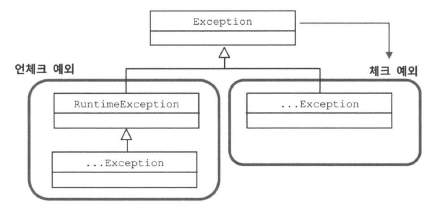

# 4장. 예외
## 4.1. 사라진 SQL EXCEPTION
### 4.1.1. 초난감 예외처리
#### 예외 블랙홀
```java
try {
    ...
} catch(SQLException e) {

}
```
- 예외를 잡고 아무것도 하지 않는 코드로, 굉장히 위험하다.
```java
} catch (Exception e) {
  System.out.println(e);
}

} catch (Exception e) {
  e.printStackTrace();
}
```
- 예외를 단순히 출력만 하는 것도 안된다. 
- 모든 예외는 적절히 `복구` 되든지, 작업을 `중단` 시키고 운영자/개발자에게 분명히 통보되어야 한다
- 굳이 예외를 잡아서 뭔가 조치를 취할 방법이 없다면 잡지 말아야 한다.
- 메소드에 throws SQLException 을 선언해서 메소드 밖으로 던지고, 자신을 호출한 코드에 **예외처리 책임을 전가해버리자**
  
#### 무의미하고 무책임한 throws
```java
public void method1() throws Exception {
  method2();
  ...
}

public void method2() throws Exception {
  method3();
  ...
}

public void method3() throws Exception ...
```
- 예외블랙홀 보단 낫지만 메소드 선언에 throws Exception을 기계적으로 붙이는 게 되면, 결과적으로 **적절한 처리를 통해 복구될 수 있는 예외상황도 제대로 다룰 수 있는 기회를 박탈당한다.**

### 4.1.2. 예외의 종류와 특징
- Error
  - 시스템에 비정상적인 상황이 발생했을 경우
  - 주로 자바 VM 에서 발생시키는 것이고, 애플리케이션 코드에서 잡으려고 하면 안된다.
  - OutOfMemoryError 나 ThreadDeath 같은 에러는 catch 로 잡아봤자 대응 방법이 없다.
- Exception 과 체크 예외
  
  - 애플리케이션 코드 작업 중에 예외상황 발생했을 경우에 사용된다
  - `체크 예외` : Exception 클래스의 서브 클래스, **RuntimeException 클래스 상속하지 않은 것**
  - `언체크 예외` : Exception 클래스의 서브 클래스, **RuntimeException 클래스 상속한 것**
  - 일반적으로 예외라 함은, 체크 예외라고 생각해도 된다
  - 체크 예외가 발생할 수 있는 메소드 사용 시 **반드시 예외를 처리하는 코드를 함께 작성**해야 한다
    - 그렇지 않으면 **컴파일 에러** 가 발생한다
- RuntimeException 과 언체크/런타임 예외
  - 런타임예외는 catch 문으로 잡거나 throws 로 선언하지 않아도 된다
  - 주로 프로그램의 오류가 있을 때 발생하도록 의도된 것으로, **피할 수 있지만 개발자가 부주의해서 발생할 수 있는 경우**에 발생하도록 만든 것이다.
  - 따라서 예상치 못한 예외상황에서 발생하는 게 아니기 때문에 굳이 catch 나 throws 를 사용하지 않아도 되도록 만든 것이다.
### 4.1.3. 예외처리 방법
#### 예외 복구
- 예외 상황을 파악하고, 문제를 해결해서 `정상 상태`로 돌려놓는 것이다
- 예외로 인해 기본 작업 흐름이 불가능하면 다른 작업 흐름으로 자연스럽게 유도해주면 예외를 복구했다고 볼 수 있다
- 예외처리 코드를 강제하는 체크 예외들은, **예외를 어떤 식으로든 복구할 가능성이 있는 경우에 사용** 한다
```java
int maxRetry = MAX_RETRY;

while(maxRetry --> 0) {
  try {
    ... // 예외가 발생할 수 있는 시도
    return; // 작업 성공
  }
  catch(SomeException e) {
    // 로그 출력, 정해진 시간만큼 대기
  }
  finally {
    // 리소스 반납, 정리 작업
  }
}
throw new RetryFailedException(); // 최대 재시도 횟수를 넘기면 직접 예외 발생
```
- 예외가 발생할 경우 최대횟수만큼 반복적으로 시도함으로써 예외상황에서 복구되게 할 수 있다.

#### 예외처리 회피
- 예외처리를 **자신이 담당하지 않고 자신을 호출한 쪽으로 던져버리는 것**
  - catch 문으로 예외를 잡은 후 로그를 남기고 throw (rethrow)
  - throws 문으로 선언
- 예외를 자신이 처리하지 않고 회피하는 방법이다
- 예외처리를 회피하려면 반드시 다른 오브젝트나 메소드가 예외를 대신 처리할 수 있게 던져주어야 한다
```java
public void add() throws SQLException {
  // JDBC API
}

public void add() throws SQLException {
  try {
    // JDBC API
  catch(SQLException e) {
    // 로그 출력
    throw e;
  }
}
```
- 콜백 오브젝트의 메소드는 SQLException 에 대한 예외를 회피하고 템플릿 레벨에서 처리하도록 던져준다.
- 하지만 콜백과 템플릿처럼 긴밀하게 역할을 분담하고 있는 관계가 아니라면 자신의 코드에서 발생하는 예외를 그냥 던지는 것은 무책임한 책임회피일 수 있다.
- 예외를 회피하는 것은 예외를 복구하는 것처럼 의도가 분명해야 한다.
  - 콜백/템플릿처럼 긴밀한 관계에 있는 다른 오브젝트에게 예외처리 책임을 분명히 지게 하거나,
  - **자신을 사용하는 쪽에서 예외를 다루는 게 최선의 방법**이라는 분명한 확신이 있어야 한다 

#### 예외 전환
- 예외 회피처럼 예외를 밖으로 던지지만, **발생한 예외를 그대로 넘기는 게 아니라 적절한 예외로 전환해서 던진다**
- 주로 2가지 목적으로 사용
  - 내부에서 발생한 예외를 그대로 던지는 것이 **예외상황에 대한 적절한 의미를 부여하지 못할 경우**에 의미를 분명하게 해줄 수 있는 예외로 변경하기 위해서이다.
    - SQLException은 DB 연결 실패, 쿼리의 실수, 중복된 아이디 존재 등 다양한 이유로 발생
    - 추가하려는 아이디가 이미 존재할 때 발생하는 예외는 DuplicateUserIdException 같은 예외로 바꿔서 던져주는 게 좋다
  - 의미가 분명한 예외가 던져지면, 서비스 계층 오브젝트에는 **적절한 복구 작업을 시도**할 수 있다
  ```java
  public void add(User user) throws DuplicatedUserIdException, SQLException{
      try{
          ...
      }catch(SQLException e){
          if(e.getErrorCode() == MysqlErrorNumbers.ER_DUP_ENTRY)
              throw DuplicatedUserIdException();
          else 
              throw e;
      }
  }
  ```
  - 보통 전환하는 예외에 원래 발생한 예외를 담아서 `중첩 예외` 로 만드는 것이 좋다
    - 생성자 또는 initCause() 메소드를 통해 원인이 되는 예외를 내부에 담아서 던진다. 
    - 주로 **예외처리를 강제하는 체크 예외를 언체크 예외인 런타임 예외로 바꾸는 경우에 사용** 한다
    ```java
    catch(SQLException e){
        ...
        throw DuplicatedUserIdException(e);
        throw DuplicatedUserIdException().initCause(e);
    }
    ```
    - 대표적으로 EJBException 이 있는데, EJB 컴포넌트 코드에서 발생하는 대부분의 체크 예외는 비즈니스 로직상 의미있는 예외이거나 복구 가능한 예외가 아니다
      - 따라서 어차피 복구 불가능한 예외라면 **가능한 빨리 런타임 예외로 포장해 던져서 다른 계층 메소드 작성 시 불필요한 throws 선언이 들어가지 않도록** 해야 한다
      - 애플리케이션 로직 상에서 예외조건이나 예외 상황 발생할 수도 있는데, 이 때는 `체크예외` 사용하는 것이 적절하다.
        - 왜냐하면 비즈니스적 의미가 있는 예외는 이에 대한 **적절한 대응이나 복구작업이 필요**하기 때문이다.
      - 어차피 복구못할 예외라면 애플리케이션 코드에서 포장해서 던지고, 예외 처리 서비스 등을 이용하여 로그 기록 및 운영진에게 알리는 것이 바람직 함
    ```java
    try{
        OrderHome orderHome = EJBHomeFactory.getInstance().getOrderHome();
        Order order = orderhome.findByPrimaryKey(Integer id);
    } catch (NamingException ne){
        throw new EJBException(ne); //체크 예외 -> 런타임 예외
    }
    ```
### 4.1.4. 예외처리 전략 
#### 런타임 예외의 보편화
- 일반적으로 체크 예외가 `일반적인 예외`를 다루고, 언체크 예외는 `시스템 장애나 프로그램 상의 오류` 에 사용한다
  - 문제는 체크예외는 **복구할 가능성이 조금이라도 있는, 말 그대로 예외적 상황이기에** 자바는 catch 블록이나 throws 선언을 강제하고 있다
- 자바가 처음 만들어질 때 사용되던 애플릿, AWT, 스윙을 사용한 독립형 애플리케이션은 통제 불가능한 시스템 예외더라도, 상황을 복구해야 했다
- 하지만 자바 엔터프라이즈 서버환경은 다르다.
  - 독립형 애플리케이션과 달리 서버에서 예외 발생 시 작업을 일시 중지하고 사용자와 커뮤니케이션하며 예외상황을 복구할 수 있는 방법이 없다
  - 차라리 예외가 발생하지 않도록 차단하거나, 해당 요청 작업을 취소하고 서버 관리자에게 통보하는 게 낫다
- 자바의 환경이 서버로 이동하며 **체크 예외의 활용도와 가치가 점점 떨어지고 있다**
  - throws Exception 이 달린 아무런 의미없는 메소드들만 낳을 뿐이다
  - **대응 불가능한 체크 예외라면 빨리 런타임 예외로 전환해서 던지는 게 낫다**
- 예전에는 복구 가능성이 조금이라도 있다면 체크 예외로 만들었는데, 지금은 **항상 복구할 수 있는 예외가 아니라면 일단 언체크 예외로 만드는** 경향이 있다