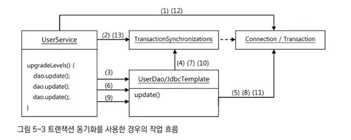
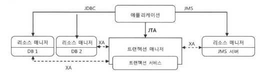
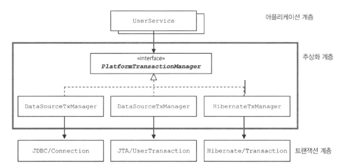

# 5장. 서비스 추상화
- 스프링이 어떻게 성격이 비슷한 여러 종류 기술을 추상화하고, 일관되게 사용할 수 있게 지원하는지 살펴보자

## 5.1. 사용자 레벨 관리 기능 추가
### 5.1.3. UserService.upgradeLevels()
- DAO 는 데이터를 어떻게 가져오고 조작할지를 다루는 곳이지, 비즈니스 로직을 두는 곳이 아니다.
- UserService는 UserDao 구현 클래스가 바뀌어도 영향받지 않도록 해야 한다.

### 5.1.5. 코드 개선
- 코드에 `중복` 은 없는가
- 코드가 `무엇을 하는 지` 이해하기 편리한가
- 코드가 자신이 있어야 할 자리에 있는가
- 앞으로 변경이 일어난다면 어떤 것이며, 변경에 쉽게 대응가능한가

#### upgradeLevels() 리팩토링
```java
public void upgradeLevels() {
  List<User> users : users) {
    if (canUpgradeLevel(user)) {
      upgradeLevel(user);
    }
  }
}

public boolean canUpgradeLevel(User user) {
  Level currentLevel = user.getLevel();
  switch (currentLevel) {
    case BASIC:
      return (user.getLogin() >= MIN_LOGCOUNT_FOR_SILVER);
    case SILVER:
      return (user.getRecommend() >= MIN_RECOMMEND_FOR_GOLD);
    case GOLD:
      return false;
    default:
      throw new IllegalArgumentException("Unknown Level: "+ currentLevel);
  }
}

private void upgradeLevel(User user) {
  if (user.getLevel() == Level.BASIC) 
    user.setLevel(Level.SILVER); 
  else if (user.getLevel() == Level.SILVER) 
    user.setLevel(Level.GOLD); 
  userDao.update(user);
}
```
- 하지만 upgradeLevel() 메소드는 여러 문제점이 존재한다
  - 다음 레벨이 무엇인지에 대한 로직과 사용자 오브젝트 level 필드를 변경하는 로직이 함께 존재한다
  - 잘못된 레벨이 들어온 상황에 대한 예외 처리가 없다  
- 레벨의 순서와 `다음 단계 레벨이 무엇인지 결정`하는 일은 level 에게 맡긴다
```java
public enum Level {
  GOLD(3, null), SILVER(2, GOLD), BASIC(1, SILVER);
  private final int value; 
  private final Level next; // 다음 단계 레벨 표현
  ...
}
```
- 사용자 오브젝트의 level 필드를 변경하는 로직은 User 에게 맡긴다
  - UserService 가 일일이 업그레이드 시 User의 어떤 필드를 수정한다는 로직을 갖고 있기 보다는 User 에게 정보를 변경하라고 요청하는 것이 낫다
```java
// User 객체의 메소드
public void upgradeLevel() {
  Level nextLevel = this.level.nextLevel(); 
  if (nextLevel == null) {
    throw new IllegalStateException(...);
  }
  else {
    this.level = nextLevel;
  }
}
```
- User에 업그레이드 작업을 담당하는 **독립적인 메소드를 두고 사용할 경우, 업그레이드 시 기타 정보가 필요할 경우 유용하다**
  - ex) 가장 최근에 레벨 변경 일자를 User에 저장하고 싶은 경우
```java
// AS-IS
private void upgradeLevel(User user) {
  if (user.getLevel() == Level.BASIC) 
    user.setLevel(Level.SILVER); 
  else if (user.getLevel() == Level.SILVER) 
    user.setLevel(Level.GOLD); 
  userDao.update(user);
}

// TO-BE
private void upgradeLevel(User user) {
  user.upgradeLevel();
  userDao.update(user);
}
```
- 객체지향적인 코드는 다른 오브젝트의 데이터를 가져와서 작업하는 대신, **데이터를 갖고 있는 다른 오브젝트에게 작업을 해달라고 요청** 하는 것이다
  - 오브젝트에게 데이터를 요구하지 말고, `작업을 요청하라` 는 것이 객체지향 프로그래밍의 가장 기본이 되는 원리이다

## 5.2. 트랜잭션 서비스 추상화
- 사용자 레벨 관리 작업 수행 도중에 문제가 생긴다면, 그때까지 진행된 변경 작업도 모두 취소시키도록 결정했다

### 5.2.1. 모 아니면 도
- 4번째의 사용자를 처리하다가 예외 발생하여 작업 중단됐으니, 이미 레벨이 수정된 사용자도 원래 상태로 돌아가는 것을 예상했다

#### 테스트 실패의 원인
- 모든 사용자의 레벨을 업그레이드 하는 upgradeLevels() 메소드가 **하나의 트랜잭션 안에서 동작하지 않았기 때문** 이다
  ```java
  public void upgradeLevels() {
    List<User> users : users) {
      if (canUpgradeLevel(user)) {
        upgradeLevel(user);
      }
    }
  }
  ```

### 5.2.2. 트랜잭션 경계설정
- DB 는 하나의 SQL 명령을 처리하는 경우 그 자체로 완벽한 트랜잭션을 지원한다
- `트랜잭션 롤백` : DB에서 2번째 SQL이 성공적으로 수행되기 전에 문제 발생 시 앞에서 처리한 SQL 작업을 취소시켜야 한다
- `트랜잭션 커밋` : 여러 개의 SQL을 하나의 트랜잭션으로 처리하는 경우 **모든 SQL 수행 작업이 성공적으로 마무리 되었다고 DB 에 알려줘서 작업을 확정** 시킨다

#### JDBC 트랜잭션의 트랜잭션 경계설정
- 트랜잭션을 끝내는 방법은 롤백, 커밋 2가지가 있다
```java
Connection c = dataSource.getConnection();

c.setAutoCommit(false); // 트랜잭션 경계 시작
try {
  PreparedStatement st1 = c.prepareStatement("update users ...");
  st1.executeUpdate();
  
  PreparedStatement st2 = c.prepareStatement("delete users ...");
  st2.executeUpdate();
  
  c.commit(); // 트랜잭션 경계 끝지점 (커밋)
} catch(Exception e) {
  c.rollback(); // 트랜잭션 경계 끝지점 (롤백)
}
c.close();
```
- 트랜잭션의 시작과 종료는 Connection 오브젝트를 통해 이뤄지기 때문에, JDBC 의 트랜잭션은 **하나의 Connection 을 가져와 사용하다가 닫는 사이에 일어난다.**
- JDBC의 기본 설정은 DB 작업을 수행한 직후 자동 커밋되게 되어있다
  - 따라서 **작업마다 커밋해서 트랜잭션을 끝내버리므로 여러 개의 DB 작업을 모아서 트랜잭션을 만드는 기능이 꺼져있다**
- JDBC에서는 auto commit 을 끄면 새로운 트랜잭션이 시작되게 만들 수 있고, **트랜잭션이 한번 시작되면 commit() 또는 rollback() 메소드가 호출될 때까지의 작업이 하나의 트랜잭션으로 묶인다**
- `트랜잭션의 경계설정` : setAutoCommit(false) 로 트랜잭션 시작 선언하고 commit(), rollback() 으로 트랜잭션을 종료하는 작업
  - 트랜잭션 경계는 하나의 Connection 이 만들어지고 닫히는 범위 내에 존재한다
  - `로컬 트랜잭션` : 하나의 DB 커넥션 안에서 만들어지는 트랜잭션

#### UserService와 UserDao의 트랜잭션 문제
- JdbcTemplate 메소드 안에서 DataSource 의 getConnection() 메소드를 호출해서 Connection 오브젝트를 가져옴
- 작업을 마치면 Connection 을 닫고 빠져나오므로 **템플릿 메소드 호출 1번에 1개의 DB 커넥션이 만들어지고 닫히는 것** 이다
- 일련의 작업이 `하나의 트랜잭션` 으로 묶이려면 작업이 진행되는 동안 **DB 커넥션도 하나만 사용되어야 한다**

#### 비즈니스 로직 내의 트랜잭션 경계설정
```java
public void upgradeLevels() throws Exception {
  (1) DB Connection 생성
  (2) 트랜잭션 시작
  try {
    (3) DAO 메소드 호출
    (4) 트랜잭션 커밋
  catch(Exception e) {
    (5) 트랜잭션 롤백
    throw e;
  }
  finally {
    (6) DB Connection 종료
  }
```
- 이렇게 코드를 작성하면 upgradeLevels() 가 한 트랜잭션 안에서 실행될 수 있다

#### UserService 트랜잭션 경계설정의 문제점
- DB 커넥션을 비롯한 리소스의 깔끔한 처리를 가능하게 했던 JdbcTemplate 을 더이상 활용할 수 없다
- DAO 메소드와 비즈니스 로직인 UserService 메소드에 Connection 파라미터가 추가되어야 한다
- Connection 파라미터가 UserDao 인터페이스 메소드에 추가되면 UserDao 는 더이상 데이터 액세스 기술에 독립적일 수 없다

### 5.2.3. 트랜잭션 동기화
- upgradeLevels() 내에서 Connection 을 생성하는데 이 오브젝트를 계속 파라미터로 전달하다가 DAO 를 호출할 때 사용하게 하는 건 피하고 싶다
  - 이를 위한 방법이 독립적인 `트랜잭션 동기화` 방식이다
- 트랜잭션 동기화 : UserService 에서 트랜잭션 시작하기 위해 만든 Connection 을 특별한 저장소에 보관해두고, 이후에 호출되는 DAO 메소드에서는 저장된 Connection 을 가져다 사용하게 하는 것



1. UserService에서 Connection 생성
2. Connection을 트랜잭션 동기화 저장소에 저장 및 setAutoCommit(false)를 호출해 트랜잭션 시작
3. 첫 번째 dao.update() 호출
4. JdbcTemplate 메소드는 트랜잭션 동기화 저장소에 Connection이 존재하는지 확인 및 가져옴
5. 가져온 Connection을 이용해 PrepareStatement를 만들어 수정 SQL 실행
6. Connection을 닫지않고 3번 부터 반복
7. ...
8. Connection의 commit()을 호출해서 트랜잭션 완료시킴
9. 트랜잭션 동기화 저장소에서 Connection 제거
- 트랜잭션 동기화 저장소은 **작업 스레드마다 독립적**으로 Connection 오브젝트를 저장하고 관리하기 때문에 **멀티스레드 환경에서 충돌이 발생하지 않음**
- 트랜잭션 동기화 기법을 사용하면, 파라미터를 통해 일일이 Connection 오브젝트를 전달할 필요가 없어진다

#### 트랜잭션 동기화 적용

```java
public class UserService {
    protected DataSource dataSource;
    
    public void setDataSource(DataSource dataSource){
        this.dataSource = dataSource;
        }
        
    public void upgradeLevels() throws SQLException {
        TransactionSynchronizationManager.initSynchronization(); // (1) 트랜잭션 동기화 작업을 초기화
        Connection c = DataSourceUtils.getConnection(dataSource); // (2) DB 커넥션 생성
        c.setAutoCommit(false);
        try{
            List<User> users = userDao.getAll();
            for (User user : users) {
                if (canUpgradeLevel(user)) {
                    upgradeLevel(user);
                }
            }
            c.commit(); // 정상 작업 마치면 트랜잭션 커밋
        }catch (Exception e){
            c.rollback(); // 예외 발생 시 롤백
            throw e;
        } finally {
            DataSourceUtils.releaseConnection(c, dataSource); //스프링 유틸리티 메소드를 이용해 DB 커넥션을 안전하게 닫음
            // 동기화 작업 종료 및 정리
            TransactionSynchronizationManager.unbindResource(this.dataSource);
            TransactionSynchronizationManager.clearSynchronization();
        }
    }
		...
}
```
- (2) : DataSource 에서 Connection 을 직접 가져오지 않고, 스프링이 제공하는 유틸리티 메소드를 사용하는 이유는 DataSourceUtils 의 getConnection() 메소드는 **Connection 오브젝트를 생성할 뿐만 아니라 트랜잭션 동기화에 사용하도록 저장소에 바인딩** 해주기 때문이다

#### JdbcTemplate 과 트랜잭션 동기화
- JdbcTemplate 은 JDBC 작업의 템플릿 메소드를 호출하면 직접 Connection 을 생성하고 종료하는 일을 담당한다
- 미리 생성되어 트랜잭션 동기화 저장소에 등록된 DB 커넥션이나 트랜잭션이 없는 경우, **JdbcTemplate 이 직접 DB 커넥션을 만들고 트랜잭션을 시작하여 JDBC 작업을 진행한다**
- 반면 트랜잭션 동기화를 시작해 두었다면 그때부터 실행되는 JdbcTemplate 의 메소드에서는 **직접 DB 커넥션을 만드는 대신 트랜잭션 동기화 저장소에 있는 DB 커넥션을 가져와 사용한다**

### 5.2.4. 트랜잭션 서비스 추상화
#### 기술과 환경에 종속되는 트랜잭션 경계설정 코드
- 1개 이상의 DB 로의 작업을 하나의 트랜잭션으로 만드는 것은 JDBC 의 Connection 을 이용한 트랜잭션 방식인 로컬 트랜잭션으로는 불가능하다
  - 로컬 트랜잭션은 **하나의 DB Connection 에 종속** 되기 때문
- 각 DB 와 독립적으로 만들어지는 Connection 이 아닌 **별도 트랜잭션 관리자를 통해 트랜잭션을 관리하는 글로벌 트랜잭션 방식을 사용** 해야 여러 개의 DB 가 참여하는 작업을 하나의 트랜잭션으로 만들 수 있다
- 자바는 글로벌 트랜잭션을 지원하는 트랜잭션 매니저를 위한 API 인 JTA 를 제공한다
  - 애플리케이션에서는 기존대로 DB 는 JDBC, 메시징 서버는 JMS 를 사용하여 필요 작업을 수행한다
  - 단, 트랜잭션은 JDBC 나 JMS API 를 사용하여 직접 제어하지 않고 JTA 를 통해 트랜잭션 매니저가 관리하도록 위임한다
  - 트랜잭션 매니저는 DB 와 메시징 서버를 제어, 관리하는 각각의 리소스 매니저와 XA 프로토콜로 연결된다
  - 이를 통해 트랜잭션 매니저가 실제 DB 와 메징 서버의 트랜잭션을 종합 제어할 수 있게 되는 것이다


#### 트랜잭션 API 의 의존관계 문제와 해결책
- UserDAO 가 DAO 패턴을 사용해서 구현 데이터 액세스 기술을 유연하게 바꿔 사용하게 했지만, UserService 에서 **트랜잭션 경계 설정을 해야하면서 다시 특정 데이터 액세스 기술에 종속되는** 구조가 되었다
- 애플리케이션 코드에서 트랜잭션 추상 계층이 제공하는 API 를 이용해 트랜잭션을 이용하게 만들어주면, 특정 기술에 종속되지 않는 트랜잭션 경계설정 코드를 만들 수 있을 것이다

#### 스프링의 트랜잭션 서비스 추상화

```java
public class UserService {
    public void upgradeLevels() {
        PlatformTransactionManager transactionManager = new DataSourceTransactionManager(dataSource); // JDBC 트랜잭션 추상 오브젝트 생성
        TransactionStatus status = transactionManager.getTransaction(new DefaultTransactionDefinition());
        try{
            List<User> users = userDao.getAll();
            for (User user : users) {
                if (canUpgradeLevel(user)) {
                    upgradeLevel(user);
                }
            }
            transactionManager.commit(status); // 커밋
        }catch (Exception e){
            transactionManager.rollback(status); // 롤백
            throw e;
        }
    }
}
```
- 스프링이 제공하는 트랜잭션 경계설정을 위한 추상 인터페이스는 `PlatformTransactionManager` 이다
- 스프링의 트랜잭션 추상화 기술은 **트랜잭션 동기화를 사용** 한다

#### 트랜잭션 기술 설정의 분리
- 트랜잭션 추상화 API 를 적용한 코드를 JTA 를 이용하는 글로벌 트랜잭션으로 변경하려면?
```java
// AS-IS
PlatformTransactionManager transactionManager = new DataSourceTransactionManager(dataSource); // JDBC 트랜잭션 추상 오브젝트 생성

// TO-BE
PlatformTransactionManager transactionManager = new JTATransactionManager();
```
- 하지만 어떤 트랜잭션 매니저 구현 클래스를 사용할지 UserService 코드가 알고 있는 것은 DI 원칙에 위배된다
  - **자신이 사용할 구체클래스를 직접 결정하고 생성하지 말고, 컨테이너를 통해 외부에서 제공받게 하는 스프링 DI 방식으로 바꾸자**
- `DataSourceTransactionManager` 는 스프링 빈으로 등록하고 UserService 가 DI 방식으로 사용하게 해야 한다.
  - 어떤 클래스든 스프링 빈으로 등록할 때 검토해야 할 것은 **싱글톤으로 만들어져 여러 스레드에서 동시 사용해도 괜찮은지** 이다
  - 스프링이 제공하는 모든 `PlatformTransactionManager` 구현 클래스는 **싱글톤 사용 가능** 하다
```java
public class UserService {
    private PlatformTransactionManager transactionManager;

    public void setTransactionManager(PlatformTransactionManager transactionManager){
        this.transactionManager = transactionManager;
    }

    public void upgradeLevels() {
        TransactionStatus status = this.transactionManager.getTransaction(
            new DefaultTransactionDefinition());
    }
}
```

## 5.3. 서비스 추상화와 단일 책임 원칙
#### 수직, 수평 계층구조와 의존관계
- 기술과 서비스에 대한 `추상화` 기법을 사용하면 특정 기술환경에 종속되지 않는 포터블한 코드를 만들 수 있다
- `수평적 분리` : 같은 애플리케이션 로직을 담은 코드지만 **내용**에 따라 분리한 것 (담당하는 코드의 **기능적** 관심에 따라 분리)
  - ex) UserDao, UserService 
- UserDao 와 DB 연결 기술, UserService 와 트랜잭션 기술의 결합도가 낮은 분리는 **애플리케이션 코드를 로우레벨의 기술 서비스와 환경에서 독립** 시켜준다
- 애플리케이션 **로직 종류** 에 따른 `수평적 구분` 이든, **로직과 기술** 이라는 `수직적 구분` 이든 모두 결합도가 낮고, 서로 영향을 주지 않고 자유롭게 확장될 수 있는 구조를 만드는 데에는 **스프링의 DI** 가 중요한 역할을 한다
  - DI 의 가치는 **관심, 책임, 성격이 다른 코드를 깔끔하게 분리**하는 데 있다

#### 단일 책임 원칙
- 하나의 모듈은 한 가지 책임을 가져야 한다
  - 하나의 모듈이 바뀌는 이유는 한 가지여야 한다

#### 단일 책임 원칙의 장점
- 단일 책임 원칙을 잘 지키면, **어떤 변경이 필요할 때 수정 대상이 명확해진다**
- 객체지향 설계와 프로그래밍 원칙은 긴밀한 관련이 있다
  - 단일 책임 원칙을 잘 지키는 코드를 위해서는 `인터페이스` 를 도입하고 이를 `DI로 연결`해야 하며, 그 결과로 단일 책임원칙 뿐만 아니라 **개방 폐쇄 원칙** 도 잘 지키고, 모듈 간의 **결합도가 낮아져** 서로의 변경이 영향을 주지 않고, 같은 이유로 변경이 단일 책임에 집중되는 **응집도 높은** 코드가 된다

## 5.4. 메일 서비스 추상화
### 5.4.3. 테스트를 위한 서비스 추상화
- 테스트하기 힘든 구조인 API 를 테스트하기 좋게 만드는 방법은 **서비스 추상화** 를 적용하는 것이다