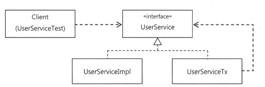
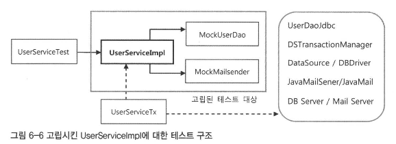
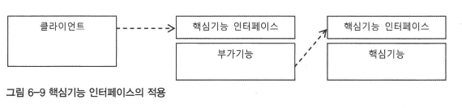
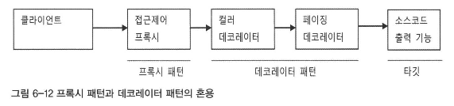
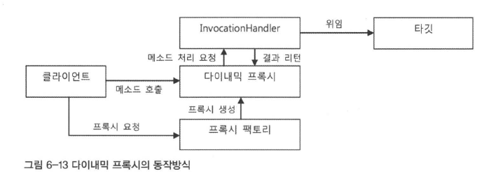
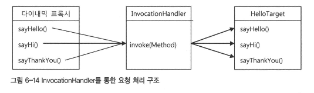
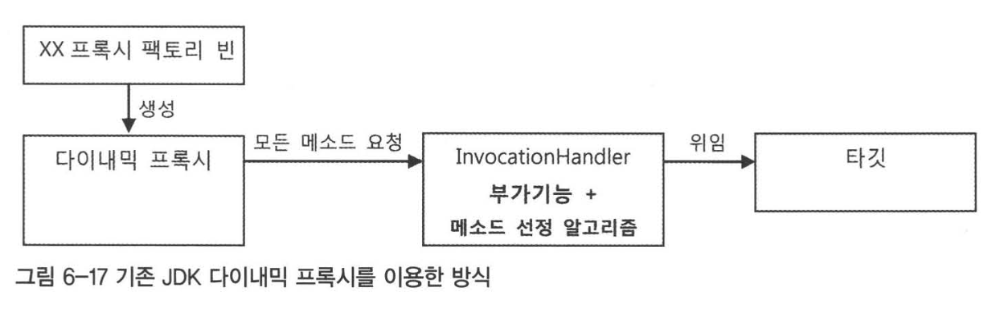
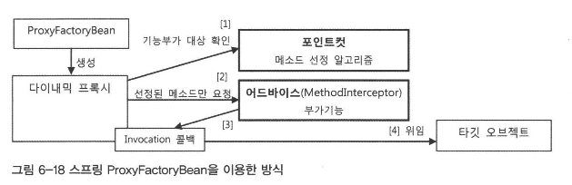
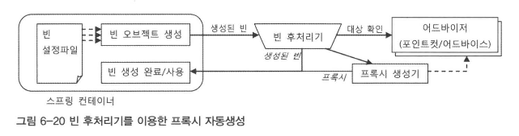
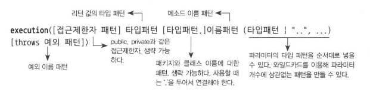

# 6장. AOP
- AOP 는 IoC/DI, 서비스 추상화와 더불어 스프링의 3대 기반 기술의 하나이다
- 스프링에 적용된 가장 인기있는 AOP 적용대상은 바로 `선언적 트랜잭션` 기능이다

## 6.1. 트랜잭션 코드의 분리
### 6.1.1. 메소드 분리
```java
// 트랜잭션 경계설정과 비즈니스 로직이 공존하는 메서드
public void upgradeLevels() throws Exception {
    TransactionStatus status = this.transactionManager.getTransaction(new DefaultTransactionDefinition());
    
    try {
        // 비즈니스 로직
        List<User> users = userDao.getAll();
        for (User user : users) {
            if (canUpgradeLevel(user)) {
                upgradeLevel(user);
            }
        }
        
        this.transactionManager.commit(status);
    } catch (Exception e) {
        this.transactionManager.rollback(status);
        throw e;
    }
}
```
- 비즈니스 로직 담당 코드를 메소드로 추출하여 비즈니스 로직과 트랜잭션 경계설정을 분리해보자.
```java
public void upgradeLevels() throws Exception {
    TransactionStatus status = this.transactionManager.getTransaction(new DefaultTransactionDefinition());
    
    try {
        upgradeLevelsInternal();
    
        this.transactionManager.commit(status);
    } catch (Exception e) {
        this.transactionManager.rollback(status);
        throw e;
    }
}

private void upgradeLevelsInternal() {
    List<User> users = userDao.getAll();
        for (User user : users) {
            if (canUpgradeLevel(user)) {
                upgradeLevel(user);
            }
        }
}  
```

### 6.1.2. DI 를 이용한 클래스의 분리
- 어차피 서로 직접적으로 정보를 주고받지 않으면, 아예 트랜잭션 코드가 존재하지 않는 것처럼 사라지게 할 수는 없을까?

#### DI 적용을 이용한 트랜잭션 분리
- DI의 기본 아이디어는 **실제 사용할 오브젝트의 클래스 정체는 감춘채 인터페이스를 통해 간접으로 접근** 하는 것
    - 보통 이 방법을 사용하는 이유는 **일반적으로 구현 클래스를 바꿔가면서 사용하기 위해서** 이다


- UserServiceTx 는 UserSeviceImpl 을 대신하기 위해 만든게 아니라, 단지 트랜잭션 경계설정이라는 책임을 맡고 있는 것이다
- 스스로는 비즈니스 로직을 담고 있지 않기 때문에, 또다른 비즈니스 로직을 담고 있는 **UserService의 구현 클래스에 실제적인 로직 처리 작업은 위임하는 것**이다

#### UserService 인터페이스 도입
- 클라이언트가 사용할 핵심 로직만 담은 메소드만 UserService 인터페이스로 만들고 UserServiceImpl 이 구현하도록 만든다
```java
public class UserServicelmpl implements UserService { 
    UserDao userDao;
    MailSender mailSender;
    public void upgradeLevels() {
        List<User> users = userDao.getAll(); 
        for (User user : users) {
            if (canUpgradeLevel(user)) { 
                upgradeLevel(user);
            } 
        }
    }
}
```

#### 분리된 트랜잭션 기능
- UserServiceTx 는 기본적으로 UserService 를 구현하지만, **같은 인터페이스를 구현한 다른 오브젝트에게 작업을 위임하게 만들면 된다**
  - 이를 위해 UserService 오브젝트를 DI 받을 수 있도록 만든다
```java
public class UserServiceTx implements UserService { 
    // UserService 를 구현한 다른 오브젝트를 DI 받는다.
    UserService userService;

    public void setUserService(UserService userService) { 
        this.userService = userService;
    }

    // DI 받은 UserService 오브젝트에 모든 기능을 위임한다.
    public void add(User user) { 
        this.userService.add(user);
    }

    public void upgradeLevels() {
        userService.upgradeLevels();
    }
}
```
- 이 UserServiceTx 에 트랜잭션 경계설정이라는 부가적인 작업을 부여해보자.
```java
public class UserServiceTx implements UserService { 
    UserService userService; 
    PlatformTransactionManager transactionManager;

    public void setTransactionManager(PlatformTransactionManager transactionManager) {
        this.transactionManager = transactionManager; 
    }

    public void setUserService(UserService userService) { 
        this.userService = userService;
    }

    public void add(User user) { 
        this.userService.add(user);
    }

    public void upgradeLevels() {
        Transactionstatus status = this.transactionManager.getTransaction(new DefaultTransactionDefinition());

        try {
            userService.upgradeLevels();
            this.transactionManager.commit(status); 
        } catch (RuntimeException e) {
            this.transactionManager.rollback(status);
            throw e; 
        }
    }
}
```

#### 트랜잭션 적용을 위한 DI 설정
- UserService 인터페이스를 통해 사용자 관리 로직을 이용하려 할 때, **트랜잭션을 담당하는 오브젝트가 사용돼서 트랜잭션 작업을 진행** 하고, 실제 **사용자 관리 로직을 담은 오브젝트는 이후에 호출돼서 비즈니스 로직 처리를 수행**하도록 한다.

#### 트랜잭션 경계설정 코드 분리의 장점
- 비즈니스 로직 담당하는 UserServiceImpl 코드 작성시에는 트랜잭션에 신경쓰지 않아도 된다
  - 트랜잭션은 **DI 를 이용해서 UserServiceTx 와 같은 트랜잭션 기능을 가진 오브젝트가 먼저 실행되도록** 만들기만 하면 된다
- 비즈니스 로직에 대한 테스트를 손쉽게 만들 수 있다

## 6.2. 고립된 단위 테스트
### 6.2.1. 복잡한 의존관계 속의 테스트

- UserServiceTest 가 테스트 하고자 하는 대상인 UserService 는 사용자 정보를 관리하는 비즈니스 로직의 구현 코드이다.
  - 따라서 UserService 의 코드가 바르게 작성되어 있으면 성공, 아니면 실패이다.
  - 따라서 **테스트의 단위는 UserService 클래스여야 한다**
- UserService 는 UserDao, TransactionManager, MailSender 라는 3가지 의존관계를 가지고 있다
  - 따라서 UserService 를 테스트하는 것처럼 보이지만 사실은 그 뒤의 의존관계를 따라 등장하는 오브젝트, 서비스, 환경 등이 모두 합쳐져 테스트 대상이 되는 것이다

### 6.2.2. 테스트 대상 오브젝트 고립시키기
- 테스트 대상이 환경, 외부 서버, 다른 클래스 코드에 종속되고 영향받지 않도록 고립시킬 필요가 있다
  - 테스트를 의존 대상으로부터 분리해서 고립시키는 방법은 **테스트를 위한 대역을 사용하는 것** 이다

#### 테스트를 위한 UserServiceImpl 고립

- 고립된 테스트가 가능하려면 UserServiceImpl 가 2개의 목 오브젝트에만 의존하도록 하면 완벽하게 고립된 테스트 대상으로 만들 수 있다.
- UserDao 는 **테스트 대상의 코드가 정상 수행되도록 돕기만 하는 스텁** 이 아니라, **부가적인 검증기능까지 가진 목 오브젝트** 로 만든다

#### 고립된 단위 테스트 활용
```java
private void upgradeLevels() {
    List<User> users = userDao.getAll(); // 업그레이드 후보 사용자 목록 조회
    for (User user : users) {
        if (canUpgradeLevel(user)) {
            upgradeLevel(user);
        }
    }
}  

protected void upgradeLevel(User user) {
    user.upgradeLevel();
    userDao.update(user); // 수정된 사용자 정보를 DB에 반영한다.
    sendUpgradeEmail(user);
}
```
- userDao.getAll() 은 레벨 업그레이드 후보가 될 사용자 목록을 받아오기에, 테스트용 UserDao 에는 DB에서 읽어온 것처럼 미리 준비된 사용자 목록을 제공해야 한다
- update() 메소드는 upgradeLevels() 의 핵심 로직인 '전체 사용자 중에서 업그레이드 대상자는 레벨을 변경해준다' 에서 **'변경' 에 해당하는 부분을 검증할 수 있는 중요한 기능이기도 하다**
  - 업그레이드를 통해 레벨이 변경된 사용자는 DB에 반영되도록 userDao의 update()에 전달돼야 하기 때문
- getAll() 에 대해서는 `스텁` 으로서, update() 에 대해서는 `목 오브젝트` 로서 동작하는 UserDao 타입의 테스트 대역이 필요하다

```java
public class MockUserDao implements UserDAO {
    // 레벨 업그레이드 후보 User 오브젝트 목록
    private List<User> users;

    // 업그레이드 대상 오브젝트를 저장해둘 목록
    private List<User> updated = new ArrayList<User>();

    private MockUserDao(List<User> users){
        this.users = users;
    }

    public List<User> getUpdated() {
        return this.updated;
    }

    // 스텁 기능 제공
    public List<User> getAll() {
        return this.users;
    }

    // 목 오브젝트 기능 제공
    public void update(User user){
        updated.add(user);
    }
    ...
}
```
- updated 리스트는 update() 메소드를 실행하면서 넘겨준 업그레이드 대상 User 오브젝트를 **저장했다가 검증을 위해 돌려주기 위한 것**

### 6.2.3. 단위 테스트와 통합 테스트
- 단위 테스트의 단위는 정하기 나름이다
  - 사용자 관리 기능 전체일 수도, 하나의 클래스나 하나의 메소드를 단위로 볼 수도 있다
  - 중요한 것은 **하나의 단위에 초점을 맞춘** 테스트라는 점이다
- `단위 테스트` : 테스트 대상 클래스를 목 오브젝트 등의 **테스트 대역을 이용해 의존 오브젝트나 외부 리소스를 사용하지 않도록 고립시켜 테스트 하는 것**
- `통합 테스트` : 2개 이상의, **성격이나 계층이 다른 오브젝트가 연동하도록 만들어 테스트**하거나 또는 외부의 DB나 파일, 서비스 등의 리소스가 참여하는 테스트
- 단위 테스트와 통합테스트 관련 가이드 라인
  - 외부 리소스를 사용해야만 가능한 테스트는 통합 테스트로 만든다
  - DAO 테스트는 DB 라는 외부 리소스를 사용하기에 통합 테스트로 분류되지만 하나의 기능 단위를 테스트하는 것이기도 하다
    - DAO 를 테스트를 통해 검증해두면 DAO 를 이용하는 코드는 DAO 역할을 스텁이나 목 오브젝트로 대체해서 테스트할 수 있다
  - 단위테스트를 만들기 복잡하다고 판단되면 처음부터 통합 테스트를 고려해본다
    - 통합테스트 참여하는 코드 중 가능한 한 많은 부분을 미리 단위 테스트로 검증해두는 게 유리하다

### 6.2.4. 목 프레임워크
#### Mockito 프레임워크
- mockUserDao 의 update() 메소드가 2번 호출됐는지 확인하고 싶을 때
```java
verify(mockUserDao, times(2)).update(any(User.class));
```
-  목 오브젝트가 제공하는 검증 기능을 통해서 **어떤 메소드가 몇 번 호출 됐는지, 파라미터는 무엇인지** 확인할 수 있다.
```java
    verify(mockUserDao, times(2)).update(any(User.class));
    verify(mockUserDao).update(users.get(1));
    assertThat(users.get(1).getLevel(), is(Level.SILVER));        verify(mockUserDao).update(users.get(3));
    assertThat(users.get(3).getLevel(), is(Level.GOLD));
```

## 6.3. 다이내믹 프록시와 팩토리 빈
### 6.3.1. 프록시와 프록시 패턴, 데코레이터 패턴
- 분리된 부가기능을 담은 클래스는 부가기능 외 나머지 모든 기능은 **원래 핵심기능을 가진 클래스로 위임** 해줘야 한다.
  - 핵심기능은 부가기능을 가진 클래스 존재 자체를 모른다. 즉, 부가기능이 핵심기능을 사용하는 구조
- 부가기능은 마치 자신이 핵심기능인 것처럼 꾸며서 클라이언트가 자신을 거쳐 핵심기능을 사용하도록 해야 한다
  - 그러려면 클라이언트는 **인터페이스** 를 통해서만 핵심기능을 사용하게 하고,
  - 부가 기능도 동일한 인터페이스를 구현한뒤 그 사이에 끼어들어야 한다
    
- 부가기능 코드에서는 핵심 기능으로 요청을 위임해주는 과정에서 **자신이 가진 부가 기능을 적용**해줄 수 있다.    
  - ex) 비즈니스 로직 코드에 트랜잭션 기능을 부여해주는 것
- 자신이 클라이언트가 사용하려고 하는 실제 대상인 것처럼 위장해서 클라이언트의 요청을 받아주는 것을 대리자 같은 역할을 한다고 해서 `프록시` 라고 한다
  - 프록시를 통해 최종적으로 요청을 위임받아 처리하는 실제 오브젝트를 `타깃` 이라고 부른다
- 프록시의 특징 : **타깃과 같은 인터페이스를 구현** 했다는 것과 프록시가 타깃을 제어할 수 있는 위치에 있다는 것
- 프록시는 사용 목적에 따라 2가지로 구분가능하다.
  - 클라이언트가 타깃에 접근하는 방법을 제어하기 위해서 -> `프록시 패턴`
  - 타깃에 부가적인 기능을 부여해주기 위해서 -> `데코레이터 패턴`
  - 2가지 모두 대리 오브젝트 개념의 프록시를 두고 사용하는 것은 동일하지만, **목적에 따라 디자인 패턴에서는 다른 패턴으로 구분** 한다

#### 데코레이터 패턴
- 타깃에 부가적인 기능을 **런타임 시 다이내믹하게 부여해주기 위해** `프록시를 사용` 하는 패턴
  - 다이내믹하게 기능 부가 == 컴파일 시점, 즉 코드상에서는 어떤 방법과 순서로 프록시와 타깃이 연결되어 사용되는지 정해져 있지 않다
- 데코레이터 패턴에서는 프록시가 꼭 1개로 제한되지 않는다
  - 같은 인터페이스를 구현한 타겟과 여러 개의 프록시를 사용할 수 있다
  - 프록시로서 동작하는 각 데코레이터는 **위임하는 대상에도 인터페이스로 접근하기 때문에** 자신이 최종 타깃으로 위임하는지, 다음 단계 데코레이터 프록시로 위임하는지 알지 못한다.
    - 데코레이터 다음 위임 대상은 인터페이스로 선언하고, 생성자/수정자 메소드를 통해 **위임 대상을 외부에서 런타임으로 주입받을 수 있게** 만들어야 한다
- 데코레이터 패턴은 **타깃의 코드를 손대지 않고, 클라이언트의 호출 방법도 변경하지 않고** 새로운 기능을 추가할 때 유용한 방법이다

#### 프록시 패턴
- 일반적으로 사용하는 프록시와 디자인 패턴에서 말하는 프록시 패턴은 구분할 필요가 있다
- 전자 : 클라이언트와 사용 대상 사이에 **대리 역할**을 맡은 오브젝트 총칭
- 후자 : 프록시를 사용하는 방법 중 **타깃에 대한 접근 방법을 제어하려는 목적** 을 가진 경우
- 프록시 패턴의 프록시는 **타깃의 기능을 확장하거나 추가하지 않는다**
- 타깃 오브젝트가 생성하기 복잡하거나, **당장 필요하지 않은 경우**, 꼭 필요한 시점까지 오브젝트를 생성하지 않고 프록시를 넘겨주는 것이다.
  - 프록시의 메소드를 통해 타깃을 사용하려고 시도할 때 **프록시가 타깃 오브젝트를 생성하고 요청을 위임** 하는 식이다.
- 특별한 상황에서 타깃에 대한 `접근 권한을 제어`하기 위해 사용할 수도 있다
  - ex) 특정 레이어로 넘어가서는 읽기전용으로만 동작하게 강제하려면 오브젝트의 프록시를 만들어서 사용한다. Collections 의 unmodifiableCollection()
- 구조적으로는 프록시와 데코레이터는 유사하다.
  - 다만 프록시는 코드에서 **자신이 만들거나 접근할 타깃 클래스 정보를 알고 있는 경우가 많다**



### 6.3.2. 다이내믹 프록시 
#### 프록시의 구성과 프록시 작성의 문제점
- 프록시의 기능
  - 타깃과 같은 메소드를 구현하고 있다가, 메소드 호출 시 **타깃 오브젝트로 위임**한다
  - 지정된 요청에 대해서는 **부가 기능을 수행**한다
- 프록시 작성의 문제점
  - 부가기능이 필요없는 메소드도 구현해서 타깃으로 위임하는 코드를 일일이 만들어줘야 한다
  - 부가기능 코드가 여러 메소드에 중복될 가능성이 많다

#### 리플렉션
- 다이내믹 프록시는 리플렉션 기능을 이용해서 프록시를 만든다
- 리플렉션 : 자바 코드 자체를 추상화해서 접근하도록 만든 것
- 자바의 모든 클래스는 그 **클래스 자체의 구성정보를 담은 Class 타입의 오브젝트를 하나씩** 갖고 있다
  - 클래스 오브젝트를 이용하면, 클래스 코드에 대한 메타정보를 가져오거나 오브젝트를 조작할 수 있다
 
#### 다이내믹 프록시 적용

- 다이내믹 프록시 : 프록시 팩토리에 의해 런타임시 다이내믹하게 만들어지는 오브젝트
  - 다이내믹 프록시 오브젝트는 타깃의 인터페이스와 같은 타입으로 만들어진다
  - 클라이언트는 다이내믹 프록시 오브젝트를 **타깃 인터페이스를 통해 사용할 수 있다**
  - **프록시 팩토리에게 인터페이스 정보만 제공해주면 해당 인터페이스를 구현한 클래스의 오브젝트를 자동으로 만들어준다**
- 다이내믹 프록시가 인터페이스 구현 클래스의 오브젝트는 만들어주지만, 프록시로서 필요한 부가기능 제공 코드는 직접 작성해야 한다
  - 부가 기능은 **프록시 오브젝트와 독립적으로 InvocationHandler 를 구현한 오브젝트에 담는다**
  - InvocationHandler 인터페이스는 메소드 1개만 가진 간단한 인터페이스이다.
  ```java
  public Object invoke(Object proxy, Method method, Object[] args)
  ```
  - Method : 리플렉션의 인터페이스
  - args : 메소드를 호출할 때 전달되는 파라미터
- 다이내믹 프록시 오브젝트는 **클라이언트의 모든 요청을 리플렉션 정보로 변환해서 InvocationHandler 구현 오브젝트의 invoke() 메소드로 넘기게 된다**
  - 타깃 인터페이스의 모든 메소드 요청이 하나의 메소드로 집중되기 때문에 중복되는 기능을 효과적으로 제공할 수 있다
1. Hello 인터페이스를 제공하면서 프록시 팩토리에게 다이내믹 프록시 만들어달라고 요청
2. 프록시 팩토리는 Hello 인터페이스의 모든 메소드를 구현한 오브젝트 생성
3. 다이내믹 프록시가 받는 모든 요청을 InvocationHandler 의 invoke() 메소드가 처리한다.
     - 즉, Hello 인터페이스의 모든 메소드를 invoke() 메소드 하나로 처리할 수 있다

- 다이내믹 프록시로부터 메소드 호출 정보를 받아 처리하는 InvocationHandler 를 만들어보자.
```java
public class UppercaseHandler implements InvocationHandler {
  Hello target;

  public UppercaseHandler(Hello target) {
    this.target = target;
  }
  // 다이내믹 프록시로부터 전달받은 요청을 다시 타깃 오브젝트에 위임해야 하므로, 타깃 오브젝트를 주입받아 둔다.

  public Object invoke(Object proxy, Method method, Object[] args) throws Throwable {
    String ret = (String) method.invoke(target, args); // 타깃으로 위임. 인터페이스의 메소드 호출에 모두 적용된다
    return ret.toUpperCase(); // 부가기능 제공
  }
}
```
- **다이내믹 프록시가 클라이언트로부터 받는 모든 요청은 invoke() 메소드로 전달된다.**
  - 다이내믹 프록시를 통해 요청이 전달되면, 리플렉션 API를 이용해 타깃 오브젝트의 메소드를 호출한다
- InvocationHandler 를 사용하고 Hello 인터페이스를 구현하는 프록시를 만들어보자
  - 다이내믹 프록시 생성 ; Proxy 클래스의 newProxyInstance() 스태틱 팩토리 메소드를 이용하면 된다
  ```java
  // 생성된 다이내믹 프록시 오브젝트는 Hello 인터페이스를 구현하고 있으므로 Hello 타입으로 캐스팅해도 안전
  Hello proxiedHello = (Hello) Proxy.newProxyInstance(
    getClass().getClassLoader(), // 다이나믹 프록시가 정의되는 클래스 로더 지정
    new Class[] { Hello.class }, //구현할 인터페이스, 하나이상
    new UppercaseHandler(new HelloTarget())); // 부가 기능과 위임 코드를 담은 InvocationHandler
  ```
  - 1번째 파라미터 : 클래스 로더 (다이내믹 프록시가 정의되는 클래스 로더)
  - 2번째 파라미터 : 다이내믹 프록시가 구현해야 할 인터페이스
    - 한번에 하나 이상의 인터페이스도 구현 가능하므로 인터페이스 배열 사용
  - 3번째 파라미터 : 부가기능과 위임 관련 코드를 담고 있는 InvocationHandler 구현 오브젝트 제공

#### 다이내믹 프록시의 확장
- 다이내믹 프록시를 생성해서 사용하는 코드는 **인터페이스의 메소드가 늘어나도 코드에 변경할 부분이 없다.**
  - 다이내믹 프록시가 만들어질 때 추가된 메소드가 자동으로 포함될 것이고, 부가기능은 invoke() 메소드에서 처리되기 때문이다
- InvocationHandler 방식은 **타깃의 종류에 상관없이도 적용이 가능하다**
  - 어차피 리플렉션의 Method 인터페이스를 이용하여 타깃 메소드를 호출하는 것이므로!
- InvocationHandler 는 단일 메소드에서 모든 요청을 처리하므로, 어떤 메소드에 어떤 기능을 적용할지 선택하는 과정이 필요할 수 있다
```java
public Object invoke(Object proxy, Method method, Object[] args) throws Throwable {
  Object ret =method.invoke(target, args);
  if (ret instanceof String && method.getName().startsWith("say")) {
    return ((String)ret).toUpperCase(); 
  }
  else { 
    return ret;
  }
}
```
### 6.3.3. 다이내믹 프록시를 이용한 트랜잭션 부가기능
- UserServiceTx 는 서비스 인터페이스를 모두 구현해야 하고, 트랜잭션이 필요한 메소드마다 트랜잭션 처리 코드가 중복돼서 나타나는 비효율적인 방법으로 만들어져 있다
```java
// AS-IS
public class UserServiceTx implements UserService { 
    UserService userService; 
    PlatformTransactionManager transactionManager;

    public void setTransactionManager(PlatformTransactionManager transactionManager) {
        this.transactionManager = transactionManager; 
    }

    public void setUserService(UserService userService) { 
        this.userService = userService;
    }

    public void add(User user) { 
        this.userService.add(user);
    }

    public void upgradeLevels() {
        Transactionstatus status = this.transactionManager.getTransaction(new DefaultTransactionDefinition());

        try {
            userService.upgradeLevels();
            this.transactionManager.commit(status); 
        } catch (RuntimeException e) {
            this.transactionManager.rollback(status);
            throw e; 
        }
    }
}
```
#### 트랜잭션 InvocationHandler
```java
public class TransactionHandler implements InvocationHandler {
  private Object target;
  private PlatformTransactionManager transactionManager;
  private String pattern;

  // setTarget, setTransactionManager, setPattern
  public void setXXX(Object target) {
    ...
  }

  public Object invoke(Object proxy, Method method, Object[] args) throws Throwable {
    // 트랜잭션 적용 대상 메소드 선별
    if(method.getName().startsWith(pattern)) {
      return invokeInTransaction(method, args); // 경계설정
    } else {
      return method.invoke(target, args);
    }
  }

  private Object invokeInTransaction(Method method, Object[] args) throws Throwable {
    TransactionStatus status = this.transactionManager.getTransaction(new DefaultTransactionDefinition());
    try {
      // 트랜잭션을 시작하고, 타깃 메소드 호출
      Object ret = method.invoke(target, args);
      this.transactionManager.commit(status); 
      return ret;
    } catch (InvocationTargetException e) { 
      this.transactionManager.rollback(status);
      return e.getTargetException();
    }
  }
}
```
- 롤백을 적용하기 위한 예외는 RuntimeException 이 아니라 InvocationTargetException 을 잡도록 해야한다
  - 리플렉션 메소드인 Method.invoke() 를 이용해 타깃 오브젝트 메소드를 호출할 때는, 타깃 오브젝트에서 발생하는 예외가 InvocationTargetException 으로 한번 포장되어 전달된다.
  - 일단 InvocationTargetException 으로 받은 후 getTargetException() 메소드로 중첩되어 있는 예외를 가져와야 한다.

### 6.3.4. 다이내믹 프록시를 위한 팩토리 빈
- 이제 TransactionHandler 와 다이내믹 프록시를 스프링의 DI 를 통해 사용할 수 있게 만들어야 한다
- 문제는 DI대상이 되는 다이내믹 프록시 오브젝트는 일반적인 스프링 빈으로는 등록할 방법이 없다
- 스프링 빈은 기본적으로 클래스 이름과 프로퍼티로 정의된다.
- 스프링은 **내부적으로 리플렉션 API 를 이용해서 빈 정의에 나오는 클래스 이름을 갖고 빈 오브젝트를 생성한다**
- 문제는 다이내믹 프록시 오브젝트는 이런식으로 프록시 오브젝트가 생성되지 않으므로, 사전에 프록시 오브젝트 클래스 정보를 미리 알아내서 스프링 빈에 정의할 방법이 없다.
  - 다이내믹 프록시는 Proxy 클래스의 스태틱 팩토리 메소드를 통해서만 만들 수 있으므로 일반적인 스프링 빈으로 등록 불가

#### 팩토리 빈
- 스프링을 대신해서 오브젝트의 생성로직을 담당하도록 만들어진 특별한 빈
- 가장 간단한 구현 방법은 FactoryBean 이라는 인터페이스를 구현하는 것이다.
```java
package org.springframework.beans.factory;

public interface FactoryBean<T>{
	T getObject() throws Exception; // 빈 오브젝트를 생성해서 돌려줌
	Class<? extends T> getObjectType(); // 생성되는 오브젝트의 타입을 알려줌
	boolean isSingleton(); // getObject()가 돌려주는 오브젝트가 항상 싱글톤 오브젝트인지 알려줌
}
```
- 생성자를 제공하지 않는 아래 Message 클래스 오브젝트를 생성해주는 팩토리 빈 클래스를 만들어보자
```java
public class Message {
  String text;

  // private 생성자여서 외부에서 생성자를 통해 오브젝트 생성 불가
  private Message(String text) {
    this.text = text;
  }
  
  public String getText() {
    return text;
  }
  
  public static Message newMessage(String text) {
    return new Message(text);
  }
}
```
```java
public class MessageFactoryBean implements FactoryBean<Message> {
  String text;

  // 오브젝트 생성 시 필요한 정보를 팩토리 빈의 프로퍼티로 설정해서 대신 DI 받을 수 있게 함
  public void setText(String text) {
    this.text = text;
  }

  // 실제 빈으로 사용될 오브젝트를 직접 생성
  public Message getObject() throws Exception {
    return Message.newMessage(this.next);
  }

  public Class<? extends Message> getObjectType() {
    return Message.class;
  }

  public boolean isSingleton() {
    return false;
  }
}
```
- 팩토리 빈은 **전형적인 팩토리 메소드를 가진 오브젝트** 이다.
- 스프링은 FactoryBean 인터페이스를 구현한 클래스가 빈의 클래스로 지정되면, **getObject() 메소드로 오브젝트를 가져오고, 이를 빈 오브젝트로 사용한다.** 
  - 빈의 클래스로 등록된 **팩토리 빈은 빈 오브젝트를 생성하는 과정에서만 사용될 뿐이다**

#### 팩토리 빈의 설정 방법
```xml
<bean id="message" class="springbook.learningtest.spring.factorybean.MessageFactoryBean">
  <property name="text" value="Factory Bean" />
</bean>
```
- 다른 빈 설정과 다른 것은 message 빈 오브젝트 타입은 class 애트리뷰트에 정의된 MessageFactoryBean 이 아니라 Message 타입이라는 것이다.
  - 즉, **Message 빈의 타입은 MessageFactoryBean 의 getObjectType() 메소드가 돌려주는 타입으로 결정된다.**
  - 또한 getObject() 메소드가 생성해주는 오브젝트가 message 빈의 오브젝트가 된다 (MessageFactoryBean 가 오브젝트가 아님!)
- **FactoryBean 인터페이스를 구현한 클래스를 스프링 빈으로 만들어두면 getObject() 메소드가 생성해주는 오브젝트가 실제 빈의 오브젝트로 대치된다**

#### 다이내믹 프록시를 만들어주는 팩토리 빈
- Proxy 의 newProxyInstance() 메소드를 통해서만 생성 가능한 다이내믹 프록시 오브젝트는 일반적인 방법으로는 스프링 빈으로 등록할 수 없다.
  - 대신 팩토리 빈을 사용하면 다이내믹 프록시 오브젝트를 스프링 빈으로 만들어 줄 수 있다.
  - 팩토리 빈의 getObject() 메소드에 다이내믹 프록시 오브젝트를 만드는 코드를 넣으면 되기 때문이다
- 다이내믹 프록시나 TransactionHandler 를 만들 때 필요한 정보는 팩토리 빈의 프로퍼티로 설정해두었다가 다이내믹 프록시를 만들면서 전달해줘야 한다.

#### 트랜잭션 프록시 팩토리 빈
```java
public class TransactionHandler implements InvocationHandler {
  private Object target;
  private PlatformTransactionManager transactionManager;
  private String pattern;

  // setTarget, setTransactionManager, setPattern
  public void setXXX(Object target) {
    ...
  }

  public Object invoke(Object proxy, Method method, Object[] args) throws Throwable {
    // 트랜잭션 적용 대상 메소드 선별
    if(method.getName().startsWith(pattern)) {
      return invokeInTransaction(method, args); // 경계설정
    } else {
      return method.invoke(target, args);
    }
  }

  private Object invokeInTransaction(Method method, Object[] args) throws Throwable {
    TransactionStatus status = this.transactionManager.getTransaction(new DefaultTransactionDefinition());
    try {
      // 트랜잭션을 시작하고, 타깃 메소드 호출
      Object ret = method.invoke(target, args);
      this.transactionManager.commit(status); 
      return ret;
    } catch (InvocationTargetException e) { 
      this.transactionManager.rollback(status);
      return e.getTargetException();
    }
  }
}
```
- TransactionHandler 를 이용하는 다이내믹 프록시를 생성하는 팩토리 빈 클래스는 아래와 같다.
```java
public class TxProxyFactoryBean implements FactoryBean<Object> {
  // TransactionHandler 를 생성할 때 필요한 3가지
  Object target;
  PlatformTransactionManager transactionManager;
  String pattern;

  Class<?> serviceInterface; // 다이나믹 프록시 생성시 필요. 

  // setTarget, setTransactionManager, setPattern
  public void setXXX(Object target) {
    ...
  }
  
  public void setServiceInterface(Class<?> serviceInterface) {
    this.serviceInterface = serviceInterface;
  }
  
  // 팩토리빈 인터페이스 구현 메서드 (DI 받은 정보를 이용해서 TransactionHandler 를 사용하는 다이내믹 프록시 생성)
  public Object getObject() throws Exception {
    TransactionHandler txHandler = new TransactionHandler();
    txHandler.setTarget(targer);
    txHandler.setTransactionManager(transactionManager);
    txHandler.setPattern(pattern);
    
    return Proxy.newProxyInstance(
            getClass().getCalssLoader(),
            new Class[] { serviceInterface },
            txHandler);
  }

  // 팩토리 빈이 생성하는 오브젝트 타입은 DI 받은 인터페이스 타입에 따라 달라진다.
  // 따라서 다양한 타입의 프록시 오브젝트 생성에 재사용 가능.
  public Class<?> getObjectType() {
    return serviceInterface; 
  }
}
```
- **팩토리 빈이 만드는 다이내믹 프록시는 구현 인터페이스나 타깃 종류에 제한이 없다**
- TxProxyFactoryBean은 코드 수정없이 다양한 클래스에 적용가능하며, 트랜잭션 부가기능이 필요한 빈이 추가될 때마다 빈 설정만 추가해주면 된다.

```xml
<bean id="userService" class="springbook.user.service.TxProxyFactoryBean">
  <property name="target" ref="userServicelmpl" />
  <property name="transactionManager" ref="transactionManager" /> 
  <property name="pattern" value="upgradeLevels" />
  <property name="serviceInterface" value="springbook.user.service.UserService"/> 
</bean>
```
### 6.3.5. 프록시 팩토리 빈 방식의 장점과 한계
- 한 번 부가기능을 가진 프록시를 생성하는 팩토리 빈을 만들어두면 타깃의 타입에 상관없이 재사용할 수 있다

#### 프록시 팩토리 빈의 재사용
- 하나 이상의 TxProxyFactoryBean 을 동시에 빈으로 등록해도 상관없다.
  - **팩토리 빈이기 때문에 각 빈의 타입은 타깃 인터페이스와 일치** 한다.
- 예를 들어 coreService 빈에 트랜잭션이 필요해지면, target 프로퍼티를 coreServiceTarget 빈으로 넣고, serviceInterface 에는 프록시가 구현할 인터페이스인 CoreService 를 넣어주면 된다.
```xml
<bean id="coreServiceTarget" class="complex.module.CoreServiceImpl">
  <property name="coreDao" ref="coreDao" />
</bean>

<bean id="coreService" class="springbook.user.service.TxProxyFactoryBean">
  <property name="target" ref="coreServiceTarget" />
  <property name="transactionManager" ref="transactionManager" /> 
  <property name="pattern" value="upgradeLevels" />
  <property name="serviceInterface" value="complex.module.CoreService"/> 
</bean>
```
- 프록시 팩토리 빈을 이용하면 프록시 기법을 아주 빠르고 효과적으로 적용 가능하다.

#### 프록시 팩토리 빈 방식의 장점
- 데코레이터 패턴이 적용된 프록시의 2가지 문제점
  - 프록시를 적용할 대상이 구현하고 있는 인터페이스를 구현하는 프록시 클래스를 일일이 만들어야 한다.
  - 부가적인 기능이 여러 메소드에 반복적으로 나타나 코드 중복이 발생한다.
- 다이내믹 프록시 **하나의 핸들러 메소드를 구현하는 것만으로도 수많은 메소드에 부가기능 부여할 수 있어 부가기능 코드 중복 문제가 사라진다**

### 프록시 팩토리 빈의 한계
- 프록시를 통해 타깃에 부가기능을 제공하는 것은 **메소드 단위** 로 일어나는 일이다.
- 하나의 클래스 내에 존재하는 여러 개의 메소드에 부가기능을 한 번에 제공하는 건 어렵지 않다.
- 하지만 한번에 여러 개의 클래스에 공통 부가 기능을 제공하는 일은 지금까지 살펴본 방법으론 불가능하다.
- 하나의 타깃에 여러 개의 부가기능을 적용하려고 할 때는 빈 설정이 부가기능 개수만큼 붙어야 해서 문제이다.
- 또한 TransactionHandler 는 타깃 오브젝트를 프로퍼티로 갖고 있으므로, 트랜잭션 부가기능을 제공하는 동일 코드임에도 불구하고 **타깃 오브젝트가 달라질 경우 새로운 TransactionHandler 오브젝트를 만들어야 한다**
  - TransactionHandler 는 다이내믹 프록시처럼 굳이 팩토리빈에서 안 만들어도 된다.
  - 하지만 타깃 오브젝트가 다르기 때문에 타깃 오브젝트 개수만큼 다른 빈으로 등록해야 한다.

## 6.4. 스프링의 프록시 팩토리 빈
### 6.4.1. ProxyFactoryBean
- 스프링은 **프록시 오브젝트를 생성해주는 기술을 추상화한 팩토리 빈을 제공**해준다.
  - ProxyFactoryBean : 프록시를 생성해서 빈 오브젝트로 등록하게 해주는 팩토리 빈
  - 기존에 만든 TxProxyFactoryBean 과 달리 **순수하게 프록시를 생성하는 작업만을 담당하고, 프록시를 통해 제공해줄 부가기능은 별도의 빈에 둘 수 있다**
- ProxyFactoryBean 이 생성하는 프록시에서 사용할 부가기능은 MethodInterceptor 인터페이스를 구현해서 만든다.
  - MethodInterceptor 는 InvocationHandler 와 비슷하지만 한 가지 다른 점이 존재한다.
  - InvocationHandler 의 invoke() 메소드는 타깃 오브젝트에 대한 정보를 제공하지 않으며, 타깃은 InvocationHandler 를 구현한 클래스가 직접 알고 있어야 한다.
  ```java
  public class TransactionHandler implements InvocationHandler {
    private Object target;
    ...
  ```
  - 반면 **MethodInterceptor 의 invoke() 메소드는 ProxyFactoryBean 으로부터 타깃 오브젝트에 대한 정보까지 함께 제공받는다.**
    - 그래서 MethodInterceptor 는 **타깃 오브젝트에 상관없이 독립적으로 만들어질 수 있으며, 타깃이 다른 여러 프록시에서 함께 사용 가능하며 싱글톤 빈으로 등록 가능하다.**

```java
public class DynamicProxyTest {
    @Test
    public void simpleProxy(){
        //JDK에서 제공하는 다이내믹 프록시 만드는 방법
        Hello proxiedHello = (Hello) Proxy.newProxyInstance(
                getClass().getClassLoader(),
                new Class[] {Hello.class}, //프록시가 구현할 인터페이스
                new UppercaseHandler(new HelloTarget()) //부가기능
        );
    }

    @Test
    public void proxyFactoryBean(){
        ProxyFactoryBean pfBean = new ProxyFactoryBean();
        pfBean.setTarget(new HelloTarget()); // 타깃 설정
        pfBean.addAdvice(new UppercaseAdvice()); // 부가 기능을 담은 어드바이스 추가. 여러 개도 가능

        // FactoryBean이므로 getObject()로 생성된 프록시를 가져옴
        Hello proxiedHello = (Hello) pfBean.getObject();

        assertThat(proxiedHello.sayHello("Toby"), is("HELLO TOBY"));
        assertThat(proxiedHello.sayHi("Toby"), is("HI TOBY"));
        assertThat(proxiedHello.sayThankYou("Toby"), is("THANK YOU TOBY"));
    }

    private static class UppercaseAdvice implements MethodInterceptor {
        @Override
        public Object invoke(MethodInvocation invocation) throws Throwable {
            // InvocationHandler와 달리 target이 필요 없음. MethodInvocation 은 메소드 정보와 함께 타깃 오브젝트를 알고 있기 때문
            String ret = (String)invocation.proceed();
            return ret.toUpperCase();
        }
    }
}
```

#### 어드바이스: 타깃이 필요 없는 순수한 부가 기능
- MethodInvocation 오브젝트는 메소드 정보와 함께 타깃 오브젝트를 담고 있어서, 타깃 오브젝트의 메소드를 실행할 수 있다.
- 따라서 MethodInterceptor 는 **부가 기능을 제공하는 데만 집중할 수 있다**
- MethodInvocation 는 일종의 콜백 오브젝트로, proceed() 메소드 실행 시 타깃 오브젝트의 메소드를 내부적으로 실행해준다.
  - ProxyFactoryBean 는 작은 단위의 템플릿/콜백 구조를 응용하여 적용함으로써 **템플릿 역할을 하는 MethodInvocation을 싱글톤으로 두고 공유할 수 있다**
- MethodInterceptor 처럼 **타깃 오브젝트에 적용하는 부가기능을 담은 오브젝트**를 스프링에서는 `어드바이스` 라고 부른다
- 원래 프록시를 직접 만들 때나 JDK 다이내믹 프록시를 만들때는 반드시 인터페이스 정보를 제공해줘야 했다. 그래야만 다이내믹 프록시 오브젝트 타입을 결정할 수 있었기 때문!
- 하지만 ProxyFactoryBean 에 있는 **인터페이스 자동검출 기능을 사용해 타깃 오브젝트가 구현하는 인터페이스 정보를 알아내고, 알아낸 인터페이스를 모두 구현하는 프록시**를 만들어준다.
- ProxyFactoryBean는 기본적으로 JDK 가 제공하는 다이내믹 프록시를 만들어준다. 
  - 경우에 따라서는 CGLib 를 활용해 프록시를 만들기도 한다.

#### 포인트컷: 부가기능 적용 대상 메소드 선정 방법
```java
public class TransactionHandler implements InvocationHandler {
  private String pattern;
  ...

  public Object invoke(Object proxy, Method method, Object[] args) throws Throwable {
    // 트랜잭션 적용 대상 메소드 선별
    if(method.getName().startsWith(pattern)) {
      return invokeInTransaction(method, args); // 경계설정
    } else {
      return method.invoke(target, args);
    }
  }
```
- 기존에 InvocationHandler 를 직접 구현했을 때는 TxProxyFactoryBean 에서 pattern 이라는 String 값을 DI 받아서 TransactionHandler 이 생성될 때 넘겨주었다.
- MethodInterceptor 오브젝트는 **여러 프록시가 공유해서 사용할 수 있어서** 타깃 정보를 갖고 있지 않도록 만들어져 있다.
  - 그 덕분에 MethodInterceptor 를 **싱글톤 빈으로 등록**할 수 있었던 것이다.
  - 트랜잭션 적용 메소드 패턴은 프록시마다 다를 수 있기에 여러 프록시가 공유하는 MethodInterceptor 에 특정 프록시에만 적용되는 패턴을 넣으면 안된다


- 부가 기능을 가진 InvocationHandler 가 타깃과 메소드 선정 알고리즘 코드에 의존하고 있다.
  - 만약 타깃과 메소드 선정 방식이 다르다면 InvocationHandler 오브젝트는 여러 프록시가 공유할 수 없다.
  - 즉, 오브젝트 차원에서 **특정 타깃을 위한 프록시에 제한된다**는 뜻이다.

  
- 스프링의 ProxyFactoryBean는 두 가지 확장 기능인 `부가기능` 과 `메소드 선정 알고리즘` 을 활용하는 유연한 구조를 제공한다
- Advice : 부가기능을 제공하는 오브젝트
- PointCut : 메소드 선정 알고리즘을 담은 오브젝트
- 두가지 모두 **프록시에 DI 로 주입**되어 사용되며, 여러 프록시에서 공유가 가능하도록 만들어지기에 **스프링 싱글톤 빈으로 등록 가능**하다.
1. 프록시는 클라이언트로 요청을 받고, 포인트컷에게 부가기능을 부여할 메소드인지 확인 요청한다.
2. 포인트컷으로부터 부가기능 적용 대상 메소드인지 확인받으면, MethodInterceptor 타입의 어드바이스를 호출한다
    - 어드바이스는 JDK 다이내믹 프록시의 InvocationHandler 와 달리 직접 타깃을 호출하지 않는다.
    - 자신이 공유돼야 하므로 타깃 정보 상태를 가질 수 없고, 직접 타깃에 의존하지 않도록 일종의 템플릿 구조로 설계되어 있다
3. 타깃 메소드 호출이 필요하면 프록시로부터 전달받은 MethodInvocation 타입 콜백 오브젝트의 proceed() 를 호출해주면 된다

```java
ProxyFactoryBean pfBean = new ProxyFactoryBean();
        pfBean.setTarget(new HelloTarget()); // 타깃 설정
        pfBean.addAdvice(new UppercaseAdvice()); // 부가 기능을 담은 어드바이스 추가. 여러 개도 가능
```
- 실제 위임대상인 타깃 오브젝트의 레퍼런스를 갖고 있고, 이를 이용해 타깃 메소드를 직접 호출하는 것은 프록시가 메소드 호출에 따라 만드는 Invocation 콜백의 역할이다.
  - **재사용 가능한 기능을 만들어두고, 바뀌는 부분 (콜백 오브젝트와 메소드 호출정보) 만 외부에서 주입**해서 이를 작업 흐름 중에 사용하도록 하는 전형적인 `템플릿/콜백` 구조이다.
  - **어드바이스가 일종의 템플릿**이 되고, **타깃을 호출하는 기능을 가진 MethodInvocation 오브젝트가 콜백**이 되는 것이다
    - 템플릿은 한번 만들면 재사용이 가능하고 여러 빈이 공유해서 사용 가능하듯, 어드바이스도 독립적인 싱글톤 빈으로 등록하고 DI 를 주입해서 여러 프록시가 사용하도록 만들 수 있다.
- **프록시로부터 어드바이스, 포인트컷을 독립시키고 DI 를 사용하게 한 것**은 전형적인 `전략 패턴` 구조이다.
  - 덕분에 여러 프록시가 공유하여 사용 가능하고, 구체적인 부가기능 방식 / 메소드 선정 알고리즘이 변화하면 구현 클래스만 바꿔서 설정에 넣어주면 된다

```java
//포인트컷을 위한 학습 테스트
public class DynamicProxyTest {
    ...
    @Test
    public void pointcutAdvisor(){
        ProxyFactoryBean pfBean = new ProxyFactoryBean();
        pfBean.setTarget(new HelloTarget());

        // 메소드 이름 비교해서 대상을 선정하는 알고리즘을 제공하는 포인트컷 생성
        NameMatchMethodPointcut pointcut = new NameMatchMethodPointcut();
        pointcut.setMappedName("sayH*"); // 메소드 선정 조건

        // 포인트컷과 어드바이스를 Advisor 로 묶어서 한 번에 추가
        pfBean.addAdvisor(new DefaultPointcutAdvisor(pointcut, new UppercaseAdvice()));

        Hello proxiedHello = (Hello) pfBean.getObject();

        assertThat(proxiedHello.sayHello("Toby"), is("HELLO TOBY"));
        assertThat(proxiedHello.sayHi("Toby"), is("HI TOBY"));
        //setMappedName가 'sayH'이기 때문에 sayThankYou는 포함 안됨
        assertThat(proxiedHello.sayThankYou("Toby"), is("Thank You Toby"));
    }
}
```
- 포인트컷이 필요 없을 때는 addAdvice() 를 호출해서 어드바이스만 등록하면된다.
- 포인트컷을 함께 등록할 때는 Advisor 타입으로 묶어서 addAdvisor()메소드를 호출해야 한다.
  - ProxyFactoryBean 에는 여러 개의 어드바이스와 포인트컷이 추가될 수 있기에, 각각을 따로 등록하면 어떤 어드바이스에 대해 어떤 포인트컷을 적용할 지 애매해지기 때문이다.
- 어드바이저 : 어드바이스 (부가기능) + 포인트컷 (메소드 선정 알고리즘)

### 6.4.2. ProxyFactoryBean 적용
#### TransactionAdvice
```java
// AS-IS : JDK 다이내믹 프록시 방식으로 만든 코드
public class TransactionHandler implements InvocationHandler {
  private Object target;
  private PlatformTransactionManager transactionManager;
  private String pattern;

  // setTarget, setTransactionManager, setPattern
  public void setXXX(Object target) {
    ...
  }

  public Object invoke(Object proxy, Method method, Object[] args) throws Throwable {
    // 트랜잭션 적용 대상 메소드 선별
    if(method.getName().startsWith(pattern)) {
      return invokeInTransaction(method, args); // 경계설정
    } else {
      return method.invoke(target, args);
    }
  }

  private Object invokeInTransaction(Method method, Object[] args) throws Throwable {
    TransactionStatus status = this.transactionManager.getTransaction(new DefaultTransactionDefinition());
    try {
      // 트랜잭션을 시작하고, 타깃 메소드 호출
      Object ret = method.invoke(target, args);
      this.transactionManager.commit(status); 
      return ret;
    } catch (InvocationTargetException e) { 
      this.transactionManager.rollback(status);
      return e.getTargetException();
    }
  }
}
```

```java
// TO-BE
public class TransactionAdvice implements MethodInterceptor { // 스프링의 어드바이스 인터페이스 구현
    private PlatformTransactionManager transactionManager;

    public void setTransactionManager(PlatformTransactionManager transactionManager){
        this.transactionManager = transactionManager;
    }

    @Override // 타깃을 호출하는 기능을 가진 콜백 오브젝트를 프록시로부터 받는다. 덕분에 어드바이스는 특정 타깃에 의존하지 않고 재사용 가능하다
    public Object invoke(MethodInvocation invocation) throws Throwable { 
        TransactionStatus status = this.transactionManager.getTransaction(new DefaultTransactionDefinition());
        try{
            Object ret = invocation.proceed(); // 콜백을 호출해서 타깃 메소드 실행.
            this.transactionManager.commit(status);
            return ret;
        }catch (RuntimeException e){ // JDK 다이내믹 프록시가 제공하는 Method 와는 달리 스프링의 MethodInvocation 를 통한 타깃 호출은 예외가 포장되지 않고 타깃에서 보낸 그대로 전달된다
            this.transactionManager.rollback(status);
            throw e;
        }
    }
}
```

#### 어드바이스와 포인트컷의 재사용
- ProxyFactoryBean 은 스프링의 DI 와 템플릿/콜백 패턴, 서비스 추상화 등의 기법이 모두 적용된 것이다
  - 덕분에 독립적이며, 여러 프록시가 공유할 수 있는 어드바이스와 포인트컷으로 확장 기능을 분리할 수 있었다

## 6.5. 스프링 AOP
### 6.5.1. 자동 프록시 생성
#### 중복 문제의 접근 방법
- JDK 의 다이내믹 프록시는 **특정 인터페이스를 구현한 오브젝트에 대해 프록시 역할을 해주는 클래스를 런타임 시 내부적으로 만들어준다**.
  - 런타임 시 만들어져 사용되므로, 클래스 소스가 따로 남지 않는다
  - 하지만, 타깃 인터페이스의 모든 메소드를 구현하는 클래스가 분명히 만들어진다
- 덕분에 개발자가 **일일이 인터페이스 메소드를 구현하는 프록시 클래스를 만들어, 위임과 부가기능 코드를 중복해서 넣어주지 않아도 됐다**.
- **변하지 않는** `타깃으로의 위임, 부가기능 적용여부 판단` 부분은 코드 생성 기법을 이용하는 `다이내믹 프록시` 에 맡긴다.
- **변하는** `부가기능 코드`는 별도로 만들어서 `다이내믹 프록시 생성 팩토리에 DI 로 제공`하는 방법을 사용했다.
- 의미있는 부가기능 로직인 트랜잭션 경계설정은 코드로 만들고, 기계적인 코드인 타깃 인터페이스 구현과 위임, 부가기능 연동부는 자동생성하게 한 것이다.

#### 빈 후처리기를 이용한 자동 프록시 생성기
- 빈 후처리기 : 스프링 빈 오브젝트가 만들어지고 난 후 **빈 오브젝트를 다시 가공할 수 있게 해준다**
- DefaultAdvisorAutoProxyCreator : 어드바이저를 이용한 자동 프록시 생성기
- 빈 후처리기를 스프링에 적용하는 방법은 **빈 후처리기 자체를 빈으로 등록하는 것**이다.
  - 빈 후처리기가 빈으로 등록되어 있으면, **빈 오브젝트가 생성될 때마다 빈 후처리기에 보내서 후처리 작업을 요청**한다
  - 이를 잘 이용해서, 스프링이 생성하는 빈 오브젝트 일부를 `프록시로 포장` 하여 `프록시를 빈 대신 등록` 할 수 있다.<br>
  -> 이것이 **자동 프록시 생성 빈 후처리기** 이다. 


- DefaultAdvisorAutoProxyCreator 빈 후처리기가 등록되어 있으면 **스프링은 빈 오브젝트 생성시 마다 후처리기에게 빈을 보낸다**.
- DefaultAdvisorAutoProxyCreator 는 빈으로 등록된 **모든 어드바이저 내의 포인트컷을 이용해 전달받은 빈이 프록시 적용 대상인지 확인한다.**
- 프록시 적용 대상이면, **내장된 프록시 생성기에게 현재 빈에 대한 프록시를 만들고, 만들어진 프록시에 어드바이저를 연결**해준다.
- 빈 후처리기는 프록시가 생성되면 원래 컨테이너가 전달해준 빈 오브젝트 대신 프록시 오브젝트를 컨테이너에게 돌려준다.
<br><br>
- 프록시 적용 대상인 빈을 선정하는 로직이 추가된 포인트컷이 담긴 어드바이저를 등록하고 빈 후처리기를 사용하면, 일일이 ProxyFactoryBean 빈을 등록하지 않아도 타깃 오브젝트에 자동으로 프록시가 적용되게 할 수 있다.
  
#### 확장된 포인트컷
- 지금까지 포인트컷이란 타깃 오브젝트 메소드 중에서 어떤 메소드에 부가기능을 적용할지 선정해주는 역할을 한다고 했다
- 그런데 여기서는 갑자기 포인트컷이 등록된 빈 중에서 어떤 빈에 프록시를 적용할지 선택한다고 설명하고 있네?
  - 포인트컷은 2가지 기능을 모두 갖고 있다.
```java
public interface PointCut {
  ClassFilter getClassFilter(); // 프록시를 적용할 클래스인지 확인
  MethodMatcher getMethodMatcher(); // 어드바이스를 적용할 메소드인지 확인  
}
```
- 지금까지는 포인트컷이 제공하는 2가지 기능 중 MethodMatcher 라는 메소드를 선별하는 기능만 사용한 것이다.
  - 메소드만 선별한다 == **클래스 필터는 모든 클래스를 다 받아주도록 만들어져 있다**는 뜻
- 만약 Pointcut 선정 기능 2가지를 모두 적용한다면 **먼저 프록시를 적용할 클래스인지 판단하고, 적용 대상 클래스인 경우 어드바이스를 적용할 메소드인지 확인하는 식으로 동작** 한다

#### 포인트컷 테스트
- 포인트컷이 클래스 필터까지 동작해서 클래스를 걸러버리면 아무리 프록시를 적용했다고 해도 부가기능은 전혀 제공되지 않는다.
  - 클래스 필터에서 통과하지 못한 대상은 프록시를 만들 필요조차 없다

### 6.5.2. DefaultAdvisorAutoProxyCreator 의 적용
#### 클래스 필터를 적용한 포인트컷 작성
- 메소드 이름만 비교하던 포인트컷인 NameMatchMethodPointcut을 상속해서 프로퍼티로 주어진 이름 패턴을 가지고 클래스 이름을 비교하는 ClassFilter를 추가하도록 만든다.
  - NameMatchMethodPointcut 은 StaticMethodMatcherPointcut 를 상속받고 있는데, setClassFilter() 는 그 클래스로부터 상속받아진다.
```java
public class NameMatchClassMethodPointcut extends NameMatchMethodPointcut {

    public void setMappedClassName(String mappedClassName) {
        // 모든 클래스를 다 허용하던 디폴트 클래스 필터를 프로퍼티로 받은 클래스 이름을 이용해서 필터를 만들어 덮어씌운다.
        this.setClassFilter(new SimpleClassFilter(mappedClassName));
    }
    
    static class SimpleClassFilter implements ClassFilter {
        String mappedName;
        
        private SimpleClassFilter(String mappedName) {
            this.mappedName = mappedName;
        }
        
        public boolean matches(Class<?> clazz) {
            return PatternMatchUtils.simpleMatch(mappedName, clazz.getSimpleName());
        }
    }
}
```

#### 어드바이저를 이용하는 자동 프록시 생성기 등록
- DefaultAdvisorAutoProxyCreator 는 등록된 빈 중에서 Advisor 인터페이스를 구현한 것을 모두 찾는다.
- 생성되는 모든 빈에 대해 **어드바이저의 포인트컷을 적용해보면서 프록시 적용 대상을 선정**한다.
- 빈 클래스가 프록시 선정 대상이라면 프록시를 생성하여, 원래 빈 오브젝트와 바꿔치기 한다
- ProxyFactoryBean 으로 등록한 빈에서처럼 transactionAdvisor 를 명시적으로 DI 하는 빈은 존재하지 않는다
  - 대신 어드바이저를 이용하는 **자동 프록시 생성기인 DefaultAdvisorAutoProxyCreator에 의해 자동수집되고, 프록시 대상 선정 과정에 참여하며, 자동 생성된 프록시에 다이내믹하게 DI 돼서 동작하는 어드바이저가 된다**

### 6.5.3. 포인트컷 표현식을 이용한 포인트컷
- 포인트컷 표현식을 지원하는 포인트컷을 적용하려면 AspectJExpressionPointcut 클래스를 사용하면 된다
- Pointcut 인터페이스를 구현해야 하는 스프링의 포인트컷은 클래스 선정을 위한 클래스 필터, 메소드 선정을 위한 메소드 매처 2가지를 제공해야 한다

#### 포인트컷 표현식
- 사실 스프링이 사용하는 포인트컷 표현식은 AspectJ 라는 유명한 프레임워크에서 제공하는 것을 가져와 일부 문법을 확장하여 사용하는 것이다
  - 따라서 이를 AspectJ 포인트컷 표현식이라고도 한다

#### 포인트컷 표현식 문법
- AspectJ 포인트컷 표현식은 포인트컷 지시자를 이용해 작성한다
  - 가장 대표적인 것이 execution()
```java
public class Target implements Targetlnterface (
  public void hello() {}
  public void hello(String a) {}
  public int minus(int a, int b) throws RuntimeException { return 0; } 
  public int plus(int a, int b) { return 0; }
  public void method() {}
}

public class Bean {
  public void method() throws RuntimeException {}
}
```


- 메소드의 풀 시그니처를 문자열로 비교하는 개념이라고 생각하면 된다
  - [] : 옵션 항목 (생략 가능)
  - | : OR 조건
- `public int springbook.learningtest.spring.pointcut.Target.minus(int,int) throws iava . lang.RuntimeException`
- 포인트컷의 선정 방식은 클래스 필터와 메소드 매처를 각각 비교하여, 2가지 조건을 모두 만족하면 해당 메소드는 포인트컷의 선정 대상이 된다

#### 포인트컷 표현식 테스트
- 필수가 아닌 항목 (접근 제한자, 클래스 타입, 예외 패턴) 을 제거하면 다음과 같이 간단해진다
- `execution(int minus(int, int))`
- 단, 생략한 부분은 모든 경우를 다 허용하도록 되어있다
- 모든 선정 조건을 다 없애고 모든 메소드를 다 허용하는 포인트컷이 필요할 경우 아래와 같이 와일드카드를 사용하면 된다
  - `execution(* *(..))`
- 주어진 포인트컷과 메소드를 비교해주는 테스트 헬퍼 메소드
```java
public void pointcutMatches(String expression, Boolean expected, Class<?> clazz, String methodName, Class<?> ...args) throws Exception {
  AspectJExpressionPointcut pointcut =new AspectJExpressionPointcut(); 
  pointcut.setExpression(expression);
  
  // 포인트컷의 클래스 필터, 메소드 매처 2가지를 동시에 만족하는지 확인
  assertThat(pointcut.getClassFilter(), matches(clazz) && pointcut.getMethodMatcher().matches(clazz.getMethod(methodName, args), null), is(expected));
}
```

#### 포인트컷 표현식을 이용하는 포인트컷 적용
- 스프링에서 사용될 때 빈의 이름으로 비교하는 bean() 이 있다.
  - bean(*Service) 라고 쓰면 아이디가 Service 로 끝나는 모든 빈을 선택한다
  - 클래스와 메소드라는 기준을 넘어서는 유용한 선정 방식이다
- 특정 애노테이션이 타입, 메소드, 파라미터에 적용되어 있는 것을 보고 메소드를 선정하게 하는 포인트컷도 만들 수 있다.
  - @annotation(org.springframework.transaction.annotation.Transactional)
  - @Transactional 애노테이션이 적용된 메소드를 선정하게 해준다

#### 타입 패턴과 클래스 이름 패턴
- 포인트컷 표현식의 클래스 이름에 적용되는 패턴은 클래스 이름 패턴이 아니라 `타입패턴` 이다.
  - 따라서 인터페이스로 선언해도, 해당 인터페이스를 구현하고 있는 구현체들도 타입 패턴의 조건을 충족하는 것이다.

### 6.5.4. AOP 란 무엇인가?
#### 트랜잭션 서비스 추상화
- 트랜잭션 추상화란 결국 인터페이스와 DI 를 통해 **무엇을 하는지 남기고, 그것을 어떻게 하는지 분리한 것**이다
- '어떻게 하는지' 는 더이상 비즈니스 로직 코드에는 영향을 주지 않고 독립적으로 변경할 수 있게 되었다

#### 프록시와 데코레이터 패턴
- 클라이언트가 인터페이스와 DI를 통해 접근하도록 설계하고, `데코레이터 패턴`을 적용한다
- 비즈니스 로직을 담은 클래스 코드에 영향을 주지 않으면서 트랜잭션이라는 부가기능을 자유롭게 부여할 수 있는 구조가 되었다
- 트랜잭션 처리하는 코드는 데코레이터에 담겨서, 클라이언트와 비즈니스 로직을 담은 타깃 클래스 사이에 존재하도록 만들었다

#### 다이내믹 프록시와 프록시 팩토리 빈
- 프록시 클래스 없이도 프록시 오브젝트를 런타임 시에 만들어주는 JDK 다이내믹 프록시 기술을 적용하여, 프록시 클래스 코드 작성의 부담을 덜었다
- JDK 다이내믹 프록시와 같은 프록시 기술을 추상화한 스프링의 프록시 팩토리 빈을 이용해서 다이내믹 프록시 생성 방법에 DI 를 도입했다.
- 내부적으로 `템플릿/콜백 패턴을 활용하는 스프링의 프록시 팩토리 빈` 덕분에 **부가기능을 담은 어드바이스와 부가기능 선정 알고리즘을 담은 포인트컷은 프록시에서 분리**될 수 있었고, 여러 프록시에서 공유해서 사용할 수 있게 되었다

#### 자동 프록시 생성 방법과 포인트컷
- 스프링 컨테이너의 빈 생성 후처리 기법을 활용해 **컨테이너 초기화 시점에 자동으로 프록시를 만들어주는 방법**을 도입했다
- 트랜잭션 부가기능을 어디에 적용하는지에 대한 정보는 포인트컷이라는 독립적인 정보로 완전히 분리할 수 있었다

#### 부가기능의 모듈화
- 관심사가 같은 코드를 분리해 한데 모으는 것은 소프트웨어 개발의 가장 기본이 되는 원칙이다
- 코드를 분리하고, 한데 모으고, 인터페이스를 도입하고, DI 를 통해 런타임 시에 의존관계를 만들어 줌으로써 대부분의 문제를 해결할 수 있었다.
- 하지만 트랜잭션 경계설정 기능을 독립된 모듈로 만들려면 특별한 기법이 필요하다
  - 왜냐하면 다른 모듈의 코드에 부가적으로 부여되는 특징이 있어 독립적인 방식으로 존재할 수가 없다
  - 이런 **부가기능을 독립적인 모듈로 만들기 위해** 도입된 것이 DI, 데코레이터 패턴, 다이내믹 프록시, 오브젝트 생성 후처리, 자동 프록시 생성, 포인트컷과 같은 기법이다.
    - 덕분에 부가기능인 트랜잭션 경계설정 기능은 TransactionAdvice 라는 이름으로 모듈화될 수 있었다

#### AOP: 애스펙트 지향 프로그래밍
- 애스펙트 : 그 자체로 **애플리케이션 핵심 기능을 담고 있지는 않지만, 애플리케이션을 구성하는 중요한 한 가지 요소이고, 핵심기능에 부가되어 의미를 갖는 특별한 모듈**
- 애스펙트 = 부가될 기능을 정의한 코드 (어드바이스) + 어드바이스를 어디에 적용할 지 결정하는 포인트컷
- 핵심기능 코드 사이에 침투한 부가기능을 독립적인 모듈인 애스펙트로 구분해냈다
  - 독립된 측면에 존재하는 애스펙트로 분리한 덕에 핵심기능은 순수하게 그 기능을 담은 코드로만 존재하고, 독립적으로 살펴볼 수 있도록 구분된 면에 존재하게 되었다
- 물론 어플리케이션의 여러 다른 측면에 존재하는 부가기능은 결국 핵심기능과 함께 어우러져 동작한다.
  - 하나 이상의 부가기능이 핵심기능과 함께 동시에 동작할 수 있다.
  - 결국 런타임 시에는 각 부가기능 애스펙트는 자기가 필요한 위치에 `다이내믹하게` 참여하게 될 것이다
  - 하지만, 설계와 개발은 다른 특성을 띤 애스펙트들을 독립적인 관점으로 작성하게 할 수 있다
- 애스펙트 지향 프로그래밍 (AOP) : 애플리케이션 핵심기능에서 부가기능을 분리해서 애스펙트라는 독특한 모듈로 만들어서 설계하고 개발하는 방법
  - AOP 는 OOP 를 돕는 보조적인 기술이지, OOP 를 완전히 대체하는 새로운 개념은 아니다
  - **AOP 는 애스펙트를 분리함으로써 핵심기능을 설계, 구현할 때 객체지향적 가치를 지킬 수 있게 도와주는 것**
- AOP 는 결국 애플리케이션을 다양한 관점에서 독립적으로 모델링, 설계, 개발할 수 있도록 만들어주는 것이다.
  - 따라서 **애플리케이션을 특정한 관점을 기준으로 바라볼 수 있게 해주는 의미**에서 `관점 지향 프로그래밍` 이라고도 한다.

### 6.5.5. AOP 적용기술
#### 프록시를 이용한 AOP
- 스프링 AOP 의 부가기능을 담은 어드바이스가 적용되는 대상은 오브젝트의 메소드이다.
  - 프록시로 만들어서 DI로 연결된 빈 사이에 적용해 타깃의 메소드 호출 과정에 참여해서 부가기능을 제공해주도록 만들었다
- 독립적으로 개발한 부가기능 모듈을 **다양한 타깃 오브젝트의 메소드에 다이내믹하게 적용하기 위해 가장 중요한 역할을 맡고 있는 것**이 프록시이다.
- 그래서 **스프링 AOP 는 프록시 방식의 AOP** 라고 할 수 있다

#### 바이트코드 생성과 조작을 통한 AOP
- 가장 강력한 AOP 프레임워크로 꼽히는 AspectJ 는 프록시를 사용하지 않는 대표적인 AOP 기술이다.
- AspectJ 는 프록시처럼 간접적인 방식이 아니라, **타깃 오브젝트를 뜯어고쳐서 부가기능을 직접 넣어주는 직접적인 방법을 사용한다**
  - **컴파일된 타깃의 클래스 파일 자체를 수정하거나, 클래스가 JVM 에 로딩되는 시점을 가로채서 바이트코드를 조작**하는 복잡한 방법을 사용한다
  - 물론 소스코드는 수정하지 않는다
- AspectJ 는 프록시와 같은 방법이 있음에도 왜 컴파일된 클래스 파일 수정이나 바이트코드 조작같은 방법을 사용할까?
  1. 바이트코드를 조작해서 타깃 오브젝트를 직접 수정하면, 스프링 같은 DI 컨테이너 도움을 받아 자동 프록시 생성 방식을 사용하지 않아도 AOP 를 적용할 수 있다.
     - 즉, **스프링 같은 컨테이너가 사용되지 않는 환경에서도 손쉽게 AOP 적용이 가능해진다**
  2. 프록시 방식보다 훨씬 강력하고 유연한 AOP 가 가능하다
     - 프록시를 AOP 의 핵심 메커니즘으로 사용하며 부가기능 부여할 대상은 클라이언트가 호출할 때 사용하는 메소드로 제한된다.
     - 하지만 바이트코드를 직접 조작해서 AOP 를 적용하면, 오브젝트 생성 / 필드 값 조회 및 조작 / 스태틱 초기화 등의 다양한 작업에 부가기능을 부여해줄 수 있다
- AspectJ 는 바이트코드 조작을 위해 JVM 실행 옵션을 변경하거나, 별도 바이트코드 컴파일러를 사용하거나, 특별한 클래스 로더를 사용하게 하는 등의 번거로운 작업이 필요하다

### 6.5.6. AOP 의 용어
- 타깃
  - 부가 기능을 부여할 대상
- 어드바이스
  - 타깃에게 제공할 부가기능을 담은 모듈
- 조인 포인트
  - 어드바이스가 적용될 수 있는 위치
  - 스프링의 프록시 AOP 에서 조인포인트는 **메소드 실행 단계뿐** 이다
  - 타깃 오브젝트가 구현한 인터페이스의 모든 메소드는 조인포인트가 된다
- 포인트컷
  - 어드바이스를 적용할 조인 포인트를 선별하는 작업 또는 그 기능을 정의한 모듈
  - 스프링 AOP 의 조인 포인트는 메소드 실행이므로, **스프링의 포인트컷은 메소드를 선정하는 기능을 갖는다**
- 프록시
  - 클라이언트와 타깃 사이에 투명하게 존재하면서 부가기능을 제공하는 오브젝트
  - DI를 통해 타깃 대신 클라이언트에 주입되며, 클라이언트 메소드 호출을 대신 받아 타깃에 위임해주면서 부가기능을 부여한다
- 어드바이저
  - 포인트컷 + 어드바이스인 오브젝트
  - **어떤 부가기능 (어드바이스) 를 어디에 (포인트컷) 전달할 것인가를 알고 있는 AOP 의 가장 기본이 되는 모듈**
  - 스프링은 자동 프록시 생성기가 어드바이저를 AOP 작업의 정보로 활용한다
- 애스펙트
  - **OOP 의 클래스처럼 애스펙트는 AOP 의 기본모듈이다**
  - 한개 또는 그 이상의 포인트컷과 어드바이스의 조합으로 만들어지며, **보통 싱글톤 형태의 오브젝트로 존재한다**
  - 스프링의 어드바이저는 아주 단순한 애스펙트라고 볼 수 있다

### 6.5.7. AOP 네임스페이스
- 스프링의 프록시 방식을 적용하려면 최소 4가지 빈을 등록해야 한다
1. 자동 프록시 생성기
   - 스프링의 DefaultAdvisorAutoProxyCreator 클래스를 빈으로 등록한다
   - 애플리케이션 컨텍스트가 빈 오브젝트를 생성하는 과정에 빈 후처리기로 참여한다
   - 빈으로 등록된 어드바이저를 이용해서 프록시를 자동으로 생성하는 기능을 담당한다
2. 어드바이스
   - 부가기능을 구현한 클래스를 빈으로 등록한다
   - TransactionAdvice 는 AOP 관련 빈 중에서 유일하게 직접 구현한 클래스를 사용한다
3. 포인트컷
   - 스프링의 AspectJExpressionPointcut 을 빈으로 등록하고, expression 프로퍼티에 포인트컷 표현식을 넣어주면 된다
4. 어드바이저
   - 스프링의 DefaultPointcutAdvisor 클래스를 빈으로 등록해서 사용한다
   - 어드바이스와 포인트컷을 프로퍼티로 참조하며, **자동 프록시 생성기에 의해 자동 검색되어 사용된다**
- 부가기능을 담은 코드로 만든 어드바이스를 제외한 **나머지는 모두 스프링이 직접 제공하는 클래스를 빈으로 등록하고 프로퍼티 설정만 해준 것이다**