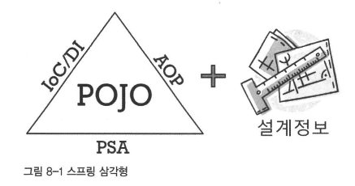
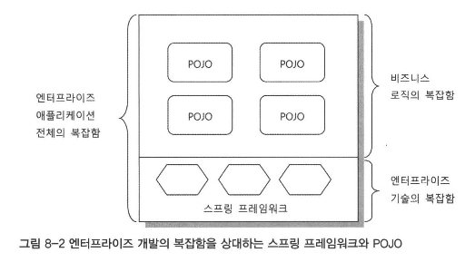

# 8장. 스프링이란 무엇인가?
- 스프링은 기본적으로 IoC 와 DI 를 위한 컨테이너로서 동작하지만 그렇다고 "스프링은 단지 IoC/DI 프레임워크다" 라고는 말할 수 없다

## 8.1. 스프링의 정의
- 스프링이란? 
  - 자바 엔터프라이즈 개발을 편하게 해주는, 오픈소스, 경량급, 애플리케이션 프레임워크
#### 애플리케이션 프레임워크
- 일반적으로 라이브러리나 프레임워크는 특정 업무 분야나 1가지 기술에 특화된 목표를 갖고 만들어진다.
  - ex) 웹 계층을 MVC 구조로 만들 수 있게 한다거나, 애플리케이션 로그 기능을 제공하거나, 관계형 DB 와 자바 오브젝트를 매핑해주는 ORM 기술 제공 등
  - 프레임워크는 **애플리케이션 특정 계층에서 주로 동작하는 1가지 기술 분야에 집중**된다
  - 하지만 스프링은 이와 달리 `애플리케이션 프레임워크` 라는 특징을 갖는다
- 애플리케이션 프레임워크 : 특정 계층, 기술, 업무 분야에 국한되지 않고 애플리케이션 전 과정을 빠르고 편리하며 효율적으로 진행하는 데 일차적인 목표를 두는 프레임워크
  - 단지 여러 계층의 다양한 기술을 한데 모아두었기 때문에 애플리케이션 프레임워크라고 불리는 건 아니다
  - **애플리케이션의 전 영역을 관통하는 일관된 프로그래밍 모델과 핵심 기술을 바탕으로 각 분야의 특성에 맞는 필요를 채워주고 있기 때문에, 애플리케이션을 빠르고 효과적으로 개발할 수 있다**
- 스프링의 일차적인 존재 목적 : **핵심 기술에 담긴 프로그래밍 모델을 일관되게 적용**해서, 엔터프라이즈 애플리케이션 **전 계층/영역에 전략과 기능을 제공**해줌으로써, **애플리케이션을 편리하게 개발**하게 해주는 애플리케이션 프레임워크

#### 경량급
- 스프링 자체가 아주 가볍다거나 작은 규모의 코드로 이루어졌다는 뜻은 아니다.
- **불필요하게 무겁지 않다**는 의미이다
- 가장 단순한 서버환경인 톰캣에서도 완벽하게 동작하며, 단순한 개발툴 / 기본적인 개발환경으로도 엔터프라이즈 개발을 하기에 충분하다
- 서블릿 컨테이너만으로 충분하니 고급 WAS 를 굳이 사용하지 않아도 된다
- 스프링을 기반으로 제작된 코드가 기존 EJB, 여타 프레임워크에서 동작하기 위해 만들어진 코드에 비해 상대적으로 작고 단순하다는 뜻이기도 하다
  - 코드에 불필요하게 등장하던, 프레임워크와 서버환경에 의존적인 부분을 제거해주기 때문에 스프링 기반의 코드가 가볍다
- **만들어진 코드가 지원하는 기술수준은 비슷하더라도, 그것을 빠르고 간편하게 작성하게 해줌으로써 생산성/품질 면에서 유리하다**는 것이 바로 경량급이라는 말로 표현되는 스프링의 특징이다

#### 자바 엔터프라이즈 개발을 편하게
- 편리한 애플리케이션 개발 : 개발자가 복잡하고 실수하기 쉬운 로우레벨 기술에 많은 신경을 쓰지 않으면서도 애플리케이션의 핵심인 사용자의 요구사항 (비즈니스 로직) 을 빠르고 효과적으로 구현하는 것
- 스프링은 EJB 가 궁극적으로 이루고자 했던 위의 목적을 제대로 실현해주엇다
  - 스프링 프레임워크가 제공하는 기술이 아닌, 자신이 작성하는 애플리케이션 로직에 더 많은 시간을 쏟게 해준다

#### 오픈소스
- 스프링은 오픈소스이기 때문에 수많은 버그, 이슈, 기술에 대해 누구나 참여하여 만들어나갈 수 있다. 
  - 공개된 커뮤니티에서 투명한 방식으로 다양한 참여를 통해 개발되기에 매우 빠르고 유연한 개발이 가능하다.
- 오픈소스 개발 방식의 가장 큰 취약점은 지속적이고 안정적인 개발이 계속될지 불확실하다는 것이다. 
  - 그래서 프레임워크 사용자에게 지속적 신뢰를 줄 수 있도록 개발을 책임지고 진행하는 전문 기업을 만들었다
- 스프링은 오픈소스의 장점을 충분히 취하며 오픈소스 제품의 단점과 한계를 작 극복하는 전문적이고 성공적인 오픈소스 소프트웨어라고 할 수 있다.

## 8.2. 스프링의 목적
- 어떤 기술이든 그 자체로는 도구에 불과하다.
  - **용도에 잘 맞게 활용하여 궁극적으로 이루고자 하는 목표를 이루는 것이 중요**하지, 도구의 사용법만 열심히 익히는 게 중요한 게 아니다.
- 자바의 근본적인 목적 : 객체지향 프로그래밍을 통해, 유연하고 확장성 좋은 애플리케이션을, 빠르게 만드는 것

### 8.2.1. 엔터프라이즈 개발의 복잡함
- 자바 엔터프라이즈 개발이 실패하는 대표적인 원인이 '엔터프라이즈 시스템 개발이 너무 복잡해져서' 였다

#### 복잡함의 근본적인 이유
1. 기술적인 제약조건과 요구사항이 늘어가기 때문
2. 엔터프라이즈 애플리케이션이 구현해야 할 핵심 기능인 비즈니스 로직의 복잡도가 증가하기 때문

#### 복잡함을 가중시키는 원인
- 엔터프라이즈 애플리케이션 개발이 실패하는 주요 원인
  - 비즈니스 로직의 복잡함
  - 기술적인 복잡함
- 하지만 각종 엔터프라이즈 기술 서비스를 적용하기 위한 코드, 각종 기술적인 API 의 호출 코드를 비즈니스 로직에 대한 구현코드와 함께 만드는 것은 매우 어렵다
  - 그럼에도 전통적인 자바 엔터프라이즈 개발 기법은 **대부분 비즈니스 로직의 복잡한 구현 코드, 엔터프라이즈 서비스를 이용하는 기술적인 코드가 혼재될 수밖에 없는 방식이었다**

### 8.2.2. 복잡함을 해결하려는 도전
#### 제거될 수 없는 근본적인 복잡함
- 엔터프라이즈 개발의 근본적인 복잡함의 원인은 제거할 대상이 아니다
- 대신 그 **복잡함을 효과적으로 상대할 수 있는 전략과 기법이 필요하다**
- 문제는 비즈니스 로직의 복잡함을 효과적으로 다루기 위한 방법, 기술적인 복잡함을 효과적으로 처리하는 데 적용되는 방법이 다르다는 점이다.
  - 따라서 가장 먼저 해야할 일은 성격이 다른 이 2가지 복잡함을 분리해내는 것이다

#### 실패한 해결책: EJB
- 개발자가 로우레벨의 기술적 복잡함에 신경쓰지 않고 비즈니스 로직을 효과적으로 개발하는 데 더 집중할 수 있게 하자는 목표가 있었지만, 결과적으로 목표 달성에 실패했다
- 애플리케이션 로직을 담은 핵심 코드에서 일부 기술적 코드가 제거된 건 사실이지만, 오히려 EJB 라는 환경과 스펙에 종속되는 코드로 만들어지게 되었다

#### 비침투적인 방식을 통한 효과적인 해결책: 스프링
- 침투적 기술 : EJB 처럼 어떤 기술을 적용했을 때 그 기술과 관련된 코드, 규약이 코드에 등장하는 경우
  - 꼭 필요한 기능을 사용해야 해서 특정 기술의 API를 이용하게 되는 건 어쩔 수 없다
- `비침투적 기술` : 기술의 적용 사실이 코드에 직접 반영되지 않는다
  - 어딘가에서는 기술 적용에 따른 필요한 작업이 들어가겠지만, **애플리케이션 코드 내에 불쑥 등장하거나, 코드 설계와 구현 방식은 제한하지 않는다는 것**이 특징이다 
- 스프링이 성공할 수 있었던 것은, 바로 비침투적 기술 전략을 택했기 때문이다
  - **근본적인 복잡함의 원인이 사라진건 아니지만, 성격이 다른 복잡함을 깔끔하게 분리해줬기에 각각을 효과적으로 상대할 수 있는 기반이 마련**되었다

### 8.2.3. 복잡함을 상대하는 스프링의 전략
- 스프링의 기본적인 전략 : 비즈니스 로직을 담은 애플리케이션 코드, 엔터프라이즈 기술을 처리하는 코드를 분리시키는 것

#### 기술적 복잡함을 상대하는 전략
- 첫번째 문제 : 기술에 대한 접근 방식이 일관성이 없고, 특정 환경에 종속적이다
  - 일관성 없는 기술과 서버 환경의 변화에 대한 스프링의 공략 방법은 `서비스 추상화` 이다.
  - 기술적 복잡함은 일단 추상화를 통해 **로우레벨의 기술 구현부분과 기술을 사용하는 인터페이스를 분리**하고, **환경과 세부 기술에 독립적인 접근 인터페이스를 제공**하는 것이 가장 좋은 해결책이다
  - 스프링이 제공하는 **템플릿/콜백 패턴** 은 판에 박힌 반복적 작업흐름과 API 사용 코드를 제거해준다.
    - 이를 통해 기술을 사용하는 코드도 최적화된 핵심 로직에만 집중하게 해준다.
- 두번째 문제 : 기술적인 처리를 담당하는 코드가 성격이 다른 코드에 섞여서 등장한다
  - ex) 비즈니스 로직 전후로 경계가 설정돼야 하는 트랜잭션, 비즈니스 로직에 대한 보안 적용, 계층 사이에 주고받는 데이터와 예외의 일괄 변환이나 로깅이나 감사 기능
  - 이런 **기술과 비즈니스 로직의 혼재로 발생하는 복잡함을 해결하기 위한 스프링의 접근 방법은 AOP 이다.**
    - AOP 는 최후까지 애플리케이션 로직을 담당하는 코드에 남아 있는 **기술 관련 코드를 깔끔히 분리해서 별도의 모듈로 관리하게 해주는 강력한 기술**이다

#### 비즈니스와 애플리케이션 로직의 복잡함을 상대하는 전략
- 엔터프라이즈 시스템 개발의 흐름은 점차 비즈니스 로직은 애플리케이션 안에서 처리하도록 만드는 추세다
- DB는 단지 **데이터의 영구적인 저장과 복잡한 조건을 가진 검색과 같은 자체적으로 특화된 기능에만 활용**하고, 데이터를 분석/가공/로직 처리하는 부분은 확장하기 쉽고, 비용이 싼 애플리케이션 서버 쪽으로 이동하는 것이다.
- 객체지향 프로그래밍 기법과 언어가 주는 장점인 유연한 설계가 가능하고, 재사용성이 높다는 점을 활용하면 자주 바귀고 조건이 까다로운 비즈니스 로직을 효과적으로 구현해낼 수 있다
  - **결국 비즈니스 로직의 복잡함을 상대하는 전략은 자바라는 객체지향 기술 그 자체다.**
  - 스프링은 단지 객체지향 언어 장점을 살리지 못하게 했던 요소들을 제거하도록 도울 뿐이다.

#### 핵심 도구: 객체지향과 DI
- 스프링의 모토는 결국 "기본으로 돌아가자" 이다.
  - 자바의 기본인 객체 지향에 충실한 설계가 가능하게 단순한 오브젝트로 개발할 수 있고,
  - 객체지향의 설계 기법을 잘 적용할 수 있는 구조를 만들기 위해 DI 같은 기술을 편하게 적용하도록 도와주는 것이 스프링의 기본 전략이다
- **DI 는 특별한 기술이라기보다는 유연하게 확장할 수 있는 오브젝트 설계를 하다보면 자연스레 적용되는 객체지향 프로그래밍 기법일 뿐이다**
  - 반대로 DI 를 열심히 적용하다보면 객체지향 설계의 원칙을 잘 따른 설계가 나올 수도 있다
- 스프링을 사용하고 DI 를 적용했지만, 기계적인 방법으로 항상 사용하는 틀에 박힌 구조의 빈만 정의하고 나머지 코드에 DI 를 적용해볼 생각조차 안한다면 DI 를 잘못 사용하고 있는 것이다
- **비즈니스 로직 자체의 복잡함을 해결하려면 DI 보다는 객체지향 설계 기법이 더 중요하다**
  - 스프링이 비즈니스 로직 자체를, 기술적 코드 + 특정 기술의 스펙이 침범하지 않는 코드로 만들어준 이유가 무엇일까?
    - **순수한 비즈니스 로직만을 담고 있는 코드에는 객체지향 분석과 설계에서 나온 도메인 모델을 쉽게 적용할 수 있기 때문이다.**
- 결국 모든 **스프링의 기술, 전략은 객체지향이라는 자바 언어가 가진 강력한 도구를 극대화해서 사용할 수 있도록 돕는 것**이다.

## 8.3. POJO 프로그래밍
- 스프링의 정수는 엔터프라이즈 서비스 기능 (트랜잭션, 보안과 같은 엔터프라이즈 시스템에서 요구되는 기술)을 POJO 에 제공하는 것
  - **엔터프라이즈 서비스 기술을, POJO 방식으로 개발된 애플리케이션 핵심 로직을 담은 코드에 제공**한다

### 8.3.1. 스프링의 핵심: POJO

- 스프링 애플리케이션 = POJO 를 이용해서 만든 `애플리케이션 코드` + POJO 가 `어떻게 관계를 맺고 동작하는지 정의해둔 설계정보`
- DI 의 기본 아이디어 : 유연하게 확장 가능한 오브젝트를 만들어두고, 그 **관계는 외부에서 다이내믹하게 설정**해준다
  - 이런 DI 의 개념을 애플리케이션 전반에 걸쳐 적용하는 것 -> 스프링의 프로그래밍 모델
- 애플리케이션을 POJO 로 개발할 수 있게 해주는 가능 기술 : IoC/DI, AOP, PSA (Portable Service Abstraction)

### 8.3.2. POJO 란 무엇인가?
- POJO : Plain Old Java Object

### 8.3.3. POJO 의 조건
- 적어도 다음 3가지 조건을 충족해야 POJO 라고 불릴 수 있다.
1. **특정 규약에 종속되지 않는다.**
- POJO 는 자바 언어와 꼭 필요한 API 외에는 종속되지 않아야 한다.
- 특정 규약을 따라 만들게 하는 경우는 대부분 규약에서 제시하는 특정 클래스를 상속하도록 요구한다.
  - 자바의 단일 상속 제한 때문에 더이상 해당 클래스에 객체지향적 설계 기법을 적용하기 어려워지는 문제가 생긴다.
  - 규약이 적용된 환경에 종속적이기에 다른 환경이로 이전이 힘들다.
2. **특정 환경에 종속되지 않는다.**
- 비즈니스 로직을 담은 코드에 HttpServletRequest 나 HttpSession, 캐시와 관련된 API 가 등장하거나 웹 프레임워크 클래스를 직접 이용하는 부분이 있다면 진정한 POJO 라고 할 수 없다.
- 소스코드에 직접 메타정보를 추가해주는 애노테이션을 사용했을 경우에는 POJO 일까?
  - 애노테이션이 부가적인 정보를 담고 있고, 환경에 종속되지만 않는다면 여전히 POJO 라고 할 수 있다
  - 하지만 애노테이션이나 엘리먼트 값에 특정 기술, 환경에 종속된 정보를 담았다면 POJO 로서의 가치를 잃어버린다
- 특정 기술규약과 환경에 종속되지 않으면 모두 POJO 라고 말할 수 있는가? (=평범한 자바 클래스 써서 개발했다고)
  - **객체지향적인 자바 언어의 기본에 충실하게 만들어져야 한다.**
- 진정한 POJO : 객체지향적인 원리에 충실, 환경과 기술에 종속되지 않고, 필요에 따라 재활용될 수 있는 방식으로 설계된 오브젝트

### 8.3.4. POJO 의 장점
- POJO 가 될 수 있는 조건이 그대로 POJO 의 장점이 된다
- 특정 기술과 환경에 종속되지 않은 오브젝트는 그만큼 깔끔하다
- 자동화된 테스트에 매우 유리하다
- 객체지향적인 설계를 자유롭게 적용할 수 있다

### 8.3.5. POJO 프레임워크
- POJO 프레임워크 : POJO 프로그래밍이 가능하도록 기술적 기반을 제공하는 프레임워크
  - ex) 스프링 프레임워크, 하이버네이트

- 스프링은 비즈니스 로직의 복잡함, 엔터프라이즈 기술의 복잡함을 분리해서 구성하게 도와준다.
  - 하지만 기술영역에만 관여하고, 비즈니스 로직을 담당하는 POJO 에서는 모습을 감춘다
  - **POJO 프레임워크로서 스프링은 자신을 직접 노출하지 않으면서 애플리케이션을 POJO 로 쉽게 개발할 수 있게 지원해준다**
- 스프링은 개발자들이 복잡한 엔터프라이즈 기술보다는 객체지향 설계, 개발의 원리에 집중할 수 있는 기회를 준다.
- 동시에 스프링이 제공하는 기술, 프레임워크 API 및 확장 포인트는 그것을 이용하는 코드가 자연스레 객체지향적인 설계 원리를 따라가도록 이끌어준다.

## 8.4. 스프링의 기술
- POJO 프로그래밍을 손쉽게 할 수 있게 지원하는 스프링의 3가지 가능 기술 : IoC/DI, AOP, PSA (Portable Service Abstraction)
  - 스프링의 기술들은, 스프링 프레임워크가 만들어진 **진정한 목표인 POJO 기반의 엔터프라이즈 개발을 편리하게 해주는 도구**일 뿐이다.

### 8.4.1. 제어의 역전(IoC) / 의존관계 주입 (DI)
- DI 는 개방 폐쇄 원칙 (OCP) 이라는 객체지향 설계 원칙으로 잘 설명될 수 있다.
  - `유연한 확장` : OCP의 '확장에는 열려있다' 
  - `재사용이 가능`하다 : OCP의 '변경에는 닫혀있다'

#### DI 의 활용방법
- **핵심기능의 변경**
  - DI 의 가장 대표적인 적용 방법은 바로 **의존 대상의 구현을 바꾸는 것**이다
    - ex) 전략 패턴 (A->B 구조에서 A 의 기능 일부를 B에게 위임할 때 B의 구현 방식을 필요에 따라 통째로 B1, B2, B3로 바꾸는 것)
- **핵심기능의 동적인 변경**
  - DI 도 기본적으로 런타임 시에 동적으로 의존 오브젝트를 연결해주지만, 일단 DI 되고 나면 그 후로는 바뀌지 않는다.
    - 즉, 동적인 방식으로 연결되지만 한번 DI 되면 바뀌지 않는 정적인 관계를 맺어주는 것이다.
    - 하지만 DI를 잘 활용하면 **애플리케이션 동작 중간에 그 의존 대상을 다이내믹하게 변경**할 수 있다
  - 동적인 방식으로 핵심 기능을 변경하는 건, 기술적으로 보자면 `다이내믹 라우팅 프록시`나 `프록시 오브젝트` 기법을 활용한 것이며 DI 없이는 불가능하다
- **부가기능의 추가**
  - **핵심 기능은 그대로 둔 채로 부가기능을 추가하는 것**이다.
    - ex) `데코레이터 패턴` (인터페이스를 두고 사용하게 하고, 실제 사용할 오브젝트는 외부에서 주입하는 DI 를 적용해두면 데코레이터 패턴을 쉽게 적용할 수 있다)
    - 부가기능의 추가 방식을 특정 오브젝트가 아니라 좀 더 많은 대상으로 일반화해서 적용하면 AOP 가 된다
- **인터페이스의 변경**
  - 클라이언트가 사용하는 인터페이스와 실제 오브젝트 사이에 인터페이스가 일치하지 않는 경우에도 DI가 유용하다
    - ex) 오브젝트 방식의 `어댑터 패턴`의 응용
  - 일반화해서 아예 인터페이스가 다른 다양한 구현을 같은 방식으로 사용하도록, **중간에 인터페이스 어댑터 역할을 해주는 레이어를 하나 추가**할 수도 있다
    - 서비스 추상화 (PSA) 가 그 예시이며, **클라이언트가 일관성 있게 사용할 수 있는 인터페이스를 정의해주고 DI를 통해 어댑터 역할을 하는 오브젝트를 이용하게 해준다**
- **프록시**
  - 필요 시점에 실제 사용할 오브젝트를 초기화하고 리소스를 준비하게 해주는 지연로딩을 적용하려면, 프록시가 필요하다.
  - 원격 오브젝트를 호출할 때 마치 로컬에 존재하는 오브젝트처럼 사용할 수 있게 해주는 원격 프록시를 적용하려고 해도 프록시가 필요하다.
- **템플릿과 콜백**
  - 반복적으로 등장하지만 **항상 고정적인 작업 흐름과 그 사이에서 자주 바뀌는 부분을 분리**해서 `템플릿, 콜백`으로 만들고 이를 DI 원리를 응용해 적용하면 지저분하게 매번 만들어야 하는 코드를 간결하게 만들 수 있다
  - 콜백을 템플릿에 주입하는 방식으로 동작하게 하는 것은 DI 의 원리에 가장 충실한 응용 방법이다
    - 콜백을 얼마든지 만들어서 사용할 수 있다 : 개방을 통한 유연한 확장성을 보여준다
    - 템플릿은 한번 만들어두면 계속 재사용 가능하다 : 기능의 확장에도 변하지 않는다는 폐쇄 원칙에 잘 들어맞는다
- **싱글톤과 오브젝트 스코프**
  - DI 가 필요한 중요한 이유 중 하나는 **DI 할 오브젝트의 생명주기를 제어할 수 있다**는 것이다.
    - DI 를 프레임워크로 이용한다 == DI 대상 오브젝트를 컨테이너가 관리한다 == DI 컨테이너가 오브젝트의 스코프를 자유롭게 제어할 수 있다
  - 스프링의 DI 는 기본적으로 싱글톤으로 오브젝트를 만들어 사용하기에, 클래스 자체는 싱글톤 고려 없이 자유롭게 설계해도 된다
- **테스트**
  - 여타 오브젝트와 협력해서 동작하는 오브젝트를 효과적으로 테스트하는 방법은 가능한 한 고립시키는 것이다.
  - 의존 오브젝트를 대신해서 스텁 또는 목 오브젝트 같은 테스트 대역을 활용해야 한다
 
- DI의 용도는 디자인 패턴 중 오브젝트 합성 방식을 따르는 패턴과 관련이 있다

### 8.4.2. 애스펙트 지향 프로그래밍 (AOP)
- AOP 는 OOP 처럼 독립적인 프로그래밍 패러다임이 아니다 (=AOP 와 OOP는 서로 배타적이 아니다)
- AOP 는 객체지향 기술의 한계와 단점을 극복하도록 도와주는 보조적인 프로그래밍 기술이다.
- **스프링의 목적인, POJO 만으로 엔터프라이즈 애플리케이션을 개발하면서도 엔터프라이즈 서비스를 선언적으로 제공하는데 반드시 필요한 것이 AOP 기술이다.**
  - IoC/DI 를 이용해서 POJO에 선언적인 엔터프라이즈 서비스를 제공할 수 있지만, 일부 서비스는 순수 객체지향 기법만으로 POJO 조건을 유지한 채로 적용하기 힘들다.
  - 이러한 문제를 해결하기 위해 AOP 가 필요하다

#### AOP의 적용 기법
- 첫번째는 스프링과 같이 **다이내믹 프록시를 사용**하는 방법이다
  - 기존 코드에 영향을 주지 않고 부가기능을 적용하게 해주는 **데코레이터 패턴을 응용**한 것이다
    - 대신 부가기능 부여할 수 있는 곳은 **메소드의 호출이 일어나는 지점** 뿐이다.
    - 인터페이스와 DI 를 활용하는 데코레이터 패턴이 기반 원리이기 때문이다.
  - 스프링의 기본적인 AOP 구현 방법 : 다이내믹 프록시를 이용하는 프록시 AOP 방식
- 두번째는 자바 언어의 한계를 넘어서는 **언어의 확장을 이용**하는 방법이다
  - AspectJ는 프록시 방식의 AOP 에서는 불가능한 다양한 조인 포인트를 제공한다

#### AOP의 적용 단계
- AOP 적용 1단계: 미리 준비된 AOP 이용
  - 처음에는 스프링이 미리 만들어 제공하는 AOP 기능을 그대로 가져다 적용한다. ex) 트랜잭션
  - 특정 아키텍처 선택 시 사용할 수 있게 준비된 AOP 기능 : @Configurable 애노테이션 이용
- AOP 적용 2단계: 전담팀을 통한 정책 AOP 적용
  - 비즈니스 로직을 가진 오브젝트에 대한 보안, 특정 계층의 오브젝트 이용 전후의 작업 기록을 남기는 로깅, 데이터 추적을 위한 트레이싱, 특정 구간의 실시간 성능 모니터링과 같은 정책적으로 적용할만한 기능에 AOP 를 적용하는 것이다
  - AOP 는 동적으로 동작하면서, 개발 정책을 위반한 코드를 잡아내는 데도 유용하다
- AOP 적용 3단계: AOP의 자유로운 이용
  - 애플리케이션 전체적으로 적용되는 AOP 가 아니라, 개발자가 구현하는 기능에 적용하면 유용한 세부적인 AOP 를 이용할 수 있다

### 8.4.3. 포터블 서비스 추상화 (PSA)
- PSA (Portable Service Abstraction) : 환경과 세부 기술의 변화에 관계없이 일관된 방식으로 기술에 접근할 수 있게 해주는 기술
- POJO 코드가 특정 환경과 기술에 직접 노출되어 만들어지지 않게 하기 위해 스프링이 제공하는 기술이 `일관성 있는 서비스 추상화` 기술이다.
  - ex) @Transactional 어노테이션을 선언하는 것 만으로 별도의 코드 추가 없이 트랜잭션 서비스를 사용할 수 있음
  - 즉, 내부적으로 트랜잭션 코드가 추상화되어 숨겨져 있는 것.
  - 이렇게 추상화 계층을 사용하여 어떤 기술을 내부에 숨기고 개발자에게 편의성을 제공해주는 것이 서비스 추상화(Service Abstraction)

## 8.5. 정리
- 객체지향 원리에 충실하게 개발하며, 환경과 규약에 의존적이지 않은 POJO 를 이용한 애플리케이션 개발은 엔터프라이즈 시스템 개발의 복잡함이 주는 많은 문제를 해결할 수 있다
- **스프링은 이런 POJO 를 사용해 엔터프라이즈 애플리케이션을 쉽고 효과적으로 개발하는 것을 지원해준다.**
- POJO 방식의 개발을 돕기 위해 IoC/DI, AOP, PSA 와 같은 가능기술을 프레임워크와 컨테이너 방식을 통해 제공한다