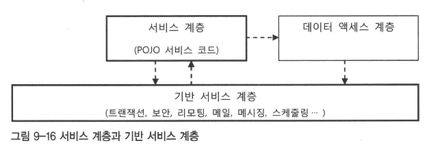

# 9장. 스프링 프로젝트 시작하기
## 9.1. 자바 엔터프라이즈 플랫폼과 스프링 애플리케이션
### 9.1.1. 클라이언트와 백엔드 시스템
- 엔터프라이즈 애플리케이션은 자신이 클라이언트가 돼서 또 다른 엔터프라이즈 시스템에 서비스를 요청할 수도 있다

### 9.1.2. 애플리케이션 서버
- 스프링으로 만든 애플리케이션을 자바 서버 환경에 배포하려면 JavaEE (또는 J2EE) 서버가 필요하다
  - JavaEE 표준을 따르는 애플리케이션 서버 2가지
    - JavaEE의 대부분의 표준 기술을 지원, 다양한 형태의 모듈로 배포 가능한 완전한 웹 애플리케이션 서버 (WAS)
    - 웹 모듈 배포만 가능한 경량급 WAS or 서블릿/JSP 컨테이너
- 경량급 WAS/서블릿 컨테이너
  - 스프링은 톰캣이나 제티 같은 가벼운 서블릿 컨테이너로도 엔터프라이즈 애플리케이션에 필요한 핵심 기능을 모두 이용할 수 있다
- WAS
  - 고도의 안정성, 고성능 시스템에서 필수적인 안정적 리소스 관리 가능
  - 관리기능, 모니터링 기능 뛰어나 여러 대의 서버 동시 운영 시 유리하다

### 9.1.3. 스프링 애플리케이션의 배포 단위
- 독립 웹 모듈
  - 보통 war 로 패키징된 독립 웹 모듈로 배포된다
  - 톰캣 같은 서블릿 컨테이너를 사용한다면 독립 웹 모듈이 유일한 방법이다
  - 가장 편리하고 단순한 배포 단위
- 엔터프라이즈 애플리케이션
  - 확장자가 ear 인 엔터프라이즈 애플리케이션으로 패키징해서 배포 가능
- 백그라운드 서비스 모듈
  - 스프링 애플리케이션이 UI 가 불필요하며 서버 내에서 백그라운드 서비스처럼 동작할 필요가 있다면 rar 모듈로 만들어 배포 가능
- 장기적으로 서버 변경하거나 종류를 바꿀 가능성이 있다면, 서버 기능에 종속되지 않도록 주의하거나, 손쉽게 다른 서버의 기능으로 변경 가능하도록 추상화해서 사용해야 한다

## 9.2. 개발도구와 환경
### 9.2.1. JavaSE 와 JavaEE
#### JavaSE/JDK
- 스프링 3.0 은 JavaSE 5버전에서 추가된 새로운 언어,문법을 최대한 활용해서 개발되어서 기본적으로 JDK 5.0 또는 그 이상을 필요로 한다

#### JavaEE/J2EE
- 스프링 3.0 이 사용될 자바 엔터프라이즈 플랫폼으로는 J2EE 1.4 버전이나 JavaEE 5.0 이 필요하다

### 9.2.2. IDE

### 9.2.3. SpringSource Tool Suite
- 스프링 애플리케이션 개발을 위한 IDE 로 이클립스 선택한 경우, 스프링 소스 (스프링 개발 업체) 가 직접 만들어 제공하는 이클립스 확장판인 STS 사용을 고려해볼 수 있다
- STS : 최신 이클립스를 기반으로 주요 스프링 지원 플러그인, 관련 도구를 모아 스프링 개발에 최적화되도록 만들어진 IDE
  - 스프링 팀이 매번 플러그인의 호환성 문제나 버전 이슈를 검증해주기에 STS 를 사용하면 편리하다

### 9.2.4. 라이브러리 관리와 빌드 툴
#### 라이브러리 관리의 어려움
- 스프링 자체만 해도 20개 가까이 세분화된 jar 모듈이 존재하며, 직접 참조하는 필요 라이브러리는 100개가 넘는다
  - 하지만 그 모든 모듈과 라이브러리가 매번 다 쓰이는 건 아니다
- 또한 라이브러리마다 여러 개의 버전이 있고, 필요한 라이브러리 조합을 만들다보면 복잡한 의존관계 속에서 같은 라이브러리의 다른 버전이 동시에 필요한 경우도 생긴다
- **자바의 jar 는 기본적으로 압축 패키징 방법일 뿐이지 구분 가능한 독립된 모듈이 아니다**

- 위 문제를 풀 수 있는 가장 간단한 방법은 `재패키징` 이다.
  - **한쪽 버전의 클래스를 다른 패키지로 옮겨서 서로 구별되는 클래스로 만들어주는 방법이다**
  - 물론 이에 의존하는 라이브러리 코드도 변경된 패키지 내의 클래스를 사용하도록 수정 되어야 한다
- jarjar 를 이용하면 간단한 명령으로 복잡한 라이브러리 클래스를 모두 재패키징할 수 있다

#### 라이브러리 선정
- 가장 먼저 해야 할 작업은 스프링으로 만드는 애플리케이션에 정확히 어떤 기능이 필요한지를 정리하는 것이다.
- 스프링 모듈
  - 모듈 사이에 의존관계를 살펴보고 필수 의존 모듈과 선택 의존 모듈을 잘 구분해서 선정한다
- 라이브러리
  - 각 모듈이 반드시 필요로 하는 라이브러리가 무엇인지, 선택적으로 사용하는 것은 무엇인지 살펴보고 적절한 라이브러리를 선택한다

#### 빌드 툴과 라이브러리 관리
- IDE 를 사용할 수 있는 환경이 아니더라도 **일관된 빌드가 가능하도록 만드는 것이 중요하다**
- Maven 은 단순 빌드 툴을 넘어, 개발 과정에서 필요한 빌드, 테스트, 배치, 문서화, 리포팅 등의 다양한 작업을 지원하는 종합 프로젝트 관리 툴의 성격을 띠고 있다
- Maven 의 특징은 **POM 이라고 불리는 프로젝트 모델 정보를 이용한다**는 점이다
  - 프로젝트의 주요한 구조와 특징, 필요한 정보를 POM 의 프로젝트 모델 정보로 만들어두면, 이를 참조해서 Maven 에 미리 정해진 절차에 따라 빌드 또는 프로젝트 관리 작업을 진행할 수 있다
  - 절차적인 스크립트와 구조가 비슷한 ANT 와 달리 Maven 은 선언적이다
- Maven POM 이 가진 특징 중 하나는 **애플리케이션이 필요로 하는 의존 라이브러리를 선언해두기만 하면 원격 서버에서 이를 자동으로 다운 받아 사용할 수 있게 해주는 것이다**
- 더 흥미로운 기능은 `전이적 의존 라이브러리 추적 기능` 이다.
  - POM 의 의존정보에 **하나의 라이브러리를 지정하면, 지정된 라이브러리가 동작하는 데 필요한 여타 라이브러리까지 함께 다운로드 해준다.**
    - 잘 정의된 의존정보를 가진 라이브러리들을 갖고 있다면, 한두 개의 최상위 의존 라이브러리만 지정해줌으로써 그에 필요한 모든 라이브러리를 손쉽게 추가할 수 있다
- 스프링의 모든 모듈은 POM 정보를 갖고 있고, 이 정보를 참고하면 모듈을 사용하는 데 필요한 라이브러리와 버전을 알 수 있다
  - 하지만 필수 라이브러리는 몇개 되지 않고, 선택 라이브러리는 Maven 의 전이적 의존 라이브러리 추적 기능의 적용을 받지 못한다.
  - 따라서 POM 정보를 참고할 수 있지만 사용하려면 명시적으로 POM 에 선언해줘야 한다
  - 결국, Maven 을 사용하고 POM 정보를 이용해도 실제 적용할 라이브러리를 선정하는 수고가 사라지진 않는다
- 어차피 개발자가 스스로 필요한 라이브러리를 선택해야 한다면 굳이 Maven 같은 라이브러리 관리 기능 툴이 필요할까? 
  - YES. 라이브러리의 효과적인 관리 측면에서 필요 !
- 조직 차원에서 프로젝트에서 변하지 않고 공통적으로 사용하는 기술 목록을 만들고, 그 기술을 적용할 때 필요한 모든 스프링 모듈과 라이브러리 선정한다.
  - 해당 목록을 갖고, 라이브러리 목록만 담긴 간단한 POM 파일을 만들고 사내 로컬 Maven 레포지토리를 셋업하고 POM 파일을 업로드한다
  - 개별 프로젝트에서는 이 공통 POM 자체를 의존 정보를 넣어 사용한다
- **기업이나 개발팀 내에서 사용하는 의존 라이브러리 그룹을 만들고, 이를 POM 과 같은 빌드 툴이 활용할 정보로 생성**해두면 매우 편리하게 이를 조합해서 모듈과 라이브러리를 지정할 수 있다

#### 스프링 모듈의 두 가지 이름과 리포지토리
> spring-core-3.0.7.RELEASE.jar   // Maven 에서 사용하는 명명 규칙 (artifactId + version)
> org.springframework.core-3.0.7.RELEASE.jar // OSGi 의 모듈 명명 규칙 
- 두 파일은 동일하지만, 배포되는 기술에 따라 관례적으로 다른 이름을 사용한다

## 9.3. 애플리케이션 아키텍처
- 아키텍처 : 어떤 경계 안의 내부 구성요소들이 어떤 책임을 가지고, 어떤 방식으로 서로 관계를 맺으며 동작하는지를 규정하는 것

### 9.3.1. 계층형 아키텍처

#### 아키텍처와 SoC
- 지금까지 해온 DI 를 바탕으로 한 유연한 설계와 구현 전략
  - 성격이 다른 코드가 얽혀 있는 것을 2개의 오브젝트로 분리
  - 그 사이에 유연한 결합을 갖도록 인터페이스를 두고
  - 그 관계를 맺어주는 제 3의 존재인 DI 컨테이너를 두고 오브젝트끼리는 직접적 관계를 알지 못하도록 하는 것
- **성격이 다른 것은 아키텍처 레벨에서 분리해주는 게 좋다**
- `계층형 아키텍처` (멀티 티어 아키텍처) : 책임과 성격이 다른 것을 크게 그룹으로 만들어 분리해두는 것
  - 보통 웹 기반 엔터프라이즈 애플리케이션은 일반적으로 3개의 계층을 갖는다고 해서 `3계층 애플리케이션`이라고도 한다

#### 3계층 아키텍처와 수직 계층

- **데이터 액세스 계층**
  - DAO 계층 (DAO 패턴을 보편적으로 사용하므로)
  - 대개는 장기적인 데이터 저장을 목적으로 하는 DB 이용이 주된 책임이다
  - 사용 기술에 따라 다시 세분화된 계층으로 구분된다. (추상화 수준에 따른 구분)

- JdbcTemplate 을 사용하는 데이터 액세스 계층의 특징 : JdbcTemplate 이 `추상화`를 위한 계층으로 사용돼서 로우레벨 기반 계층에 존재하는 JDBC, 드라이버, 스프링 트랜잭션 추상화 서비스의 동기화 기능을 간접적으로 이용하게 만든다
- **서비스 계층**
  - 잘 만들어진 스프링 애플리케이션의 **서비스 계층 클래스는 이상적인 POJO 로 작성된다**
  - POJO 로 만든다면 객체지향적인 설계 기법이 적용된 코드를 통해 비즈니스 로직의 핵심을 잘 담아내고, 이를 쉽게 테스트하고 유연하게 확장할 수 있다
  - 이 계층은 특별한 경우가 아니라면 추상화 수직 계층구조를 가질 필요가 없다.
    - 기술 API 를 직접 다루는 코드가 아니기에 기술에 일관된 방식으로 접근하게 하거나 편하게 사용하게 해주는 추상화가 필요 없다

  - 일반적으로 서비스 계층이 필요에 따라 기반 서비스 계층 API 를 호출해서 이용한다
  - 하지만 서비스 계층의 코드를 기반 서비스 계층에서 실행시키는 경우가 있다
    - ex. 스케줄링 (미리 정해진 시간에 특정 서비스 계층 로직이 동작하도록 기반 서비스 계층에서 호출)
  - 원칙적으로 서비스 계층 코드가 기반 서비스 계층의 구현에 종속되어선 안된다
    - **서비스 계층 코드는 추상화된 기반 서비스 인터페이스를 통해서만 접근하도록 만들어 특정 구현과 기술에 대한 종속성을 제거해야 한다**
  - 이상적인 서비스 계층은 데이터 액세스 계층, 프레젠테이션 계층이 모두 바뀌어도 그대로 유지될 수 있어야 한다
- **프레젠테이션 계층**
  - 엔터프라이즈 애플리케이션의 프레젠테이션 계층은 **클라이언트 종류와 상관없이 HTTP 프로토콜을 사용하는 서블릿이 바탕이 된다**

#### 계층형 아키텍처 설계의 원칙